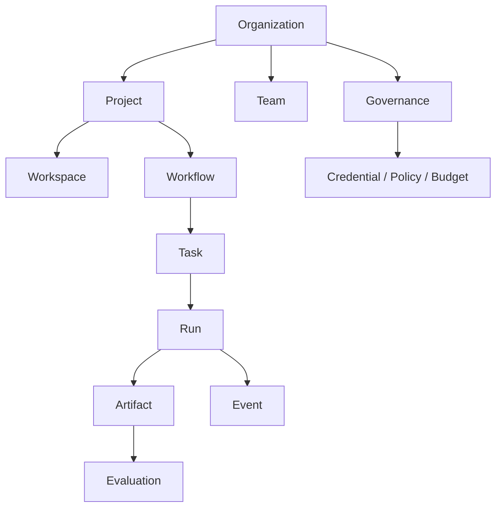

# Workforce — Domain Model

**版本：** V0.1 Draft  
**状态：** Architecture baseline  
**日期：** 2026-09-10

## 1. 设计目标

本模型定义 Workforce 的统一产品语言，使软件开发、研究、文档、数据分析等场景能够共享相同核心对象。模型强调：

- Worker 与 Runtime 解耦
- Task 与 Run 解耦
- Project 与 Workspace 解耦
- Artifact、Event、Evaluation 为一级对象
- 配置版本化，运行记录不可变
- 权限、预算和审批贯穿执行过程

## 2. 聚合关系



## 3. 核心边界

| 聚合 | 负责内容 | 不负责内容 |
|---|---|---|
| Organization | 成员、团队、治理、凭据、全局预算 | 单次执行过程 |
| Project | 目标、上下文、Workspace、Workflow 实例 | Runtime 内部实现 |
| Worker | 角色、能力、工具、策略和 Runtime 绑定 | Task 生命周期 |
| Workflow | Task 依赖、路由、条件、审批和恢复策略 | Agent 的内部推理 |
| Task | 工作意图、输入、输出要求、约束和验收 | 某次执行日志 |
| Run | Task 的一次执行、状态、用量和结果 | 修改 Task 定义 |
| Artifact | 可持久化工作产物及其血缘 | 临时 stdout |

## 4. 实体定义

### 4.1 Organization

治理和隔离的最高边界。

```ts
interface Organization {
  id: OrganizationId;
  name: string;
  slug: string;
  settings: OrganizationSettings;
  createdAt: Timestamp;
  updatedAt: Timestamp;
}
```

### 4.2 Project

围绕一个业务目标组织 Team、Workflow、Task、Workspace 和 Artifact。

```ts
interface Project {
  id: ProjectId;
  organizationId: OrganizationId;
  name: string;
  objective: string;
  status: "draft" | "ready" | "running" | "paused" | "completed" | "failed" | "cancelled";
  teamId?: TeamId;
  workflowVersionId?: WorkflowVersionId;
  contextRef?: ContextRef;
  budget?: BudgetLimit;
  createdBy: PrincipalRef;
  createdAt: Timestamp;
  updatedAt: Timestamp;
}
```

### 4.3 Workspace

Worker 真正执行工作的环境。一个 Project 可有一个基础 Workspace，并为不同 Task/Run 派生隔离实例。

```ts
interface Workspace {
  id: WorkspaceId;
  projectId: ProjectId;
  kind: "local_directory" | "git_repository" | "container" | "remote";
  platform: "windows" | "macos" | "linux";
  rootRef: string;
  repository?: RepositoryBinding;
  isolation: "shared" | "worktree" | "container" | "sandbox";
  status: "provisioning" | "ready" | "busy" | "error" | "archived";
  createdAt: Timestamp;
}
```

### 4.4 Team

可复用的 Worker 编组；Project 绑定的是 Team 的一个版本快照。

```ts
interface Team {
  id: TeamId;
  organizationId: OrganizationId;
  name: string;
  description?: string;
  activeVersionId: TeamVersionId;
}

interface TeamMember {
  workerVersionId: WorkerVersionId;
  teamRole: string;
  quantity: number;
  routingWeight?: number;
}
```

### 4.5 Worker、Role 与 Runtime

Worker 是平台中的可配置执行者；Role 表示职责；Runtime 表示实际执行引擎。

```ts
interface WorkerVersion {
  id: WorkerVersionId;
  workerId: WorkerId;
  version: number;
  roleId: RoleId;
  runtimeProfileId: RuntimeProfileId;
  capabilities: CapabilityRef[];
  toolBindings: ToolBinding[];
  instructionRef: PromptVersionRef;
  policyId: PolicyVersionId;
  memoryProfileId?: MemoryProfileId;
  immutable: true;
}

interface RuntimeProfile {
  id: RuntimeProfileId;
  adapterType: "codex" | "claude_code" | "custom";
  model?: string;
  executionMode: "local_process" | "remote_api" | "container";
  capabilities: RuntimeCapability[];
  config: Record<string, unknown>;
}
```

关键约束：

- 一个 Role 可由多个 Worker 实现。
- 一个 Worker 的不同版本可以绑定不同 Runtime。
- Runtime 不拥有业务角色，也不直接决定 Task 路由。
- Run 必须记录实际使用的 WorkerVersion、Runtime Adapter 版本和模型。

### 4.6 Workflow

WorkflowDefinition 是可复用定义；WorkflowInstance 属于某个 Project。

```ts
interface WorkflowVersion {
  id: WorkflowVersionId;
  workflowId: WorkflowId;
  version: number;
  nodes: WorkflowNode[];
  edges: WorkflowEdge[];
  failurePolicy: FailurePolicy;
  immutable: true;
}

type WorkflowNode =
  | TaskNode
  | ApprovalNode
  | ConditionNode
  | ParallelNode;
```

V0.1 不把循环建模为无限通用结构；返工通过有上限的 retry/rework transition 表达。

### 4.7 Task

Task 是可分配、可执行、可验收的最小工作单元。Task 定义目标，不记录 Runtime 内部过程。

```ts
interface Task {
  id: TaskId;
  projectId: ProjectId;
  workflowNodeId?: WorkflowNodeId;
  objective: string;
  instructions?: string;
  status: TaskStatus;
  inputs: InputRef[];
  contextRef?: ContextRef;
  requiredCapabilities: CapabilityRef[];
  expectedOutputs: OutputSpec[];
  acceptanceCriteria: AcceptanceCriterion[];
  constraints: TaskConstraints;
  dependencies: TaskDependency[];
  assignee?: WorkerVersionId;
  budget?: BudgetLimit;
  priority: number;
  createdAt: Timestamp;
  updatedAt: Timestamp;
}

type TaskStatus =
  | "draft"
  | "blocked"
  | "ready"
  | "queued"
  | "running"
  | "waiting_review"
  | "completed"
  | "failed"
  | "cancelled";
```

### 4.8 Run

Run 是 Task 的一次尝试。重试必须创建新的 Run，不覆盖旧记录。

```ts
interface Run {
  id: RunId;
  taskId: TaskId;
  attempt: number;
  status: RunStatus;
  workerVersionId: WorkerVersionId;
  runtimeSnapshot: RuntimeSnapshot;
  workspaceId: WorkspaceId;
  startedAt?: Timestamp;
  endedAt?: Timestamp;
  usage: UsageSummary;
  failure?: FailureRecord;
  parentRunId?: RunId;
}

type RunStatus =
  | "pending"
  | "starting"
  | "running"
  | "waiting_input"
  | "paused"
  | "succeeded"
  | "failed"
  | "timed_out"
  | "cancelled";
```

### 4.9 Artifact

Artifact 是可寻址、可版本化、可授权和可评估的工作结果。

```ts
interface Artifact {
  id: ArtifactId;
  projectId: ProjectId;
  taskId: TaskId;
  runId: RunId;
  kind: "file" | "code" | "data" | "web" | "message" | "external_resource";
  mediaType?: string;
  name: string;
  version: number;
  storageRef: StorageRef;
  createdBy: PrincipalRef;
  metadata: Record<string, unknown>;
  lineage: ArtifactLineage;
  createdAt: Timestamp;
}

interface ArtifactLineage {
  sourceArtifactIds: ArtifactId[];
  sourceInputRefs: InputRef[];
  transformation?: string;
}
```

### 4.10 Event

Event 是执行历史的事实来源，只追加、不修改。

```ts
interface DomainEvent<T = unknown> {
  id: EventId;
  type: string;
  schemaVersion: number;
  organizationId: OrganizationId;
  projectId?: ProjectId;
  taskId?: TaskId;
  runId?: RunId;
  sequence: number;
  occurredAt: Timestamp;
  actor: PrincipalRef;
  correlationId: string;
  causationId?: EventId;
  payload: T;
}
```

### 4.11 Approval

```ts
interface ApprovalRequest {
  id: ApprovalId;
  projectId: ProjectId;
  taskId?: TaskId;
  runId?: RunId;
  subjectRef: EntityRef;
  action: string;
  status: "pending" | "approved" | "rejected" | "changes_requested" | "expired" | "cancelled";
  requestedFrom: PrincipalRef[];
  decision?: ApprovalDecision;
  expiresAt?: Timestamp;
}
```

### 4.12 Evaluation

```ts
interface Evaluation {
  id: EvaluationId;
  subjectRef: EntityRef;
  evaluator: PrincipalRef;
  method: "rule" | "test" | "model" | "human";
  scores: Record<string, number>;
  verdict: "pass" | "fail" | "needs_review";
  evidenceRefs: EntityRef[];
  notes?: string;
  createdAt: Timestamp;
}
```

### 4.13 Context 与 Memory

Context 是本次执行被明确组装的输入；Memory 是跨 Run 保存、经过治理的长期知识。

```ts
interface ContextBundle {
  id: ContextId;
  scope: "organization" | "team" | "project" | "task" | "run";
  entries: ContextEntry[];
  assembledAt: Timestamp;
  policyId: PolicyVersionId;
}

interface MemoryRecord {
  id: MemoryId;
  scope: "worker" | "team" | "organization";
  contentRef: StorageRef;
  provenance: EntityRef[];
  retentionPolicyId: string;
}
```

### 4.14 Policy、Credential 与 Budget

- Policy 决定某 Principal 可对某 Resource 执行哪些 Action。
- Credential 只通过引用和受控 Broker 使用，禁止写入 Prompt、Event payload 或普通日志。
- BudgetLimit 可绑定 Organization、Project、Task、Worker 或 Run。
- UsageRecord 记录 token、API、计算、工具和时间消耗。

## 5. 身份模型

所有动作统一归属于 Principal：

```ts
type PrincipalRef =
  | { type: "user"; id: UserId }
  | { type: "worker"; id: WorkerVersionId }
  | { type: "service"; id: ServiceId };
```

Supervisor 是具备观察、评估、重试、重新分配、暂停和升级权限的 Worker/Service，不是绕过 Policy Engine 的超级用户。

## 6. 不变量

1. Task 完成必须至少关联一个可验收 Artifact 或明确的无产物结果记录。
2. 每个 Run 只属于一个 Task；每次重试创建新 Run。
3. Run 启动后使用不可变的 Worker、Workflow、Prompt、Policy 和 Runtime 快照。
4. Artifact 必须记录 creator、task、run、storage 和 lineage。
5. Credential 明文不得进入 Prompt、Artifact 元数据、Event 或日志。
6. 所有状态变化都产生带 schema version 的 Event。
7. Supervisor 的动作必须经过 Policy 检查并写入审计事件。
8. Task 只有在依赖满足且必要审批通过后才可进入 ready。
9. Project 取消后不得启动新 Run；运行中的 Run 按策略取消或安全收尾。
10. Budget 超限必须阻止新 Run 或触发显式批准。

## 7. V0.1 关系基数

| 关系 | 基数 |
|---|---|
| Organization → Project | 1:N |
| Organization → Team | 1:N |
| TeamVersion → WorkerVersion | N:M |
| Project → Workspace | 1:N |
| Project → Task | 1:N |
| Task → Run | 1:N |
| Run → Event | 1:N |
| Run → Artifact | 1:N |
| Artifact → Artifact | N:M lineage |
| Entity → Evaluation | 1:N |
| Entity → ApprovalRequest | 1:N |

## 8. V0.1 实现取舍

- 单用户本地模式仍保留 `organizationId` 和 `PrincipalRef`，避免后续迁移核心表。
- Worker、Workflow、Prompt、Policy 使用版本表；编辑产生新版本。
- Event Store 初期可使用 PostgreSQL/SQLite 普通追加表，不要求完整 Event Sourcing。
- Artifact 文件保存在 Workspace 或本地对象目录，数据库只保存元数据和引用。
- Context 先采用显式 bundle，不实现自动长期记忆检索。
- Capability 先使用受控字符串注册表，后续再增加类型系统和 discovery 协商。

## 9. 下一文档的输入

System Architecture 必须基于本模型划分以下组件：

- Desktop UI
- Local Daemon
- Project/Workflow Service
- Runtime Adapter Host
- Workspace Manager
- Policy/Credential Gateway
- Event Bus and Event Store
- Artifact Store
- Evaluation/Approval Service
- Local SQLite 与可选 Cloud Control Plane

后续 Task、Artifact、Runtime 与 Event Protocol 文档将把本模型中的接口展开为可验证 JSON Schema。

## 10. Execution Node 与执行位置模型

Execution Node 是能够承载 Runtime 和 Run 的机器级执行主体。本机与远程服务器使用同一模型。产品 Placement kind 为 `local`（默认）/ `remote` / `container`，权威见 [D19](../planning/decision-register.md#d19-执行-placement本机远程与容器)；下列 TypeScript 是概念节选，不是 T02 已冻结的 DTO。

```ts
interface ExecutionNode {
  id: ExecutionNodeId;
  organizationId: OrganizationId;
  name: string;
  kind: "local" | "remote" | "enterprise";
  platform: "windows" | "macos" | "linux";
  status: "enrolling" | "online" | "draining" | "offline" | "revoked";
  capabilities: CapabilityRef[];
  labels: Record<string, string>;
  capacity: {
    cpuCores: number;
    memoryBytes: number;
    diskAvailableBytes: number;
    maxConcurrentRuns: number;
  };
  lastHeartbeatAt?: Timestamp;
}

interface RuntimeInstallation {
  id: RuntimeInstallationId;
  nodeId: ExecutionNodeId;
  runtimeProfileId: RuntimeProfileId;
  adapterVersion: string;
  runtimeVersion?: string;
  capabilities: RuntimeCapability[];
  status: "available" | "busy" | "degraded" | "unavailable";
}

interface PlacementPolicy {
  mode: "automatic" | "local_only" | "remote_only" | "specific_node";
  nodeId?: ExecutionNodeId;
  requiredLabels?: Record<string, string>;
  preferredLabels?: Record<string, string>;
  dataLocality?: "workspace_local" | "replicated" | "remote_access";
}

interface ExecutionLease {
  id: ExecutionLeaseId;
  runId: RunId;
  nodeId: ExecutionNodeId;
  fencingToken: number;
  acquiredAt: Timestamp;
  expiresAt: Timestamp;
  renewedAt: Timestamp;
}
```

Run 增加不可变的 `nodeId`、`runtimeInstallationId` 和 `placementSnapshot`。一个 Node 可承载多个 RuntimeInstallation 和并发 Run；每个 Run 必须拥有独立 WorkspaceInstance、进程树、PermissionGrant、日志流和资源配额。同一时刻一个 Run 只能由一个有效 ExecutionLease 执行。

Workspace 拆分为逻辑 `WorkspaceBinding`、节点上的 `WorkspaceInstance` 和运行时不可变 `WorkspaceSnapshot`。RuntimeProfile 不再通过 executionMode 表达机器位置。正交轴：`transport` 为 `process | sdk | http`；Placement **intent mode** 为 `automatic | local_only | remote_only | specific_node`（系统默认 `local_only`）；Placement **kind** 为 `local | remote | container`（产品默认 `local`）。`Workspace.kind` / `isolation` 里的 `"container"` 与 `RuntimeProfile.executionMode` 不得读成 D19 已实现的容器 runner。`container` kind 不是第四种 `ExecutionNode.kind`。
