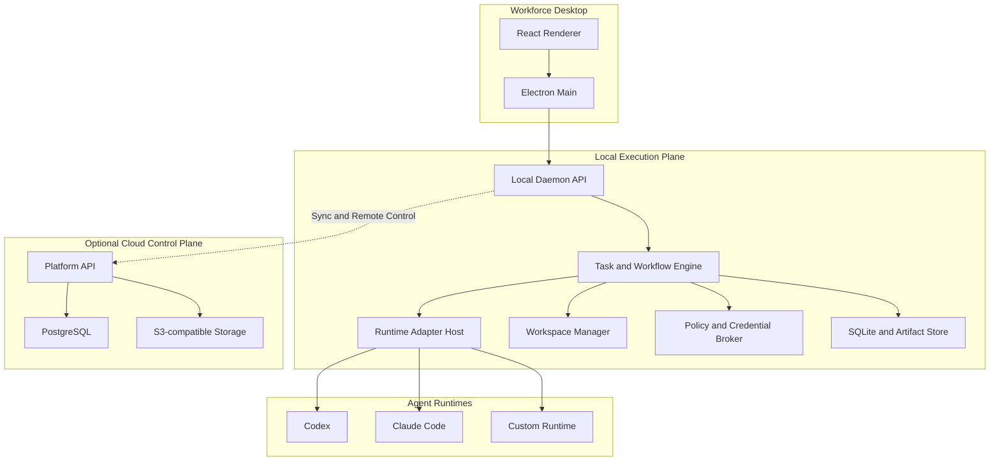
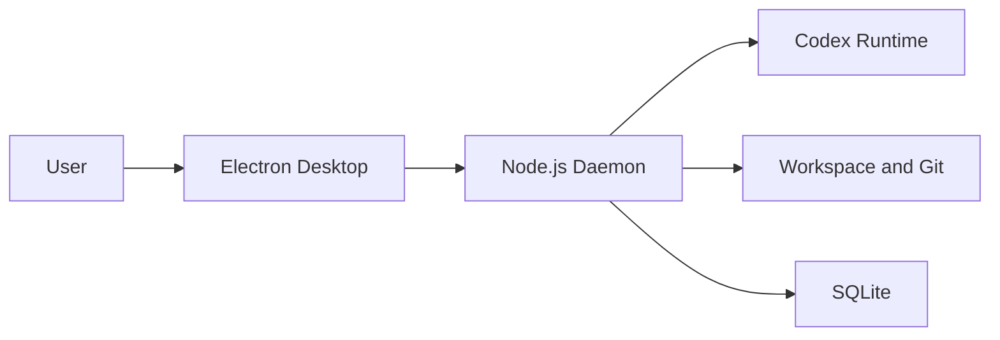
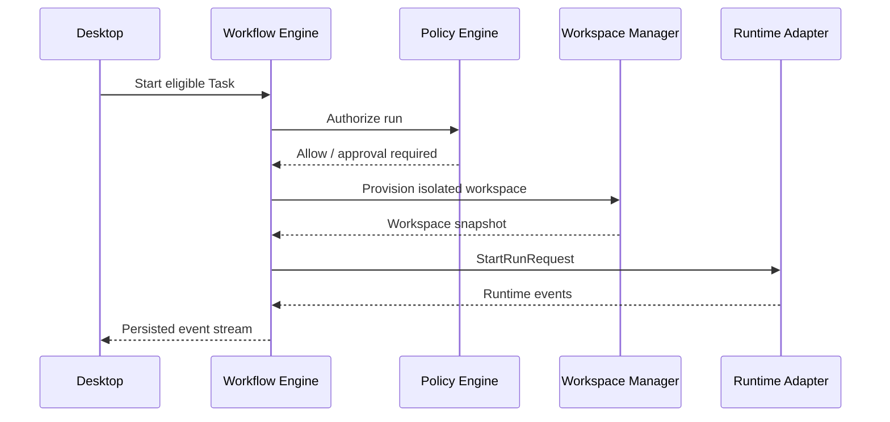
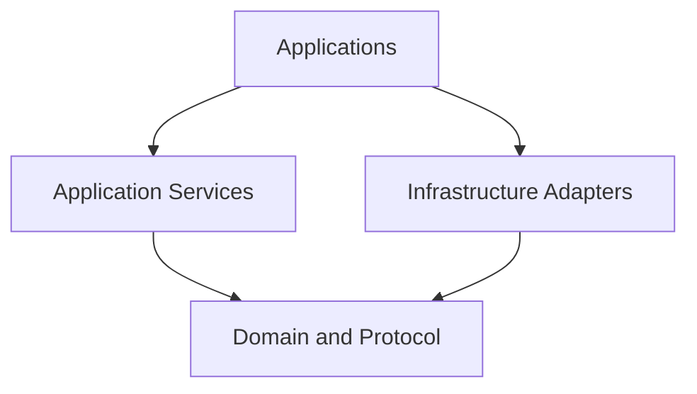
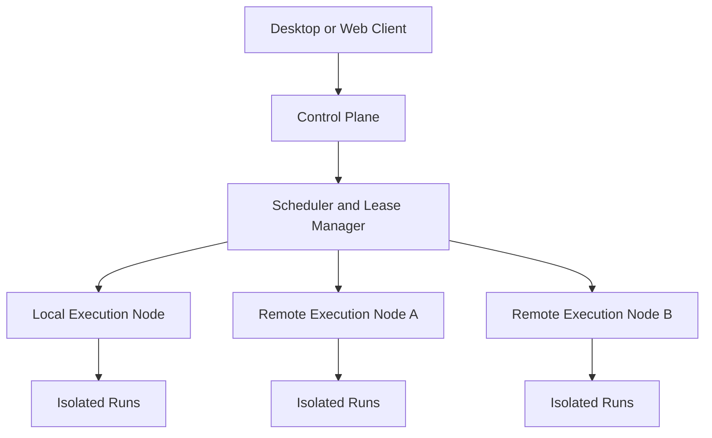

# Workforce — System Architecture

**版本：** V0.1 Draft  
**状态：** Architecture baseline  
**日期：** 2026-09-10

## 1. 架构目标

Workforce 采用“跨平台桌面客户端 + 本地执行面 + 可选云端控制面”的架构。V0.1 优先实现本地闭环，同时保证核心协议、数据标识和模块边界可以平滑演进到多人协作、远程 Worker 与企业私有部署。

架构必须满足：

- Windows、macOS、Linux 原生可用
- Agent 在用户控制的 Workspace 中真实执行工作
- UI、业务编排与具体 Runtime 解耦
- 长任务可观察、可取消、可重试、可恢复
- 权限与凭据不直接暴露给 Agent Prompt
- 所有重要动作可审计，所有产物可追踪
- 本地离线模式可独立运行，云端能力可选

## 2. 总体架构



## 3. 部署拓扑

### 3.1 V0.1：Local-first



特点：

- 不依赖云端账号即可创建和运行 Project。
- 数据库、事件、配置和 Artifact 元数据默认在本机。
- Runtime 使用用户已经授权的本地身份或受控凭据引用。
- Desktop 退出不应自动杀死允许后台运行的任务；Daemon 有独立生命周期。

### 3.2 后续：Hybrid

云端负责组织、协作、策略、同步和远程调度；本地或企业节点负责执行。控制面不直接读取任意本地文件，只接收策略允许的 Event、状态、Artifact 或摘要。

### 3.3 企业模式

- Private Control Plane
- Headless Worker Nodes
- 企业 Credential Broker
- 集中 Policy、Audit 与 Artifact Storage
- 网络出口控制和受管 Sandbox

## 4. 进程边界

| 进程 | 主要职责 | 权限边界 |
|---|---|---|
| Renderer | 页面、交互、状态展示 | 禁止直接使用 Node、文件系统和 Shell |
| Electron Main | 窗口、托盘、通知、安装更新、Daemon 生命周期 | 仅开放白名单 IPC |
| Local Daemon | Project、Task、Run、Workflow、事件与本地 API | 通过 Policy 调用系统能力 |
| Runtime Process | Codex/Claude Code/自定义 Agent | 仅访问分配的 Workspace 和允许的工具 |
| Helper/Sandbox | 平台相关隔离、Git、PTY、进程树控制 | 最小 OS 权限 |

Renderer 必须启用 `contextIsolation`，关闭 `nodeIntegration`，并通过 typed preload API 与 Main 通信。

## 5. Local Daemon 模块

### 5.1 Local API Gateway

- 只监听 loopback 或受保护的本地 IPC
- 提供 typed RPC、SSE/WebSocket 事件订阅和健康检查
- 使用短期 session token、origin 校验和请求版本
- 不向 Renderer 暴露 Credential 明文

### 5.2 Project Service

- 管理 Project、Team、Worker 与配置快照
- 创建 WorkflowInstance
- 组装 Project/Task Context
- 保证跨聚合引用合法

### 5.3 Task & Workflow Engine

- 计算依赖和 ready tasks
- 执行状态转换
- 选择 Worker 和 Runtime
- 管理 retry、timeout、pause、cancel、approval
- 在每次副作用前后写入 Event
- V0.1 使用数据库持久化轻量状态机，不引入 Temporal

### 5.4 Runtime Adapter Host

统一向上暴露：

```ts
interface RuntimeAdapter {
  describe(): Promise<RuntimeDescriptor>;
  validate(config: RuntimeConfig): Promise<ValidationResult>;
  start(request: StartRunRequest): Promise<RuntimeHandle>;
  sendInput(runId: RunId, input: RuntimeInput): Promise<void>;
  pause?(runId: RunId): Promise<void>;
  resume?(runId: RunId): Promise<void>;
  cancel(runId: RunId): Promise<void>;
  inspect(runId: RunId): Promise<RuntimeStatus>;
  stream(runId: RunId): AsyncIterable<RuntimeEvent>;
}
```

Adapter 负责翻译协议，不承担 Task 业务逻辑。Runtime 特有输出必须转为标准 RuntimeEvent，并允许保留 namespaced raw payload 供调试。

### 5.5 Workspace Manager

- 绑定本地目录或 Git Repository
- 为 Task/Run 创建隔离目录或 Git worktree
- 记录基线 commit、branch 和文件变化
- 执行路径标准化与越界检查
- 清理临时 Workspace 前确认 Artifact 已持久化
- Windows 支持 PowerShell/WSL 差异，禁止假设 POSIX 路径

### 5.6 Process & Terminal Manager

- 创建 PTY 或非交互子进程
- 捕获 stdout、stderr、exit code 和 process tree
- 支持 cancel、timeout 和强制终止升级策略
- 对输出做 Credential/secret 脱敏
- 限制并发、输出大小和日志速率

### 5.7 Policy Engine

输入 `principal + action + resource + context`，输出 allow、deny 或 require_approval。

V0.1 至少控制：

- Workspace 读写范围
- 可执行命令
- 网络访问声明与危险工具调用
- Git commit/branch 权限
- 删除、覆盖、发送、发布等高风险动作
- Run 时间、重试与预算限制

### 5.8 Credential Broker

- 数据模型只保存 CredentialRef
- 在副作用发生前按 Policy 临时注入
- 默认不进入环境变量继承链；必须使用最小作用域
- 写入日志和 Event 前统一脱敏
- 支持失效、轮换和撤销

### 5.9 Event Bus & Event Store

- Domain Event 和 Runtime Event 统一封装
- 事件先持久化，再推送给 UI
- 单个 Run 内使用严格递增 sequence
- 消费者必须幂等
- V0.1 采用 SQLite append-only table + 内存订阅
- 后续可替换为 PostgreSQL/outbox 和消息系统

### 5.10 Artifact Service

- 注册文件、代码、数据和外部资源
- 计算 hash、版本、大小和 media type
- 维护 Task/Run/creator/lineage
- 管理本地存储引用和生命周期
- Artifact 元数据与文件内容分离

### 5.11 Approval & Evaluation Service

- 建立 ApprovalRequest 并冻结待审批动作
- 支持 approve、reject、request changes、take over
- 运行规则、测试、模型或人工 Evaluation
- 将 verdict 反馈给 Workflow Engine，而不是由 Reviewer 直接改状态

## 6. 数据架构

### 6.1 本地数据

| 数据 | 存储 |
|---|---|
| 核心实体与配置 | SQLite |
| Event | SQLite append-only tables |
| 小型结构化 Artifact | 本地 Artifact directory |
| 代码与文件 | Project Workspace / Git |
| 日志 | 分块文件 + SQLite 索引 |
| Secret | OS Keychain/credential store |

### 6.2 一致性

- 业务状态变化和 Domain Event 使用同一 SQLite transaction。
- 外部副作用采用 command record + idempotency key。
- Artifact 内容先落盘并校验 hash，再提交元数据。
- Runtime 断连后根据 handle 和 process identity 恢复或标记 orphaned。

### 6.3 云同步原则

- Local entity 使用全局唯一 ID，避免迁移时重写主键。
- Event 包含 schemaVersion、sequence、correlationId 和 causationId。
- 同步只传允许的数据类别。
- 冲突以 immutable Run/Event 为基础；可编辑配置使用显式版本。

## 7. 控制流

### 7.1 启动一次 Run



### 7.2 完成与验收

1. Runtime 报告完成候选结果。
2. Artifact Service 注册输出并验证完整性。
3. Evaluation Service 执行测试或规则。
4. Workflow 根据 verdict 进入 completed、waiting_review 或 rework。
5. 所有判断写入 Event，Run 终态后不可修改。

## 8. 故障模型

| 故障 | V0.1 处理 |
|---|---|
| Runtime 启动失败 | 记录失败；按上限重试 |
| Runtime 无响应 | heartbeat/timeout；取消进程树 |
| Desktop 崩溃 | Daemon 继续；重启后重连事件流 |
| Daemon 崩溃 | 重启扫描非终态 Run 并 reconcile |
| Workspace 冲突 | 阻止执行；重新 provision |
| Artifact 不完整 | Run 不得成功；进入 failed/review |
| 审批长时间未处理 | 保持等待；到期升级或取消 |
| 预算超限 | 阻止新 Run；请求批准 |
| Credential 失效 | 暂停并提示重新授权，不自动降权绕过 |

## 9. 安全基线

- Renderer、Daemon、Runtime 进程相互隔离
- 默认拒绝 Workspace 外写入
- 命令参数化执行，避免未经验证的 Shell 拼接
- 每个 Run 使用最小环境变量集合
- 高风险操作通过 ApprovalRequest
- Credential 使用系统安全存储
- Log/Event/Artifact metadata 统一 secret scanning
- 下载、插件和 Runtime Adapter 未来必须签名与校验版本
- 自动更新需校验签名，并支持安全回滚

V0.1 的 Node daemon 不是完整安全沙箱；产品必须明确其信任边界。真正的强隔离需要 OS sandbox、容器或后续 Rust/原生 helper。

## 10. API 分层

```text
UI Commands
  → Local Application API
  → Domain Services
  → Ports
  → Adapters
  → OS / Runtime / Storage
```

禁止：

- UI 直接写数据库
- Workflow Engine 直接 spawn Codex
- Runtime Adapter 直接修改 Task 状态
- Workspace Manager 决定业务审批
- Cloud API 通过任意路径直接操作用户本地文件

## 11. 技术选型

| 能力 | V0.1 | 演进方向 |
|---|---|---|
| Desktop | Electron + React + Vite | 保持或按证据评估 Tauri |
| Daemon | Node.js + TypeScript | Go daemon；Rust/原生安全模块 |
| Local API | Fastify + WebSocket/SSE | gRPC/Connect 用于远程节点 |
| Database | SQLite + Drizzle | PostgreSQL |
| Workflow | 持久化状态机 | Temporal |
| Schema | Zod + JSON Schema | 独立协议包与代码生成 |
| Observability | Structured events + OTel API | OTel Collector + metrics/traces |
| Packaging | Electron Builder/Forge | 签名、增量更新、企业分发 |

## 12. V0.1 模块依赖规则



- `domain` 和 `protocol` 不依赖 Electron、Fastify、数据库或具体 Runtime SDK。
- Runtime adapters 依赖公共 Runtime SPI，不被业务核心反向依赖。
- 数据库实现位于 infrastructure，领域层只定义 repository ports。
- UI 通过 generated/typed client 使用 API，不共享服务器内部实现。

## 13. 架构决策记录

| 决策 | 结果 | 理由 |
|---|---|---|
| Local-first | 采用 | 本地 Agent、文件、Git、终端是首个场景核心 |
| Desktop 与 Daemon 分离 | 采用 | 生命周期、权限与未来 headless node 需要独立边界 |
| V0.1 单体模块化 Daemon | 采用 | 降低分布式复杂度，同时保留清晰 ports |
| Event-driven execution | 采用 | 长任务观测、恢复和审计需要 |
| Event sourcing | 暂不采用 | V0.1 不需要由事件重建全部业务状态 |
| Temporal | 暂不采用 | 先验证 Task/Run/Workflow 语义 |
| Node daemon | 采用 | 快速集成 CLI、PTY、Git 与 TypeScript 协议 |
| Cloud mandatory | 不采用 | 首版必须可在本地独立运行 |

## 14. 尚待冻结的问题

以下问题会在对应设计文档中解决：

1. Desktop 与 Daemon 使用本地 HTTP、Unix socket/named pipe 还是混合传输。
2. Codex Adapter 使用 CLI 进程、SDK/API 或多模式接入。
3. Windows 首版将 PowerShell native 还是 WSL 作为默认执行环境。
4. Git worktree 的 branch/commit 命名和清理策略。
5. Runtime 原始事件的保留级别与日志上限。
6. Artifact 大文件阈值和本地垃圾回收策略。
7. Local-only 用户是否需要可选的设备加密恢复机制。

这些问题不改变总体架构；将在 Runtime Protocol、Repository Structure、Security 和 MVP Plan 中逐项冻结。

## 15. 下一步

下一份 `04 Repository Structure` 将把上述进程和模块映射到 pnpm/Turborepo 目录、package 边界、依赖规则、测试层级与构建产物。

## 16. 混合与多节点执行拓扑



每个 Execution Node 运行相同职责的 Node Agent：节点注册与身份、heartbeat、Runtime inventory、Workspace provision、进程或容器控制、事件缓冲、Artifact 上传和断线 reconcile。一台 Node 可以同时运行多个 Agent Run，但必须受 `maxConcurrentRuns`、CPU、内存、磁盘、GPU 和预算约束。

Control Plane 是 Project、Task、Workflow、Placement 和 ExecutionLease 的权威来源；Execution Node 是 Runtime 进程事实与本地原始日志的权威来源。节点断网时不得领取新任务；已开始任务按策略继续并缓冲事件、暂停或安全取消。重新调度必须等待旧 Lease 失效并使用 fencing token。

Git/GitHub 属于 Artifact Plane，不承担调度、心跳或事件总线职责。跨节点信息协同通过 Task、Event 和结构化 CoordinationMessage 完成，大内容只传 ArtifactRef。

## 17. 技术栈复核

混合与多节点需求不改变 V0.1 主技术栈，但调整长期职责边界：

| 层 | V0.1 | 远程/规模化演进 |
|---|---|---|
| Desktop | Electron + React + TypeScript + Vite | 保持；Web Client 可复用 React UI |
| Local Node / Daemon | Node.js + TypeScript | Node Agent 优先评估 Go 单 binary |
| Control Plane | TypeScript + Fastify | 可继续使用；按负载拆服务 |
| Node transport | 本地 HTTP/IPC + SSE/WebSocket | HTTPS + Connect/gRPC；双向认证 |
| Local data | SQLite + Drizzle | 保持 |
| Server data | PostgreSQL | 保持，增加 outbox/lease |
| Workflow | 持久化状态机 | 复杂长流程再评估 Temporal |
| Artifact | 本地目录/Git | S3-compatible object storage + Git |
| Observability | Structured Event + OTel API | OTel Collector + metrics/traces/logs |

不采用全面 Rust 重写。Rust/原生模块仅用于强沙箱、系统隔离和性能敏感能力。远程传输采用 schema-first 协议，业务语义不得依赖 Fastify、Electron、Node.js 或具体 RPC 框架。
