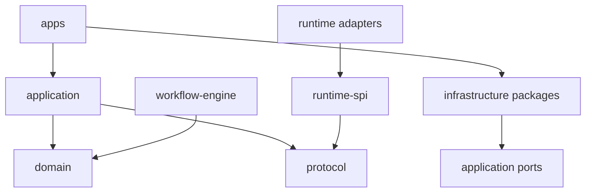

# Workforce — Repository Structure

**版本：** V0.1 Draft  
**状态：** Engineering baseline  
**日期：** 2026-09-10

## 1. 目标

本文件将 Workforce 的领域模型和系统架构映射到可执行的 monorepo。结构需要支持：

- Electron Desktop 与独立 Local Daemon
- Windows、macOS、Linux 开发、测试与打包
- 领域、协议、应用服务和基础设施之间的单向依赖
- Runtime Adapter 独立开发和测试
- V0.1 本地模式与后续 Cloud Control Plane 共用核心协议
- 包级版本、代码所有权和渐进式拆分

## 2. 工具基线

| 类别 | 选择 |
|---|---|
| Package manager | pnpm |
| Monorepo orchestration | Turborepo |
| Language | TypeScript, strict mode |
| Runtime | Node.js LTS |
| Build | tsup/tsc；Vite 用于 renderer |
| Test | Vitest；Playwright；平台集成测试 |
| Lint | ESLint |
| Format | Prettier |
| Schema | Zod + JSON Schema generation |
| Database | Drizzle ORM + SQLite |
| Release | Changesets（公共包阶段启用） |
| CI | GitHub Actions |

根目录使用 `packageManager` 固定 pnpm 版本，使用 `.nvmrc` 或 `.node-version` 固定 Node 主版本，并提交 lockfile。

## 3. 建议目录

```text
workforce/
├── apps/
│   ├── desktop/
│   │   ├── src/main/
│   │   ├── src/preload/
│   │   ├── src/renderer/
│   │   ├── resources/
│   │   └── tests/
│   ├── daemon/
│   │   ├── src/bootstrap/
│   │   ├── src/api/
│   │   ├── src/modules/
│   │   └── tests/
│   ├── web/                    # 云端阶段启用
│   └── api/                    # 云端阶段启用
├── packages/
│   ├── domain/
│   ├── protocol/
│   ├── application/
│   ├── workflow-engine/
│   ├── runtime-spi/
│   ├── runtime-sdk/
│   ├── workspace/
│   ├── policy/
│   ├── events/
│   ├── artifacts/
│   ├── database/
│   ├── observability/
│   ├── ui/
│   ├── desktop-client/
│   ├── config/
│   └── testkit/
├── runtimes/
│   ├── codex/
│   ├── claude-code/            # 首版可只保留契约测试骨架
│   └── mock/
├── templates/
│   └── software-development-team/
├── tooling/
│   ├── eslint/
│   ├── typescript/
│   ├── scripts/
│   └── fixtures/
├── docs/
│   ├── blueprint/
│   ├── adr/
│   ├── protocols/
│   └── operations/
├── tests/
│   ├── contract/
│   ├── integration/
│   ├── e2e/
│   └── platform/
├── .github/
│   ├── workflows/
│   ├── ISSUE_TEMPLATE/
│   ├── pull_request_template.md
│   └── CODEOWNERS
├── package.json
├── pnpm-workspace.yaml
├── turbo.json
├── tsconfig.base.json
├── vitest.workspace.ts
├── eslint.config.js
├── prettier.config.js
├── .editorconfig
├── .gitignore
├── SECURITY.md
├── CONTRIBUTING.md
├── LICENSE
└── README.md
```

## 4. 应用边界

### 4.1 `apps/desktop`

仅负责桌面体验和 OS 应用集成。

```text
src/
├── main/
│   ├── app-lifecycle/
│   ├── daemon-supervisor/
│   ├── ipc/
│   ├── notifications/
│   ├── updater/
│   └── windows/
├── preload/
│   ├── bridge.ts
│   └── contracts.ts
└── renderer/
    ├── app/
    ├── features/
    ├── components/
    ├── hooks/
    └── routes/
```

禁止：

- Renderer 直接访问 Node API、数据库、文件系统或 Shell。
- Main Process 实现 Workflow、Task 或 Runtime 业务逻辑。
- IPC 接口直接暴露任意路径或任意命令执行。

### 4.2 `apps/daemon`

Composition root 与本地服务进程。它负责组装依赖，不承载可复用领域实现。

```text
src/
├── bootstrap/
│   ├── container.ts
│   ├── migrations.ts
│   └── shutdown.ts
├── api/
│   ├── commands/
│   ├── queries/
│   ├── events/
│   └── middleware/
└── modules/
    ├── projects/
    ├── tasks/
    ├── runs/
    ├── approvals/
    └── system/
```

Daemon 只能通过 package 的公开入口导入实现，禁止跨包访问 `src/internal`。

## 5. 核心包职责

| 包 | 职责 | 可以依赖 |
|---|---|---|
| `domain` | Entity、Value Object、状态、不变量、领域错误 | 无基础设施依赖 |
| `protocol` | 外部消息、API DTO、JSON Schema、版本规则 | `domain` 的共享标识/值类型 |
| `application` | Use case、ports、transaction boundary | `domain`, `protocol` |
| `workflow-engine` | DAG、状态转换、调度与恢复逻辑 | `domain`, `events` |
| `runtime-spi` | Adapter 必须实现的接口与标准事件 | `protocol`, `domain` |
| `runtime-sdk` | 第三方 Adapter 辅助函数和测试套件 | `runtime-spi`, `protocol` |
| `workspace` | Workspace provision、Git worktree、路径策略 | `domain`, ports |
| `policy` | authorization decision、approval requirement | `domain` |
| `events` | Event envelope、publisher/store ports、序列规则 | `domain`, `protocol` |
| `artifacts` | Artifact 注册、hash、lineage 与 storage ports | `domain`, `events` |
| `database` | Drizzle schema、repository、migration、transaction | 上层定义的 ports |
| `observability` | 日志、metrics、trace adapters、secret redaction | `events`, `protocol` |
| `ui` | 通用 React 组件和 design tokens | 无 Node 依赖 |
| `desktop-client` | Local API typed client、事件订阅 | `protocol` |
| `config` | 配置 schema 与加载规则 | `protocol` |
| `testkit` | fixture、fake clock、fake repositories、contract harness | 测试所需公共包 |

## 6. Runtime 目录

每个 Adapter 是独立 workspace package：

```text
runtimes/codex/
├── src/
│   ├── adapter.ts
│   ├── capability-discovery.ts
│   ├── process-controller.ts
│   ├── event-translator.ts
│   ├── config.ts
│   └── index.ts
├── tests/
│   ├── contract.test.ts
│   ├── translation.test.ts
│   └── fixtures/
└── package.json
```

规则：

- 只能通过 `runtime-spi` 与平台交互。
- 不能直接写 Task/Run 数据表。
- 不能绕过 Workspace、Policy 或 Credential ports。
- 原始 Runtime payload 必须 namespaced，标准字段由 translator 生成。
- 所有 Adapter 必须通过 `runtime-sdk` 提供的契约测试。

`runtimes/mock` 是 V0.1 的必要组成部分，用于稳定测试长任务、失败、超时、等待输入、Artifact 和取消流程。

## 7. 模板目录

模板是数据，不是硬编码业务：

```text
templates/software-development-team/
├── template.yaml
├── workers/
│   ├── planner.yaml
│   ├── developer.yaml
│   └── reviewer.yaml
├── workflows/
│   └── feature-delivery.yaml
├── policies/
│   └── default.yaml
└── evaluations/
    └── code-review.yaml
```

模板在导入时验证 schema，并实例化为版本化的 Team、Worker、Workflow 和 Policy。

## 8. 依赖方向



强制规则：

1. `domain` 不依赖任何 framework、数据库或 Electron。
2. `protocol` 不依赖 app 或具体 Adapter。
3. `application` 定义 ports；`database/workspace/adapters` 实现 ports。
4. apps 负责 composition，不被 packages 反向依赖。
5. `ui` 不依赖 `desktop/main` 或 Node-only package。
6. 不允许循环依赖。
7. 禁止通过相对路径跨 package 边界。

使用 ESLint boundaries、TypeScript project references 和依赖图 CI 检查这些规则。

## 9. 包公开接口

每个 package 使用 `exports` 显式声明公共 API：

```json
{
  "name": "@workforce/domain",
  "type": "module",
  "exports": {
    ".": "./src/index.ts",
    "./testing": "./src/testing/index.ts"
  }
}
```

- 默认禁止 `@workforce/domain/src/...` 深度导入。
- Node-only 与 browser-safe 入口分开。
- 领域 ID 使用 branded string，不让数据库模型成为公共 API。
- DTO 与 Domain Entity 分离，API 边界必须显式映射。

## 10. TypeScript 配置

基础规则：

```json
{
  "compilerOptions": {
    "strict": true,
    "noUncheckedIndexedAccess": true,
    "exactOptionalPropertyTypes": true,
    "useUnknownInCatchVariables": true,
    "noImplicitOverride": true,
    "verbatimModuleSyntax": true,
    "isolatedModules": true
  }
}
```

- Node、Electron main、renderer 使用不同 tsconfig presets。
- 不用 `any` 逃避 Runtime payload 验证；外部输入先视为 `unknown`。
- Schema 是传输边界的事实来源；类型由 Schema 推导或一致性测试保护。

## 11. 测试结构

### 11.1 Unit

与源码同包，验证：

- 领域不变量
- 状态转换
- DAG 与依赖计算
- Event translation
- Policy decision
- 路径与平台适配纯函数

### 11.2 Contract

集中在 `tests/contract` 和 `runtime-sdk`：

- Runtime Adapter Contract
- Repository Contract
- Artifact Store Contract
- Event Store Contract
- Local API Schema Compatibility

### 11.3 Integration

- SQLite migration 与 transaction
- Git repository/worktree
- Process/PTY 生命周期
- Daemon API 与事件流
- Secret redaction

### 11.4 E2E

使用 mock runtime 跑通确定性场景；Codex live tests 单独标记，不能成为普通 PR 的不稳定门禁。

首条 E2E：

```text
Create Project
→ Bind temporary Git repository
→ Instantiate software team
→ Start workflow
→ Mock planner creates task
→ Mock developer changes file
→ Evaluation passes
→ Human approves
→ Project completes
```

### 11.5 Platform

在 Windows、macOS、Linux CI 上验证：

- path normalization
- child process termination
- shell detection
- file watching
- Git/worktree
- packaging smoke test

## 12. CI 工作流

```text
pull-request.yml
  → install --frozen-lockfile
  → format check
  → lint
  → typecheck
  → unit + contract
  → build affected packages

integration.yml
  → Linux integration tests
  → Windows integration tests
  → macOS integration tests

desktop-release.yml
  → build matrix
  → sign/notarize where configured
  → smoke test
  → publish draft artifacts
```

初期 PR 必须通过 Linux 主流水线；平台敏感模块要求三平台通过后才能发布。

## 13. 构建产物

| 目标 | 产物 |
|---|---|
| Windows x64 | Desktop installer + unpacked smoke artifact |
| macOS arm64/x64 | Signed app/DMG（证书配置后） |
| Linux x64 | AppImage/deb 之一作为首发格式 |
| Daemon | 与 Desktop 一起分发的 Node bundle |
| Protocol | JSON Schema bundle + TypeScript declarations |
| Runtime SDK | 内部 package；生态开放时独立发布 |

ARM64 Linux 可在基础功能稳定后加入正式发布矩阵；代码和协议不得阻止该目标。

## 14. 数据库与迁移目录

```text
packages/database/
├── src/schema/
├── src/repositories/
├── src/transactions/
├── migrations/
├── seeds/
└── tests/
```

- Migration 只前进，不在已发布版本中重写。
- Desktop 启动时由 Daemon 在锁保护下迁移。
- 迁移前备份本地数据库；失败不启动业务服务。
- Schema 不直接导出给 Renderer。

## 15. 配置与 Secret

- 普通配置通过 schema 验证，并区分 default、user、project、runtime 四层。
- Secret 仅保存在 OS credential store；配置文件保存引用。
- `.env` 只用于本地开发，不作为桌面产品的凭据机制。
- 所有环境变量使用 `WORKFORCE_` 前缀。
- 测试使用隔离临时目录，禁止读写真实用户配置。

## 16. 文档结构

现有蓝图在建仓时映射为：

```text
docs/blueprint/
├── 01-product-vision-prd.md
├── 02-domain-model.md
├── 03-system-architecture.md
├── 04-repository-structure.md
├── 05-task-protocol.md
├── 06-artifact-protocol.md
├── 07-runtime-protocol.md
├── 08-workflow-state-machine.md
├── 09-event-model.md
├── 10-database-schema.md
├── 11-api-design.md
└── 12-mvp-implementation-plan.md
```

关键技术取舍单独进入 `docs/adr/`，协议规范进入 `docs/protocols/`，避免 PRD 变成实现细节堆积处。

## 17. GitHub 基线

建仓时建议：

- 私有仓库 `workforce`
- 默认分支 `main`
- 禁止直接 push 到 `main`
- 必须通过 PR 与 CI
- squash merge
- 启用 Dependabot/Renovate 之一
- `CODEOWNERS` 覆盖 protocol、security、runtime 和 release
- Secret scanning 与依赖漏洞扫描
- Release 使用 tag：`v0.1.0-alpha.N`

GitHub 账号关联在执行建仓、push 与 CI 配置时才需要；当前蓝图阶段不需要。

## 18. 初始脚手架范围

第一次代码提交只创建必要闭环：

```text
apps/desktop
apps/daemon
packages/domain
packages/protocol
packages/application
packages/workflow-engine
packages/runtime-spi
packages/database
packages/testkit
runtimes/mock
runtimes/codex
templates/software-development-team
docs/blueprint
```

`web`、云端 `api`、Claude Code 完整 Adapter、公共 SDK 发布和 Temporal 集成暂不进入第一次提交。

## 19. Definition of Done

Repository Skeleton 完成时必须满足：

- `pnpm install --frozen-lockfile` 可复现
- `pnpm lint`、`pnpm typecheck`、`pnpm test`、`pnpm build` 成功
- Desktop 可以启动并连接 Daemon health endpoint
- Mock Runtime 契约测试通过
- SQLite migration 可以从空库执行
- 三平台 CI 配置存在，至少完成基础 smoke 验证
- 依赖边界检查可以阻止违规导入
- 无真实 Credential、用户路径或本地配置进入仓库

## 20. 下一步

下一份 `05 Task Protocol` 将定义 Task envelope、输入输出、能力要求、约束、依赖、预算、验收、版本兼容和幂等规则，并给出正式 JSON Schema 方向。

## 16. 分布式执行的目录预留

长期模块边界预留如下；V0.1 可以只创建 package 接口或空实现，不启动远程服务。

```text
apps/
├── desktop/
├── daemon/                 # V0.1 本地控制面 + Local Node
├── control-plane/          # 后续云端/私有控制面
└── node-agent/             # 后续独立远程执行节点

packages/
├── node-protocol/          # 注册、心跳、inventory、lease
├── scheduler/              # placement、容量与调度策略
├── coordination/           # 结构化 Agent 消息与 handoff
├── workspace/
├── runtime-sdk/
└── protocol/
```

`domain` 与 `protocol` 不得依赖本地路径、Electron 或具体网络传输。Daemon 的 V0.1 Local Node 实现必须通过 Node ports 调用 Runtime 和 Workspace，以便后续把同一接口移入独立 node-agent。

## 17. 语言与框架边界

Monorepo 继续以 TypeScript 为主，保持 pnpm + Turborepo。协议 Schema 是跨语言事实来源，不能只以 TypeScript interface 存在。

- `apps/desktop`、`apps/web`、`apps/control-plane`：TypeScript。
- `apps/daemon`：V0.1 TypeScript，实现 Local Node。
- `apps/node-agent`：V0.1 只保留协议与 Mock；规模化阶段可采用 Go。
- `packages/protocol`：JSON Schema/OpenAPI/AsyncAPI 或等价 schema-first 定义并生成 TS/Go 类型。
- Rust/原生 helper 独立进程或窄 FFI，不进入领域与 Workflow 核心。
- 不允许 Desktop、Control Plane 和 Node Agent 共享只在 Node.js 可执行的内部对象作为网络契约。
