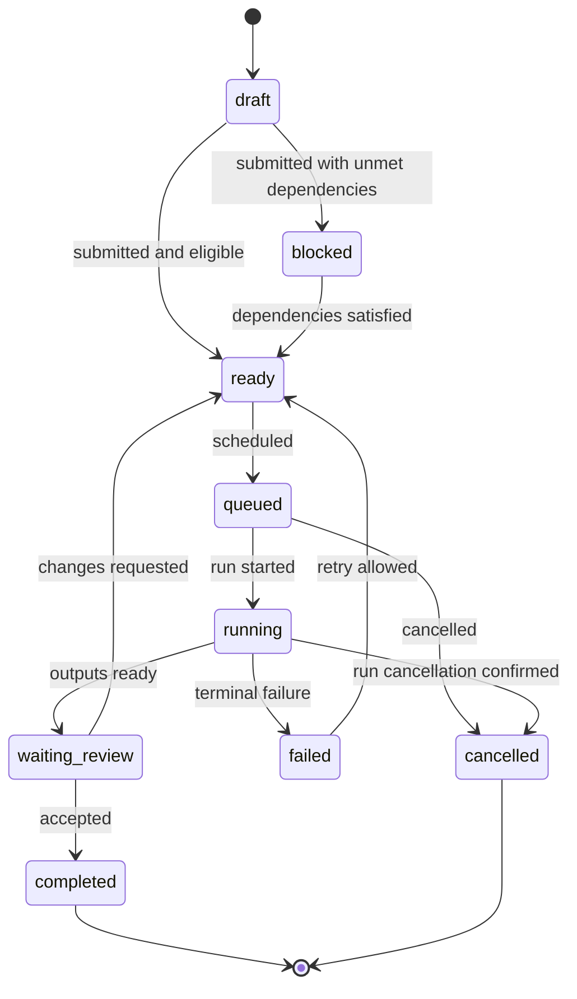

# Workforce — Task Protocol

**协议名：** Workforce Task Protocol  
**协议版本：** `0.1`  
**状态：** Draft  
**日期：** 2026-09-10

## 1. 目的

Task Protocol 定义平台、Workflow、Worker、Runtime 与人类之间共同理解的工作单元。它描述“要完成什么、允许使用什么、需要交付什么、如何判断完成”，但不描述某个 Agent 内部如何推理。

核心目标：

- 同一 Task 可由 Codex、Claude Code、自定义 Agent 或人类执行
- Task 可持久化、传输、版本化、重试和审计
- 输入、上下文、能力、约束、预算和验收均为显式字段
- Runtime 私有参数不会污染通用 Task
- Task 定义与每次 Run 的执行记录分离

## 2. Task Envelope

```json
{
  "protocol": "workforce.task",
  "protocolVersion": "0.1",
  "id": "tsk_01J...",
  "revision": 1,
  "organizationId": "org_01J...",
  "projectId": "prj_01J...",
  "workflowInstanceId": "wfi_01J...",
  "workflowNodeId": "node_implement",
  "parentTaskId": null,
  "title": "Implement user authentication",
  "objective": "Add email/password authentication to the application.",
  "instructions": "Follow the existing architecture and do not change public APIs unnecessarily.",
  "status": "ready",
  "priority": 50,
  "inputs": [],
  "context": {},
  "requiredCapabilities": [],
  "expectedOutputs": [],
  "acceptanceCriteria": [],
  "constraints": {},
  "dependencies": [],
  "assignment": null,
  "executionPolicy": {},
  "budget": {},
  "labels": [],
  "metadata": {},
  "createdBy": { "type": "user", "id": "usr_01J..." },
  "createdAt": "2026-09-10T00:00:00Z",
  "updatedAt": "2026-09-10T00:00:00Z"
}
```

## 3. 标识与版本

### 3.1 标识

- 所有 ID 是不透明、全局唯一字符串，推荐 UUIDv7 或 ULID。
- ID 前缀仅用于可读性，不参与业务判断。
- Task 的逻辑身份由 `id` 表示。
- Task 的可编辑版本由单调递增的 `revision` 表示。

### 3.2 协议版本

- `protocol` 固定为 `workforce.task`。
- `protocolVersion` 使用 `major.minor`。
- minor 版本只允许增加可选字段或枚举能力声明。
- 删除字段、改变语义或收紧已有合法值需要 major 版本。
- 接收方必须拒绝未知 major 版本。

### 3.3 执行快照

Task 在首次 Run 启动前可以编辑。每个 Run 启动时保存 Task revision 和完整执行快照；后续编辑不得改变已经运行或完成的 Run。

## 4. 核心字段

| 字段 | 必需 | 含义 |
|---|---:|---|
| `id` | 是 | Task 身份 |
| `revision` | 是 | Task 当前修订号 |
| `projectId` | 是 | 所属 Project |
| `title` | 是 | 面向用户的短标题 |
| `objective` | 是 | 可验证的目标 |
| `instructions` | 否 | 执行说明，不应包含 Credential |
| `status` | 是 | Task 当前业务状态 |
| `priority` | 是 | `0–100`，越大越优先 |
| `inputs` | 是 | Artifact、文件、数据或外部资源引用 |
| `context` | 是 | 执行时需要组装的上下文声明 |
| `requiredCapabilities` | 是 | Worker/Runtime 必须满足的能力 |
| `expectedOutputs` | 是 | 输出类型、格式与数量 |
| `acceptanceCriteria` | 是 | 完成条件 |
| `constraints` | 是 | 时间、工具、路径、网络等限制 |
| `dependencies` | 是 | 前置 Task 及满足规则 |
| `assignment` | 否 | 指定或动态分配 Worker |
| `executionPolicy` | 是 | 重试、超时、审批、并发和取消策略 |
| `budget` | 是 | 费用、token、时间和工具消耗上限 |

## 5. Objective 与 Instructions

`objective` 必须描述结果，而不是行为列表。

推荐：

```text
Add email/password authentication with passing integration tests.
```

不推荐：

```text
Think carefully, inspect files, write code and run tests.
```

`instructions` 可包含执行约束和领域指导，但不得：

- 嵌入 API key、token 或密码
- 指定与 Task 无关的 Runtime 私有命令
- 覆盖平台 Policy
- 用自然语言代替结构化预算、权限或验收字段

## 6. Inputs

```ts
type TaskInput =
  | ArtifactInput
  | WorkspaceInput
  | DataInput
  | ExternalResourceInput
  | InlineInput;

interface BaseInput {
  id: string;
  name: string;
  required: boolean;
  mediaType?: string;
  integrity?: { algorithm: "sha256"; value: string };
}
```

### 6.1 Artifact input

```json
{
  "id": "in_requirements",
  "type": "artifact",
  "name": "Requirements",
  "required": true,
  "artifactId": "art_01J...",
  "version": 3
}
```

### 6.2 Workspace input

```json
{
  "id": "in_repository",
  "type": "workspace",
  "name": "Source repository",
  "required": true,
  "workspaceId": "wsp_01J...",
  "selector": {
    "kind": "git",
    "ref": "main",
    "path": "."
  }
}
```

### 6.3 External resource

外部资源只能保存引用和访问要求。Credential 使用单独的 CredentialRef，由执行层在授权后解析。

```json
{
  "id": "in_issue",
  "type": "external_resource",
  "name": "GitHub issue",
  "required": true,
  "uri": "https://github.com/acme/app/issues/42",
  "credentialRef": "cred_github_readonly"
}
```

### 6.4 Inline input

- 仅用于小型文本或 JSON。
- V0.1 建议序列化后不超过 64 KiB。
- 大内容必须成为 Artifact 或 StorageRef。

## 7. Context Declaration

Task 不直接内嵌完整组织历史，而声明需要哪些上下文：

```json
{
  "context": {
    "include": [
      { "scope": "project", "selector": "architecture" },
      { "scope": "task", "selector": "dependencies.outputs" }
    ],
    "exclude": ["organization.billing"],
    "maxBytes": 524288,
    "freshness": "latest_at_run_start"
  }
}
```

Run 启动时 Context Assembler 生成不可变 ContextBundle，并记录来源与截断信息。

## 8. Capabilities

```json
{
  "requiredCapabilities": [
    { "name": "coding", "version": ">=1" },
    { "name": "filesystem.write", "scope": "workspace" },
    { "name": "git", "features": ["diff", "commit"] },
    { "name": "terminal", "platforms": ["windows", "macos", "linux"] }
  ]
}
```

能力匹配规则：

- 所有 required capability 必须满足后才能分配。
- preferred capability 可影响排序，但不阻止执行。
- Runtime discovery 的能力声明必须带 Adapter 版本和检测时间。
- Policy deny 的能力不能因 Runtime 支持而启用。
- 未知 capability 默认视为不满足。

## 9. Expected Outputs

```json
{
  "expectedOutputs": [
    {
      "id": "out_code_change",
      "name": "Code changes",
      "kind": "code",
      "required": true,
      "cardinality": { "min": 1, "max": 1 },
      "schema": {
        "type": "git_diff",
        "baseRef": "main"
      }
    },
    {
      "id": "out_test_result",
      "name": "Test result",
      "kind": "data",
      "required": true,
      "mediaTypes": ["application/vnd.workforce.test-result+json"]
    }
  ]
}
```

Runtime 结束不代表 Task 完成。所有 required outputs 注册并通过完整性检查后，Task 才能进入验收阶段。

## 10. Acceptance Criteria

```ts
type AcceptanceCriterion =
  | RuleCriterion
  | TestCriterion
  | SchemaCriterion
  | ReviewCriterion
  | CompositeCriterion;
```

示例：

```json
[
  {
    "id": "ac_tests",
    "type": "test",
    "description": "Authentication tests pass",
    "commandRef": "test:auth",
    "required": true
  },
  {
    "id": "ac_review",
    "type": "review",
    "description": "Reviewer approves security and code quality",
    "reviewerRole": "code_reviewer",
    "required": true
  }
]
```

规则：

- 每条 criterion 有稳定 ID。
- 机器可检查项优先结构化表示。
- Evaluation 记录 criterion、证据、结果和 evaluator。
- 必需项全部通过后 Task 才可 completed。
- `waived` 需要带理由和授权者，不能等同于 pass。

## 11. Constraints

```json
{
  "constraints": {
    "workspace": {
      "writeScopes": ["src/**", "tests/**"],
      "denyScopes": [".env", ".git/config"]
    },
    "tools": {
      "allow": ["git", "node", "pnpm"],
      "deny": ["sudo"]
    },
    "network": {
      "mode": "allowlist",
      "hosts": ["registry.npmjs.org", "github.com"]
    },
    "time": {
      "notBefore": null,
      "deadline": null
    },
    "data": {
      "classification": "internal",
      "externalUpload": false
    }
  }
}
```

Task constraints 只能收紧上级 Policy，不能放宽 Organization 或 Project Policy。

## 12. Dependencies

```json
{
  "dependencies": [
    {
      "taskId": "tsk_plan",
      "condition": "completed",
      "requiredArtifacts": ["out_implementation_plan"]
    }
  ]
}
```

规则：

- V0.1 必须形成 DAG，不允许循环依赖。
- 依赖未满足时 Task 状态为 `blocked`。
- 上游失败后的行为由 Workflow failure policy 决定。
- 依赖 Artifact 必须通过显式 input binding 进入下游。
- Workflow Engine 创建 Task 时必须检测环路。

## 13. Assignment

```ts
type TaskAssignment =
  | { mode: "unassigned" }
  | { mode: "worker"; workerVersionId: string }
  | { mode: "role"; roleId: string }
  | { mode: "dynamic"; strategy: AssignmentStrategy };
```

动态匹配至少考虑：

1. required capabilities
2. Policy 与 Credential 可用性
3. platform/workspace compatibility
4. Worker 可用状态与并发限制
5. 预算约束
6. 质量、成本和延迟评分（后续）

V0.1 可先实现指定 Worker 与按 Role 匹配；智能路由不作为首版阻塞项。

## 14. Execution Policy

```json
{
  "executionPolicy": {
    "timeoutSeconds": 3600,
    "maxAttempts": 3,
    "retry": {
      "strategy": "exponential",
      "initialDelaySeconds": 5,
      "maxDelaySeconds": 60,
      "retryableErrors": ["runtime_unavailable", "transient_tool_error"]
    },
    "concurrencyKey": "workspace:wsp_01J...",
    "approval": {
      "beforeStart": false,
      "beforeActions": ["external.publish", "git.push"]
    },
    "onCancel": "terminate_and_preserve_workspace"
  }
}
```

要求：

- `maxAttempts` 包含首次执行。
- 重试创建新 Run，不能覆盖旧 Run。
- 非幂等副作用失败后不得盲目重试。
- timeout 从 Runtime 成功启动或协议指定时点计算。
- cancel 是请求；最终必须由 Run 事件确认终止状态。

## 15. Budget

```json
{
  "budget": {
    "currency": "USD",
    "maxCost": 5.0,
    "maxInputTokens": 500000,
    "maxOutputTokens": 100000,
    "maxRuntimeSeconds": 3600,
    "maxToolCalls": 500,
    "onLimit": "request_approval"
  }
}
```

- 上级预算是硬上限，Task 预算只能更严格。
- 缺少价格数据时仍记录原始 usage，不伪造成本。
- 达到限制前应发送 threshold event。
- `onLimit` 仅允许 stop、pause、request_approval；不得静默超额。

## 16. 状态机



状态规则：

- Task 与 Run 使用不同状态机。
- `running` 表示存在活动 Run。
- `waiting_input`、`paused` 属于 Run 状态；Task 仍可保持 running。
- Task 进入 completed 后不可重新打开；返工创建新 revision 或 follow-up Task。
- 所有状态转换必须附带 actor、reason 和 Event。

## 17. Task 创建与拆分

Task 可由用户、Workflow、Supervisor 或另一个授权 Worker 创建。

拆分规则：

- 子 Task 设置 `parentTaskId`。
- 父 Task 完成条件必须说明是否依赖所有子 Task。
- 子 Task 拥有独立预算、权限、输入、输出与验收。
- 防止无界递归：Project Policy 设置最大深度和最大 Task 数量。
- Worker 创建 Task 仍需通过 Schema、Policy 与 DAG 验证。

## 18. Idempotency 与并发

### 18.1 Command idempotency

所有创建、分配、启动、取消和审批命令携带 `idempotencyKey`。

```json
{
  "commandId": "cmd_01J...",
  "idempotencyKey": "start:tsk_01J...:revision:1",
  "expectedRevision": 1
}
```

- 同一 key 与相同 payload 返回原结果。
- 同一 key 与不同 payload 返回 conflict。
- 状态修改使用 optimistic concurrency。

### 18.2 Scheduling lease

调度器通过短期 lease 保证同一 Task revision 在同一时刻只启动允许数量的 Run。Daemon 崩溃后 lease 到期并进入 reconcile，不直接假定 Run 已失败。

## 19. Error Model

```json
{
  "code": "TASK_CAPABILITY_UNSATISFIED",
  "message": "No eligible worker satisfies filesystem.write.",
  "retryable": false,
  "details": {
    "capability": "filesystem.write"
  },
  "correlationId": "cor_01J..."
}
```

错误类别：

- validation
- dependency
- assignment
- policy
- workspace
- runtime
- tool
- artifact
- evaluation
- budget
- cancellation
- internal

用户可见 message 与诊断 details 分离；details 必须脱敏。

## 20. Task Result

TaskResult 是 Task 终态摘要，不替代 Artifact 或 Evaluation：

```json
{
  "taskId": "tsk_01J...",
  "revision": 1,
  "status": "completed",
  "successfulRunId": "run_01J...",
  "artifactIds": ["art_01J..."],
  "evaluationIds": ["eval_01J..."],
  "summary": "Authentication implemented and tests passed.",
  "completedAt": "2026-09-10T01:00:00Z"
}
```

## 21. 完整示例

```json
{
  "protocol": "workforce.task",
  "protocolVersion": "0.1",
  "id": "tsk_auth_implementation",
  "revision": 1,
  "organizationId": "org_local",
  "projectId": "prj_demo",
  "workflowInstanceId": "wfi_feature_delivery",
  "workflowNodeId": "implement",
  "parentTaskId": null,
  "title": "Implement email/password authentication",
  "objective": "Users can register, sign in and sign out; automated authentication tests pass.",
  "instructions": "Follow existing project conventions. Do not change unrelated public APIs.",
  "status": "blocked",
  "priority": 50,
  "inputs": [
    {
      "id": "in_repo",
      "type": "workspace",
      "name": "Application repository",
      "required": true,
      "workspaceId": "wsp_demo",
      "selector": { "kind": "git", "ref": "main", "path": "." }
    },
    {
      "id": "in_plan",
      "type": "artifact",
      "name": "Implementation plan",
      "required": true,
      "artifactId": "art_plan",
      "version": 1
    }
  ],
  "context": {
    "include": [
      { "scope": "project", "selector": "architecture" },
      { "scope": "task", "selector": "dependencies.outputs" }
    ],
    "exclude": [],
    "maxBytes": 524288,
    "freshness": "latest_at_run_start"
  },
  "requiredCapabilities": [
    { "name": "coding", "version": ">=1" },
    { "name": "filesystem.write", "scope": "workspace" },
    { "name": "git", "features": ["diff"] },
    { "name": "terminal" }
  ],
  "expectedOutputs": [
    {
      "id": "out_diff",
      "name": "Code changes",
      "kind": "code",
      "required": true,
      "cardinality": { "min": 1, "max": 1 },
      "schema": { "type": "git_diff", "baseRef": "main" }
    },
    {
      "id": "out_tests",
      "name": "Test results",
      "kind": "data",
      "required": true,
      "cardinality": { "min": 1, "max": 1 },
      "mediaTypes": ["application/vnd.workforce.test-result+json"]
    }
  ],
  "acceptanceCriteria": [
    {
      "id": "ac_auth_tests",
      "type": "test",
      "description": "Authentication test suite passes",
      "commandRef": "test:auth",
      "required": true
    },
    {
      "id": "ac_review",
      "type": "review",
      "description": "Code reviewer approves the changes",
      "reviewerRole": "code_reviewer",
      "required": true
    }
  ],
  "constraints": {
    "workspace": {
      "writeScopes": ["src/**", "tests/**"],
      "denyScopes": [".env", ".git/config"]
    },
    "tools": { "allow": ["git", "node", "pnpm"], "deny": ["sudo"] },
    "network": { "mode": "deny" },
    "data": { "classification": "internal", "externalUpload": false }
  },
  "dependencies": [
    {
      "taskId": "tsk_auth_plan",
      "condition": "completed",
      "requiredArtifacts": ["out_plan"]
    }
  ],
  "assignment": { "mode": "role", "roleId": "developer" },
  "executionPolicy": {
    "timeoutSeconds": 3600,
    "maxAttempts": 2,
    "retry": {
      "strategy": "exponential",
      "initialDelaySeconds": 5,
      "maxDelaySeconds": 60,
      "retryableErrors": ["runtime_unavailable", "transient_tool_error"]
    },
    "concurrencyKey": "workspace:wsp_demo",
    "approval": { "beforeStart": false, "beforeActions": ["git.push"] },
    "onCancel": "terminate_and_preserve_workspace"
  },
  "budget": {
    "currency": "USD",
    "maxCost": 5,
    "maxRuntimeSeconds": 3600,
    "maxToolCalls": 500,
    "onLimit": "request_approval"
  },
  "labels": ["feature", "authentication"],
  "metadata": {},
  "createdBy": { "type": "user", "id": "usr_local" },
  "createdAt": "2026-09-10T00:00:00Z",
  "updatedAt": "2026-09-10T00:00:00Z"
}
```

## 22. V0.1 验证规则

Schema 验证之外，应用层必须检查：

1. 引用对象属于相同 Organization/允许的共享范围。
2. Task dependencies 不形成环。
3. 必需 Artifact/Input 可访问且版本存在。
4. Task constraints 不放宽上级 Policy。
5. Budget 不超过 Project 剩余额度。
6. Assignment 满足 required capabilities。
7. 状态转换合法且 revision 匹配。
8. expected outputs 和 acceptance criteria 至少有一种明确的完成定义。
9. CredentialRef 存在但不解析到 Task payload。
10. 所有用户提供的 path、URI、commandRef 经过对应 adapter 验证。

## 23. V0.1 明确不支持

- 循环 Task dependency
- 无限制递归拆分
- Task 内嵌 Secret
- 用任意脚本作为未经审批的 acceptance evaluator
- 在一个 Task 上并发写入多个共享 Workspace
- 修改已启动 Run 的 Task snapshot
- Runtime-specific top-level 字段
- 静默忽略未知必需字段或 capability

## 24. 后续协议文件

代码仓库中应生成：

```text
packages/protocol/schemas/task/
├── v0.1/task.schema.json
├── v0.1/task-result.schema.json
├── v0.1/task-command.schema.json
├── v0.1/task-error.schema.json
└── fixtures/
```

下一份 `06 Artifact Protocol` 将定义 Artifact identity、版本、存储引用、完整性、权限、生命周期、Evaluation 与 lineage。

## 18. 执行位置与资源约束

Task 增加可选、可版本化的执行位置要求；未提供时由 Scheduler 自动选择。

```ts
interface TaskPlacement {
  mode: "automatic" | "local_only" | "remote_only" | "specific_node";
  nodeId?: string;
  requiredLabels?: Record<string, string>;
  preferredLabels?: Record<string, string>;
  requiredRuntime?: string;
  resources?: {
    cpuCores?: number;
    memoryBytes?: number;
    gpu?: string;
    diskBytes?: number;
  };
  isolation?: "process" | "worktree" | "container";
  dataLocality?: "workspace_local" | "replicated" | "remote_access";
}
```

Task 只表达 placement intent；最终 `nodeId`、`runtimeInstallationId`、资源分配和 WorkspaceInstance 记录在 Run 快照。调度失败必须区分无匹配节点、容量不足、Runtime 不可用、Workspace 不可达和策略拒绝。
