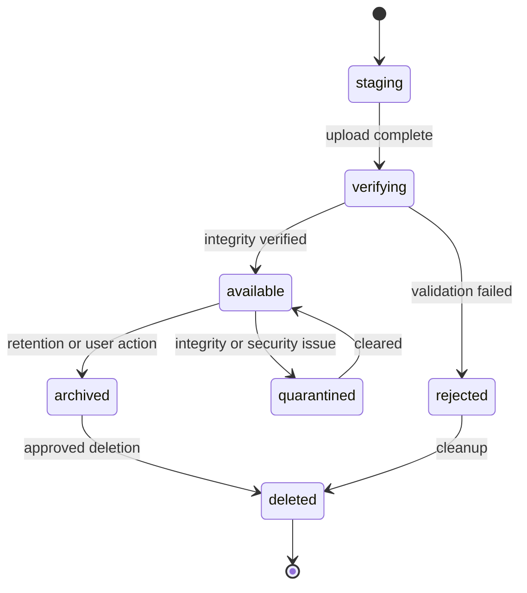

# Workforce — Artifact Protocol

**协议名：** Workforce Artifact Protocol  
**协议版本：** `0.1`  
**状态：** Draft  
**日期：** 2026-09-10

## 1. 目的

Artifact Protocol 定义 Workforce 中可持久化、可寻址、可验证、可授权和可追溯的工作产物。它统一表示代码、文件、结构化数据、网页、消息和外部资源，使不同 Worker、Runtime、Workflow 与人类能够可靠交接结果。

核心目标：

- 内容与元数据分离，避免数据库承载大文件
- 每个产物关联 Project、Task、Run 和创建者
- 版本不可变，变更产生新版本
- 内容在注册前完成完整性校验
- 输入、派生过程和输出形成可查询血缘
- 权限、数据分类和保留策略贯穿生命周期
- Artifact 可作为 Task input、Evaluation evidence 和 Approval subject

Artifact 不等同于临时 stdout、UI 消息或 Event。只有需要保存、交接、验收或审计的结果才注册为 Artifact。

## 2. Artifact Envelope

```json
{
  "protocol": "workforce.artifact",
  "protocolVersion": "0.1",
  "id": "art_01J...",
  "version": 1,
  "organizationId": "org_01J...",
  "projectId": "prj_01J...",
  "taskId": "tsk_01J...",
  "runId": "run_01J...",
  "outputSpecId": "out_report",
  "kind": "file",
  "subtype": "document",
  "name": "Market analysis report",
  "description": "Reviewed final report.",
  "mediaType": "application/pdf",
  "state": "available",
  "storageRef": {},
  "integrity": {},
  "sizeBytes": 284311,
  "createdBy": { "type": "worker", "id": "wkv_01J..." },
  "lineage": {},
  "classification": "internal",
  "accessPolicyRef": "pol_01J...",
  "retention": {},
  "metadata": {},
  "createdAt": "2026-09-10T00:00:00Z",
  "availableAt": "2026-09-10T00:00:01Z"
}
```

## 3. 标识、协议版本与内容版本

### 3.1 标识

- `id` 表示一个逻辑 Artifact，推荐 UUIDv7 或 ULID。
- `version` 是该逻辑 Artifact 下单调递增的正整数。
- `(id, version)` 唯一定位不可变版本。
- ID 前缀只用于可读性，不参与业务判断。
- V0.1 默认每次创建内容均分配新 `id`；只有显式更新同一逻辑产物时递增 `version`。

### 3.2 协议版本

- `protocol` 固定为 `workforce.artifact`。
- `protocolVersion` 使用 `major.minor`。
- minor 版本可增加可选字段或可忽略的枚举能力。
- 删除字段、改变字段语义或收紧合法值需要 major 版本。
- 接收方必须拒绝未知 major 版本。

### 3.3 不可变性

进入 `available` 后，以下字段不可原地修改：

- 内容及 `storageRef`
- `integrity`、`sizeBytes`、`mediaType`
- `taskId`、`runId`、`createdBy`
- lineage 的来源和 transformation

名称、描述、标签等展示信息如需更改，V0.1 也建议创建新版本并记录 `supersedes`，避免审计歧义。

## 4. 核心字段

| 字段 | 必需 | 含义 |
|---|---:|---|
| `id`, `version` | 是 | 逻辑身份与不可变版本 |
| `organizationId`, `projectId` | 是 | 治理与隔离边界 |
| `taskId`, `runId` | 是 | 产生该版本的 Task 与 Run |
| `outputSpecId` | 否 | 对应 Task `expectedOutputs[].id` |
| `kind` | 是 | 顶层产物类型 |
| `subtype` | 否 | 受控扩展类型 |
| `name` | 是 | 面向用户的短名称 |
| `mediaType` | 是 | IANA media type 或 Workforce vendor type |
| `state` | 是 | 当前生命周期状态 |
| `storageRef` | 是 | 内容位置或外部资源定位符 |
| `integrity` | 是 | 内容摘要和校验范围 |
| `sizeBytes` | 条件 | 本平台管理内容时必须提供 |
| `createdBy` | 是 | 创建者 PrincipalRef |
| `lineage` | 是 | 来源、转换、前后版本关系 |
| `classification` | 是 | 数据分类 |
| `accessPolicyRef` | 是 | 授权策略引用 |
| `retention` | 是 | 保留与删除规则 |
| `metadata` | 是 | 类型相关、可脱敏的结构化元数据 |

## 5. Artifact 类型

```ts
type ArtifactKind =
  | "file"
  | "code"
  | "data"
  | "web"
  | "message"
  | "external_resource";
```

| kind | 常见 subtype | 示例 |
|---|---|---|
| `file` | `document`, `presentation`, `spreadsheet`, `image`, `archive` | PDF、DOCX、PPTX、XLSX、PNG、ZIP |
| `code` | `git_diff`, `commit`, `branch`, `pull_request`, `repository_snapshot`, `build` | patch、commit SHA、PR 引用 |
| `data` | `json`, `csv`, `dataset`, `test_result`, `metrics` | JSON、CSV、测试报告 |
| `web` | `url`, `website`, `web_snapshot` | 发布页面、不可变网页快照 |
| `message` | `email`, `slack`, `teams`, `draft` | 邮件草稿、已发送消息引用 |
| `external_resource` | `drive_file`, `issue`, `database_record`, `generic` | Google Docs、GitHub Issue、外部记录 |

规则：

- `kind` 用于跨 Runtime 的稳定路由；`subtype` 提供领域语义。
- 新 subtype 可以扩展，但必须有注册定义和 JSON Schema。
- `external_resource` 和仅引用型 `code/web/message` Artifact 可不复制原内容，但必须保存可验证 locator 与访问条件。
- 一组多文件结果应使用 manifest Artifact；不得只依赖目录扫描推断成员。

## 6. StorageRef

```ts
type StorageRef =
  | { type: "artifact_store"; storeId: string; key: string; region?: string }
  | { type: "workspace"; workspaceId: string; relativePath: string }
  | { type: "git"; repositoryId: string; commit: string; path?: string }
  | { type: "external"; provider: string; locator: string; credentialRef?: string };
```

示例：

```json
{
  "type": "artifact_store",
  "storeId": "local-default",
  "key": "sha256/92/92db...",
  "region": "local"
}
```

约束：

- `workspace.relativePath` 必须是规范化相对路径，禁止绝对路径和 `..` 越界。
- 本地绝对路径、签名下载 URL、临时 token 和 Credential 明文不得写入 envelope。
- `artifact_store.key` 应为不透明 key；客户端通过受控 resolver 获取临时访问能力。
- `git.commit` 必须是完整不可变 commit SHA；branch 名不能单独作为最终版本引用。
- `external.locator` 应使用 provider 的稳定对象 ID，URL 仅作为辅助字段。
- 临时 Workspace 清理前，required output 必须复制至持久 Artifact Store，或证明外部引用满足保留策略。

## 7. 内容完整性

```json
{
  "integrity": {
    "algorithm": "sha256",
    "value": "92db...",
    "scope": "content",
    "verifiedAt": "2026-09-10T00:00:01Z",
    "verifiedBy": "svc_artifact_store"
  }
}
```

- V0.1 唯一必需算法为 SHA-256。
- 平台托管内容必须先写临时位置，再计算 hash、核对字节数，最后原子提交元数据。
- manifest 的 hash 覆盖 canonical JSON；成员各自保留内容 hash。
- 外部资源无法读取内容时，`scope` 可为 `external_revision`，并记录 provider revision/etag；此类 Artifact 的完整性等级低于内容 hash。
- 内容读取时可按策略重新校验；不匹配立即进入 `quarantined`，不得作为可信 Task input。
- hash 用于完整性和去重，不表示内容安全或授权。

## 8. Manifest 与复合 Artifact

多文件输出使用 media type `application/vnd.workforce.artifact-manifest+json`：

```json
{
  "schemaVersion": 1,
  "entries": [
    {
      "path": "dist/app.js",
      "artifactId": "art_js",
      "version": 1,
      "required": true
    },
    {
      "path": "dist/app.css",
      "artifactId": "art_css",
      "version": 1,
      "required": true
    }
  ]
}
```

成员路径必须唯一、规范化且排序。Manifest 本身也是 Artifact，可被评估、授权和纳入 lineage。

## 9. Lineage

```ts
interface ArtifactLineage {
  sources: Array<{
    artifactId: string;
    version: number;
    relation: "derived_from" | "transformed_from" | "combined_from" | "quoted_from";
  }>;
  inputRefs: Array<{ taskInputId: string; resolvedRef: string }>;
  transformation?: {
    type: "runtime" | "tool" | "human" | "import";
    name: string;
    version?: string;
    parametersDigest?: string;
  };
  supersedes?: { artifactId: string; version: number };
}
```

要求：

- `sources` 精确引用 `(artifactId, version)`，禁止隐式指向 latest。
- Task input 在 Run 启动时解析并冻结，结果写入 `inputRefs`。
- 自动转换应记录工具/Runtime 版本和非敏感参数摘要。
- lineage 必须形成有向无环图；注册时检测直接或间接自引用。
- `supersedes` 表示版本替代，不代表旧版本删除或失效。
- 引用网页或外部资料时优先保存 snapshot Artifact；无法快照时记录稳定 locator、访问时间和 provider revision。
- Credential、完整 Prompt 和未脱敏命令行不得写入 lineage。

## 10. 创建者与责任归属

`createdBy` 使用 Domain Model 的 `PrincipalRef`：

```ts
type PrincipalRef =
  | { type: "user"; id: string }
  | { type: "worker"; id: string }
  | { type: "service"; id: string };
```

Worker 产物中的 `id` 指向实际 `WorkerVersion`。平台代理导入外部内容时使用 service principal，并在 lineage 中保存原始来源。审批人和评估人记录在 Approval/Evaluation，不覆盖创建者。

## 11. 权限、分类与凭据

### 11.1 数据分类

```ts
type DataClassification = "public" | "internal" | "confidential" | "restricted";
```

- Artifact 分类不得低于其来源中最高等级，除非有显式、经批准的降级流程。
- 导出、外发、公开发布和跨组织复制是独立受控动作。
- `metadata`、预览、搜索索引与缩略图继承原 Artifact 分类。

### 11.2 授权动作

V0.1 至少支持：

- `artifact.read_metadata`
- `artifact.read_content`
- `artifact.create_version`
- `artifact.use_as_input`
- `artifact.export`
- `artifact.publish`
- `artifact.archive`
- `artifact.delete`

访问判定同时考虑 Principal、Organization、Project、Artifact classification、Task constraints 和上级 Policy。Task 权限只能收紧上级 Policy。

### 11.3 Credential

- Credential 只保存 `credentialRef`，由 Credential Gateway 在访问时解析。
- Artifact 内容、元数据、预览、Event 和日志都必须经过 secret scanning/redaction。
- 外部 Credential 撤销不会删除 Artifact 元数据，但可能使内容状态变为 `unavailable`。

## 12. 生命周期



状态语义：

| 状态 | 含义 |
|---|---|
| `staging` | 内容正在写入，不可作为 Task input |
| `verifying` | 正在校验 hash、大小、Schema 和安全策略 |
| `available` | 可依授权读取、引用和评估 |
| `quarantined` | 检测到完整性或安全问题，禁止使用 |
| `archived` | 不参与默认检索，但仍可审计和恢复 |
| `rejected` | 注册失败，内容等待清理 |
| `deleted` | 内容已删除；最小 tombstone 按审计策略保留 |
| `unavailable` | 外部引用暂时或永久不可访问 |

required output 只有进入 `available` 才计入 Task 输出。Runtime 声称完成不代表 Artifact 已成功注册。

## 13. 保留、归档与删除

```json
{
  "retention": {
    "policyId": "ret_default_internal",
    "retainUntil": null,
    "legalHold": false,
    "deleteMode": "content_then_tombstone"
  }
}
```

- 删除是授权命令，不是直接删除 Storage key。
- 服务先确认无 legal hold、审批要求及依赖阻塞，再删除内容。
- tombstone 至少保留 ID、版本、hash、actor、删除时间和理由，且不得包含已要求清除的敏感内容。
- 源 Artifact 删除后，下游 lineage 仍保留其 tombstone 引用。
- V0.1 不自动级联删除派生产物。
- 内容寻址去重时，只有引用计数归零且保留策略允许才能删除共享 blob。

## 14. Task 输出绑定与验收

Artifact 注册请求可携带 `outputSpecId`：

```json
{
  "taskId": "tsk_auth_implementation",
  "runId": "run_auth_1",
  "outputSpecId": "out_tests",
  "artifactId": "art_test_result",
  "version": 1
}
```

Artifact Service 必须验证：

1. Run 属于该 Task 且仍允许发布输出。
2. creator 与 Run 的 Worker/授权服务一致。
3. kind、mediaType、schema 和 cardinality 符合 OutputSpec。
4. 内容完整性、安全策略和 Workspace scope 通过。
5. required output 全部 available 后，Task 才可进入 `waiting_review`。

同一 output slot 的替换必须创建新 Artifact 版本或新 Artifact，并以事件明确 supersede；不能静默覆盖。

## 15. Evaluation

Evaluation 是独立一级对象，Artifact 只保存派生摘要或 ID，不内嵌可变评分：

```json
{
  "id": "eval_01J...",
  "subjectRef": { "type": "artifact", "id": "art_01J...", "version": 1 },
  "evaluator": { "type": "worker", "id": "wkv_reviewer_2" },
  "method": "rule",
  "scores": { "correctness": 1.0, "completeness": 0.95 },
  "verdict": "pass",
  "evidenceRefs": [
    { "type": "artifact", "id": "art_test_result", "version": 1 }
  ],
  "createdAt": "2026-09-10T00:05:00Z"
}
```

- Evaluation 必须绑定精确 Artifact 版本。
- 新 Artifact 版本不会继承旧版本的 pass verdict。
- 自动测试结果本身应注册为 Artifact，供 Evaluation 作为证据引用。
- 必需 acceptance criteria 的 Evaluation 全部通过，Task 才可 completed。
- waiver 是带授权者和理由的独立决定，不能伪装成 pass。

## 16. Artifact Events

所有状态和绑定变化写入追加式 Event Store。V0.1 事件至少包括：

- `artifact.staging_started`
- `artifact.content_uploaded`
- `artifact.verification_started`
- `artifact.registered`
- `artifact.available`
- `artifact.verification_failed`
- `artifact.quarantined`
- `artifact.quarantine_cleared`
- `artifact.version_created`
- `artifact.bound_to_output`
- `artifact.archived`
- `artifact.deletion_requested`
- `artifact.deleted`
- `artifact.external_unavailable`

事件使用 Domain Event envelope，包含 `schemaVersion`、organization/project/task/run、sequence、actor、correlationId 和 causationId。Event payload 只保存 Artifact 引用、状态及脱敏原因；不得复制大内容、Credential 或签名 URL。

## 17. 注册协议与幂等

推荐三阶段：

1. `begin`: 校验权限并分配 Artifact ID、版本和 staging target。
2. `commit`: 提交预期 hash、大小、mediaType 与 lineage。
3. `verify`: 服务端验证后发布 `artifact.available`。

```json
{
  "commandId": "cmd_01J...",
  "idempotencyKey": "artifact:run_auth_1:out_tests:attempt_1",
  "expected": {
    "sha256": "92db...",
    "sizeBytes": 18342
  }
}
```

- 同一 idempotency key 与相同 payload 返回原结果。
- 同一 key 与不同 payload 返回 conflict。
- 并发创建同一逻辑版本使用 optimistic concurrency。
- 服务崩溃后 reconciler 可根据 staging record 继续 verify 或安全清理，不得生成重复 available 版本。

## 18. Error Model

```json
{
  "code": "ARTIFACT_INTEGRITY_MISMATCH",
  "message": "Artifact content does not match the declared SHA-256 digest.",
  "retryable": false,
  "details": {
    "artifactId": "art_01J...",
    "version": 1
  },
  "correlationId": "cor_01J..."
}
```

错误类别与建议代码：

| 类别 | 代码示例 | retryable |
|---|---|---:|
| validation | `ARTIFACT_SCHEMA_INVALID` | 否 |
| storage | `ARTIFACT_STORE_UNAVAILABLE` | 是 |
| integrity | `ARTIFACT_INTEGRITY_MISMATCH` | 否 |
| policy | `ARTIFACT_ACCESS_DENIED` | 否 |
| lineage | `ARTIFACT_LINEAGE_CYCLE` | 否 |
| conflict | `ARTIFACT_VERSION_CONFLICT` | 视情况 |
| external | `ARTIFACT_EXTERNAL_UNAVAILABLE` | 是 |
| retention | `ARTIFACT_LEGAL_HOLD` | 否 |
| security | `ARTIFACT_QUARANTINED` | 否 |

错误 details 必须脱敏。存储内部路径、provider 响应、扫描命中内容和 Credential 信息只进入受限诊断系统。

## 19. 完整示例

```json
{
  "protocol": "workforce.artifact",
  "protocolVersion": "0.1",
  "id": "art_auth_changes",
  "version": 1,
  "organizationId": "org_local",
  "projectId": "prj_demo",
  "taskId": "tsk_auth_implementation",
  "runId": "run_auth_1",
  "outputSpecId": "out_diff",
  "kind": "code",
  "subtype": "git_diff",
  "name": "Authentication implementation diff",
  "description": "Code and tests implementing email/password authentication.",
  "mediaType": "text/x-diff",
  "state": "available",
  "storageRef": {
    "type": "artifact_store",
    "storeId": "local-default",
    "key": "sha256/92/92dbf78a4c...",
    "region": "local"
  },
  "integrity": {
    "algorithm": "sha256",
    "value": "92dbf78a4c...",
    "scope": "content",
    "verifiedAt": "2026-09-10T00:20:01Z",
    "verifiedBy": "svc_artifact_store"
  },
  "sizeBytes": 18342,
  "createdBy": {
    "type": "worker",
    "id": "wkv_developer_3"
  },
  "lineage": {
    "sources": [
      {
        "artifactId": "art_implementation_plan",
        "version": 1,
        "relation": "derived_from"
      }
    ],
    "inputRefs": [
      {
        "taskInputId": "in_plan",
        "resolvedRef": "artifact:art_implementation_plan:1"
      },
      {
        "taskInputId": "in_repo",
        "resolvedRef": "git:repo_demo:9f13b5e8..."
      }
    ],
    "transformation": {
      "type": "runtime",
      "name": "codex-adapter",
      "version": "0.1.0",
      "parametersDigest": "sha256:12ac..."
    }
  },
  "classification": "internal",
  "accessPolicyRef": "pol_project_default_v1",
  "retention": {
    "policyId": "ret_project_default",
    "retainUntil": null,
    "legalHold": false,
    "deleteMode": "content_then_tombstone"
  },
  "metadata": {
    "baseCommit": "9f13b5e8...",
    "changedFiles": 8,
    "additions": 421,
    "deletions": 33
  },
  "createdAt": "2026-09-10T00:20:00Z",
  "availableAt": "2026-09-10T00:20:01Z"
}
```

## 20. V0.1 实现范围

V0.1 必须实现：

- 六种顶层 kind 与受控 subtype 注册表
- `(id, version)` 不可变版本定位
- 本地 Artifact Store 与 Workspace 相对路径导入
- SHA-256、大小和 media type 校验
- Artifact 注册、读取、归档和受控删除
- Task output binding 与 required output 完整性检查
- 精确版本 lineage 和环路检测
- `public/internal/confidential/restricted` 分类及基础 Policy 检查
- SQLite 元数据、追加式 Artifact Events 和崩溃 reconcile
- JSON、文本、diff、测试结果、通用文件及 manifest
- External resource 稳定引用与 unavailable 状态

V0.1 明确不做：

- 跨区域、多租户对象存储复制
- 完整数字签名、时间戳权威和供应链证明系统
- 自动语义血缘推断
- 任意 provider 的双向实时同步
- 内容级协同编辑或 CRDT
- 全文搜索、向量索引和自动长期 Memory 提取
- 自动级联删除派生产物
- 大规模 Dataset 分片、流式查询和湖仓能力

## 21. 实现不变量

1. Artifact 必须关联一个 Project、Task、Run 与创建者。
2. required output 未进入 `available`，Run 成功也不能使 Task 进入验收。
3. `available` 内容不可原地覆盖；任何变化产生新版本或新 Artifact。
4. 平台托管内容必须保存 SHA-256 和字节数。
5. lineage 永远引用精确版本，并且不得形成环。
6. Credential 明文、签名 URL 和本地绝对路径不得进入 Artifact envelope、metadata、Event 或普通日志。
7. Artifact classification 不得未经批准低于来源最高分类。
8. 所有状态改变、output 绑定、版本创建和删除都产生 Event。
9. 删除不得破坏审计链；legal hold 优先于删除请求。
10. Evaluation 和 Approval 必须绑定精确 Artifact 版本。

## 22. 后续协议依赖

- Runtime Protocol 必须定义 Runtime 如何声明、上传并提交 Artifact。
- Workflow State Machine 必须以 `artifact.available` 和 Evaluation verdict 驱动验收转换。
- Event Model 必须冻结本文件列出的事件 envelope、顺序和重放规则。
- Database Schema 必须分离 Artifact、ArtifactVersion、StorageObject、LineageEdge 与 OutputBinding。
- API Design 必须提供幂等注册、受控下载、版本查询、lineage 查询、归档和删除命令。
