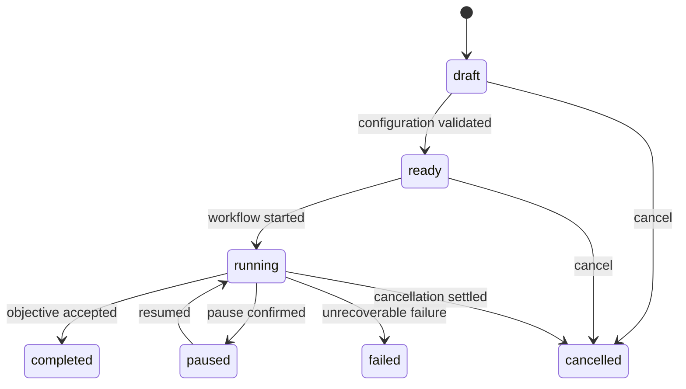
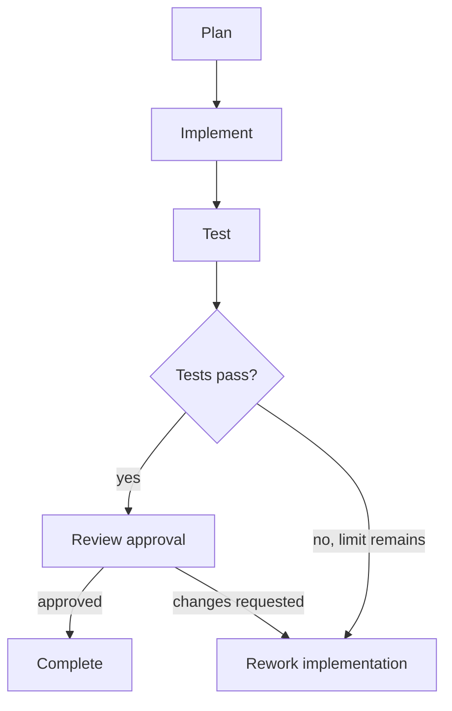

# Workforce — Workflow State Machine

**协议名：** Workforce Workflow State Machine  
**版本：** `0.1`  
**状态：** Draft  
**日期：** 2026-09-10

## 1. 目的

本文定义 Workflow 从静态编排到可恢复执行的语义，包括节点依赖、状态转换、调度、审批、重试、返工、超时、取消和故障恢复。它不规定 Worker 的内部推理，也不取代 Task、Runtime 或 Event Protocol。

设计目标：

- 同一 WorkflowDefinition 可在多个 Project 中复用
- 执行使用不可变版本快照，后续编辑不改变历史
- 用有限 DAG 表达确定性编排，V0.1 不实现任意循环
- 所有状态变化可审计、可重放、可协调
- 进程崩溃后依据持久化事实恢复，而非依赖内存状态
- Project、WorkflowInstance、Task 与 Run 状态保持清晰分层

## 2. 核心对象

### 2.1 WorkflowDefinition 与 WorkflowVersion

`WorkflowDefinition` 是逻辑身份；每次发布产生不可变 `WorkflowVersion`。

```ts
interface WorkflowDefinition {
  id: WorkflowId;
  organizationId: OrganizationId;
  name: string;
  activeVersionId?: WorkflowVersionId;
}

interface WorkflowVersion {
  id: WorkflowVersionId;
  workflowId: WorkflowId;
  version: number;
  entryNodeIds: WorkflowNodeId[];
  nodes: WorkflowNode[];
  edges: WorkflowEdge[];
  failurePolicy: WorkflowFailurePolicy;
  concurrencyPolicy: WorkflowConcurrencyPolicy;
  immutable: true;
  publishedAt: Timestamp;
}
```

草稿可编辑；发布时必须通过 Schema、引用、DAG 和策略校验。已发布版本不得原地修改。

### 2.2 WorkflowInstance

`WorkflowInstance` 是某个 Project 对指定 WorkflowVersion 的一次执行实例。

```ts
interface WorkflowInstance {
  id: WorkflowInstanceId;
  projectId: ProjectId;
  workflowVersionId: WorkflowVersionId;
  status: WorkflowInstanceStatus;
  revision: number;
  inputBindings: Record<string, InputRef>;
  policySnapshotRef: SnapshotRef;
  budgetSnapshotRef?: SnapshotRef;
  startedAt?: Timestamp;
  endedAt?: Timestamp;
  cancellationRequestedAt?: Timestamp;
  failure?: FailureRecord;
  createdAt: Timestamp;
  updatedAt: Timestamp;
}
```

一个 Project 在 V0.1 最多有一个活动 WorkflowInstance；未来可支持多个独立实例。实例启动时冻结 WorkflowVersion、Team/Worker、Policy 和关键配置引用。

### 2.3 Node 与 Edge

```ts
type WorkflowNode =
  | TaskNode
  | ApprovalNode
  | ConditionNode
  | ParallelNode;

interface WorkflowEdge {
  id: WorkflowEdgeId;
  from: WorkflowNodeId;
  to: WorkflowNodeId;
  condition?: EdgeCondition;
  inputBindings?: InputBinding[];
  onUpstream?: "completed" | "failed" | "cancelled" | "any_terminal";
}
```

- `TaskNode`：实例化一个 Task，并等待 Task 达到终态。
- `ApprovalNode`：创建 ApprovalRequest，等待人类或授权 Principal 决策。
- `ConditionNode`：基于结构化输入选择分支；表达式必须可确定性求值。
- `ParallelNode`：显式标记并行扇出/汇合语义；底层仍展开为 DAG 依赖。

V0.1 的边只能引用上游结构化结果、Evaluation、Approval 决策和 Artifact 元数据，不能执行任意脚本。

## 3. DAG 规则

发布 WorkflowVersion 时执行以下验证：

1. Node ID 在版本内唯一，所有 Edge 端点存在。
2. 至少有一个入口节点，且所有节点可从入口到达。
3. 拓扑排序必须成功，不允许自环或循环依赖。
4. Condition 的默认分支最多一个；可能命中的分支必须明确互斥或声明优先级。
5. 汇合节点必须声明 `joinPolicy`：`all_success`、`all_terminal` 或 `min_success`。
6. Edge 的 Artifact binding 必须引用上游声明的 expected output。
7. 所有 Approval、retry 和 rework 次数均有硬上限。
8. 入口至终点至少存在一条可达路径。

节点只有在所有必需前驱满足 Edge 条件和 join policy 后才 eligible。未被选中的条件分支标记为 `skipped`，不会阻塞汇合。

## 4. 状态层级

状态属于不同聚合，不能互相替代：

| 层级 | 说明 | 主要终态 |
|---|---|---|
| Project | 用户目标的总体生命周期 | `completed`、`failed`、`cancelled` |
| WorkflowInstance | 某编排版本的一次执行 | `completed`、`failed`、`cancelled` |
| NodeInstance | Workflow 节点的一次实例化结果 | `completed`、`failed`、`skipped`、`cancelled` |
| Task | 可分配、可验收的工作单元 | `completed`、`failed`、`cancelled` |
| Run | Task 的一次执行尝试 | `succeeded`、`failed`、`timed_out`、`cancelled` |

### 4.1 Project 状态

```ts
type ProjectStatus =
  | "draft" | "ready" | "running" | "paused"
  | "completed" | "failed" | "cancelled";
```



Project `paused` 阻止启动新 Run，但不自动杀死已运行进程；暂停策略决定当前 Run 是继续至安全点还是进入 paused。

### 4.2 WorkflowInstance 状态

```ts
type WorkflowInstanceStatus =
  | "created" | "validating" | "ready" | "running"
  | "waiting" | "paused" | "cancelling"
  | "completed" | "failed" | "cancelled";
```

- `waiting`：没有可立即调度节点，但正在等待审批、输入、重试时间或外部完成信号。
- `paused`：用户或 Policy 已暂停，禁止新调度。
- `cancelling`：取消已被接受，正在终止/收尾活动 Run。

### 4.3 NodeInstance 状态

```ts
type NodeInstanceStatus =
  | "pending" | "blocked" | "ready" | "active" | "waiting"
  | "completed" | "failed" | "skipped" | "cancelled";
```

NodeInstance 记录 `nodeId`、`workflowInstanceId`、`attempt/reworkGeneration`、关联 Task 或 Approval，以及输入解析快照。

### 4.4 Task 状态

沿用 Task Protocol：

```text
draft → blocked/ready → queued → running → waiting_review → completed
                                      └→ failed → ready（允许重试）
queued/running → cancelled
waiting_review → ready（changes requested）
```

Task `completed` 后不可重新打开。后续返工生成新 Task revision 对应的新 NodeInstance generation，或生成明确的 follow-up Task。

### 4.5 Run 状态

```ts
type RunStatus =
  | "pending" | "starting" | "running" | "waiting_input" | "paused"
  | "succeeded" | "failed" | "timed_out" | "cancelled";
```

Run `succeeded` 仅表示 Runtime 成功结束；Task 仍需检查 Artifact 和 Acceptance Criteria。

## 5. WorkflowInstance 转换表

| 当前状态 | 命令/事实 | 守卫条件 | 下一状态 | 主要副作用 |
|---|---|---|---|---|
| `created` | `validate` | 版本存在 | `validating` | 冻结输入和策略引用 |
| `validating` | validation passed | DAG、绑定、权限、预算有效 | `ready` | 创建 NodeInstance |
| `validating` | validation failed | — | `failed` | 记录结构化失败 |
| `ready` | `start` | Project 可运行 | `running` | 激活入口节点 |
| `running` | no runnable work | 存在非终态等待项 | `waiting` | 设置下一唤醒时间 |
| `waiting` | signal/dependency/timer | 节点变为 eligible | `running` | 入队 ready 节点 |
| `running`/`waiting` | `pause` | Policy 允许 | `paused` | 阻止新调度并处理活动 Run |
| `paused` | `resume` | 阻塞原因解除 | `running` | reconcile 后恢复调度 |
| `running`/`waiting`/`paused` | `cancel` | 非终态 | `cancelling` | 发出子级取消请求 |
| `cancelling` | all children settled | 无活动 Run | `cancelled` | 保留 Workspace 和 Artifact |
| `running`/`waiting` | completion evaluated | 所有必需终点成功 | `completed` | 更新 Project/输出 |
| `running`/`waiting` | unrecoverable failure | recovery exhausted | `failed` | 记录根因和未执行节点 |

任何未列出的转换均非法，并返回 `WORKFLOW_INVALID_TRANSITION`。修改命令使用 `expectedRevision` 做乐观并发控制。

## 6. Scheduler

Scheduler 是事件驱动的持久化协调器，而不是定时扫描器的内存队列。

每轮调度：

1. 读取 WorkflowInstance 和最新 materialized state。
2. 获取实例级短租约；重复消费者只能有一个提交状态。
3. 对受影响子图重新计算 eligibility，不必遍历所有实例。
4. 检查 Project 状态、依赖、审批、预算、Policy、能力和并发额度。
5. 以事务方式将 Node/Task 置为 ready/queued 并写 Outbox Event。
6. Runtime Dispatcher 消费命令并启动 Run。
7. 结果事件触发下一轮推进。

排序建议：`priority DESC`、`eligibleAt ASC`、`createdAt ASC`。优先级不能绕过权限、预算和依赖守卫。

### 6.1 Lease 与幂等

- 调度 lease 只授予推进权，不证明 Runtime 已停止或正在运行。
- `start run` 的幂等键为 `start:{taskId}:revision:{revision}:attempt:{attempt}`。
- 相同命令重复投递返回原 Run；不同 payload 使用相同 key 返回 conflict。
- lease 过期触发 reconcile，禁止直接创建重复 Run。

## 7. 并发与汇合

并发限制按最严格层级共同生效：

```text
Organization → Project → Workflow → Worker → Runtime → Workspace/concurrencyKey
```

- 默认同一可写 Workspace 同时只允许一个 Run。
- Git coding 任务可通过独立 worktree 获得不同 concurrency key。
- Worker/Runtime 的容量通过计数 semaphore 或 lease 管理。
- `all_success`：所有选中分支 completed 才放行；任一失败按 failure policy 处理。
- `all_terminal`：等待所有选中分支终结，并把结果集合交给下游。
- `min_success(n)`：至少 n 个分支成功；其余分支按策略取消或允许收尾。
- 分支完成顺序不得影响聚合结果；输入按稳定 Node ID 排序。

V0.1 不支持推测执行和同一 Task 的竞争性多 Run。

## 8. Retry、Rework 与 Reassign

### 8.1 Retry

Retry 处理同一 Task 的执行失败：

- 每次重试创建新 Run，`attempt` 单调增加，旧 Run 永不覆盖。
- 只对 policy 中声明的 retryable error 生效。
- backoff 计算结果持久化为 `nextAttemptAt`；重启后不重置等待时间。
- 非幂等副作用在重试前必须确认是否已发生，否则转人工处理。
- 达到 `maxAttempts` 后执行 Task/Workflow failure policy。

### 8.2 Rework

Rework 处理“执行成功但验收未通过”：

- `changes_requested` 必须包含 criterion、证据和修改说明。
- 原 Run 与 Artifact 保留；创建新 generation/revision 及新 Run。
- 新 Task 明确引用前一版本 Artifact 和 Review 作为输入。
- `maxReworkCycles` 是硬上限，达到后失败或升级人工。
- Approval reject 表示不接受当前结果；是否允许 rework 由节点策略决定。

Retry 不改变目标；Rework 可在受控范围内修订 instructions，但不得静默改变 objective、权限或预算上限。

### 8.3 Reassign

重新分配只影响后续 Run。已经启动的 Run 先按策略 cancel/pause/finish；新 Run 记录新的 WorkerVersion 和 RuntimeSnapshot。Supervisor 的 reassign 必须经过 Policy 并产生审计事件。

## 9. Approval 与人工等待

ApprovalNode 或受保护动作会创建独立 ApprovalRequest：

```text
pending → approved | rejected | changes_requested | expired | cancelled
```

- `approved`：满足 Edge 条件后继续。
- `changes_requested`：进入有界 rework 路径。
- `rejected`：按策略失败、跳过或升级，默认不等同于 changes requested。
- `expired`：触发 timeout policy，不得默认为批准。
- 重复决策通过 idempotency key 合并；相互冲突的后续决策返回 conflict。
- Workflow 等待审批时为 `waiting`，不是 `failed`。

V0.1 支持单一审批者或“任一授权审批者”；多人 quorum 留待后续版本。

## 10. Timeout 与 Deadline

区分以下时间限制：

| 类型 | 起点 | 典型动作 |
|---|---|---|
| Run timeout | Runtime 启动确认 | 请求终止，Run → `timed_out` |
| Node timeout | Node active/waiting 起点 | retry、fail 或 escalate |
| Approval expiry | Approval 创建 | expire 并执行策略 |
| Workflow deadline | Instance 指定时间 | pause、cancel 或 request approval |
| Project deadline | Project 策略指定时间 | 阻止新 Run 并升级 |

Timer 必须持久化，使用 UTC 时间戳。超时是事件，不是本地进程“消失”的推断。Runtime 未确认终止时先标记 cancellation pending，经 reconcile 后才能确定终态。

## 11. Pause、Cancel 与终止传播

### 11.1 Pause

- 停止调度新 Run。
- 活动 Run 根据 `pauseMode`：`checkpoint`、`finish_current` 或 `request_runtime_pause`。
- 不支持 pause 的 Runtime 不得伪造 paused；改为安全收尾或取消。
- resume 前执行 reconcile，并重新检查 Policy、Credential、预算和 Workspace。

### 11.2 Cancel

取消是请求及收敛过程：

1. WorkflowInstance 进入 `cancelling`。
2. 未启动节点变为 `cancelled`；等待审批同步取消。
3. 活动 Run 收到带 reason/deadline 的 cancel 命令。
4. Runtime 确认、进程观察或安全超时后 Run 进入 `cancelled`。
5. 所有子级 settled 后实例进入 `cancelled`。

已完成 Artifact 不删除；Workspace 按保留策略保存。Project 取消后禁止启动任何新 Run。

## 12. Failure Policy 与恢复

```ts
interface WorkflowFailurePolicy {
  default: "fail_fast" | "continue_independent" | "request_human";
  maxReworkCycles: number;
  onRuntimeUnavailable: "retry" | "reassign" | "request_human" | "fail";
  onBudgetExceeded: "pause" | "request_approval" | "fail";
  onDependencyFailure: "skip" | "fallback" | "request_human" | "fail";
}
```

错误先归类再恢复：

| 类别 | 例子 | 默认处理 |
|---|---|---|
| transient | Runtime 临时不可用、可重试工具错误 | 有界 retry |
| capacity | Worker/并发额度不足 | 等待或 reassign |
| validation | 输入/Schema 不合法 | fail，不自动重试 |
| policy | 权限拒绝、Credential 不可用 | request human 或 fail |
| budget | 成本/时间上限 | pause/request approval |
| quality | 验收失败 | 有界 rework |
| infrastructure | daemon 崩溃、连接丢失 | reconcile 后决定 |

`fail_fast` 只取消尚未产生必要副作用的同级活动；已经发生的外部副作用必须记录并交由补偿或人工处置。V0.1 不提供通用事务回滚，只允许节点定义显式 compensation Task。

## 13. Checkpoint

Checkpoint 是恢复提示，不是真实状态的替代品。

必须持久化的检查点：

- WorkflowInstance revision 与物化状态
- 已完成/跳过/失败 NodeInstance 集合
- Task revision 和每个 Run 的不可变执行快照
- 未决 Approval、Timer、Retry schedule
- Artifact 引用、完整性摘要和 lineage
- Runtime resume token（若 Adapter 支持）
- usage、budget reservation 和实际消耗
- 最新连续 Event sequence/high-water mark

Checkpoint 必须带 schema version、创建时间和 checksum。无法恢复 Runtime 内部状态时，从最后一个安全 Task 边界新建 Run，不得假装续跑。

## 14. Reconcile

以下情况必须 reconcile：Daemon 启动、lease 过期、Runtime 断连、状态冲突、resume 以及定期健康检查。

流程：

1. 读取 Event Store、数据库物化状态、活动 lease 和 Runtime observed status。
2. 验证每个 active Task 是否最多有允许数量的非终态 Run。
3. 查询 Runtime Adapter；将 `unknown` 与 `failed` 区分处理。
4. 注册尚未入库但可验证的 Artifact/usage 结果。
5. 对丢失进程创建 `runtime_lost` 事实，再按 retry policy 决策。
6. 修复可重建的投影视图，不修改历史 Event。
7. 释放确认失效的 lease，重新计算 eligible nodes。

冲突时采用更安全的状态：不重复副作用、不自动批准、不扩大权限、不超预算。无法确定时进入 `waiting` 并请求人工处理。

## 15. Event 与事务边界

所有状态转换必须在一个本地数据库事务中完成：

1. 校验 expected revision 和守卫条件。
2. 更新聚合状态。
3. 追加带 actor、reason、correlationId、causationId 的 Domain Event。
4. 写入 Outbox command/event。

典型事件：

```text
workflow.instance.created
workflow.instance.started
workflow.node.ready
workflow.node.skipped
task.queued
run.started
run.failed
task.review_requested
approval.decided
workflow.retry_scheduled
workflow.rework_requested
workflow.cancellation_requested
workflow.instance.completed
```

Event 至少一次投递；消费者必须幂等。Event Store 是审计事实来源，物化表用于高效查询，二者不一致时通过 projection rebuild/reconcile 修复。

## 16. 系统不变量

1. 一个 WorkflowInstance 永远绑定一个不可变 WorkflowVersion。
2. V0.1 Workflow 图必须为 DAG，任何 retry/rework 均受次数上限约束。
3. Task 只有在依赖、输入、审批、权限和预算均满足时才可 queued。
4. 同一 Task revision 同时最多存在策略允许数量的活动 Run；V0.1 固定为一个。
5. 每次 retry/rework 都创建新 Run，历史 Run 和 Artifact 不得覆盖。
6. Run `succeeded` 不自动等于 Task `completed`。
7. 所有必需 Acceptance Criteria 通过或获得有权限的显式 waiver 后，Task 才能 completed。
8. Project/Workflow 取消后不得启动新 Run。
9. 未知 Runtime 状态不得直接转换为 failed 或重新执行，必须先 reconcile。
10. Condition 只使用已持久化、版本化输入，并记录求值结果。
11. 所有状态转换产生 Event；所有外部命令携带 idempotency key。
12. Credential 明文不得进入 Workflow definition、Checkpoint、Event 或错误记录。
13. 子级状态只通过规则汇总到父级，禁止直接手工伪造父级完成。
14. Budget 预留和消耗不得超过上级硬限制，除非存在显式审批的新预算版本。

## 17. 示例：软件开发 Workflow



示例定义（节选）：

```json
{
  "protocol": "workforce.workflow",
  "protocolVersion": "0.1",
  "version": 1,
  "entryNodeIds": ["plan"],
  "nodes": [
    { "id": "plan", "type": "task", "taskTemplate": "software.plan" },
    { "id": "implement", "type": "task", "taskTemplate": "software.implement" },
    { "id": "test", "type": "task", "taskTemplate": "software.test" },
    { "id": "test_gate", "type": "condition", "expression": "evaluation:test.verdict" },
    { "id": "review", "type": "approval", "action": "code.accept" },
    { "id": "rework", "type": "task", "taskTemplate": "software.rework", "maxGenerations": 2 },
    { "id": "done", "type": "parallel", "joinPolicy": "all_success" }
  ],
  "failurePolicy": {
    "default": "request_human",
    "maxReworkCycles": 2,
    "onRuntimeUnavailable": "retry",
    "onBudgetExceeded": "request_approval",
    "onDependencyFailure": "fail"
  }
}
```

虽然图上展示“返工回到实现”，持久化定义仍展开为有限 generation（如 `implement_g1`、`implement_g2`），因此运行图保持 DAG，不形成无限循环。

## 18. V0.1 实现范围

必须实现：

- 发布并冻结 WorkflowVersion
- 单 Project 单活动 WorkflowInstance
- Task、Approval、Condition、Parallel/Join 四类节点
- DAG 校验、拓扑推进和条件分支 skip
- Task/Run 分层状态机
- 持久化 Scheduler、lease、幂等命令和乐观并发
- 单工作区写并发保护
- 有界 retry、exponential backoff 和有界 rework
- Approval approve/reject/request changes/expire
- pause、resume、cancel、timeout
- Event + Outbox，Daemon 重启后的 reconcile
- fail-fast、continue-independent、request-human 基础策略

明确不做：

- 任意循环、递归 Workflow 或无限自我拆分
- 用户自定义脚本表达式和通用 BPMN
- 动态修改运行中的 Workflow 图
- 分布式多 Scheduler 共识；V0.1 为单 Daemon，本地 SQLite
- 通用事务补偿/自动回滚外部副作用
- 多人 quorum 审批、推测执行和竞速 Run
- 历史任意事件点的完整 time-travel replay UI

## 19. 验收标准

实现满足以下测试才视为完成：

1. 非法环路、失效引用和不完整 binding 无法发布。
2. 并行节点乱序完成仍产生相同确定性结果。
3. 重复 `start/cancel/approve` 命令不会产生重复 Run 或决策。
4. Daemon 在 Run 期间崩溃并重启后，不重复启动已存在进程。
5. retry/rework 达到上限后可靠进入配置的失败或人工路径。
6. cancellation 传播完成前实例保持 `cancelling`。
7. Runtime 成功但 Artifact/验收失败时 Task 不会 completed。
8. Project 暂停或预算超限时不会调度新 Run。
9. Event Log 能解释每一次状态转换的 actor、reason 与因果链。

## 20. 后续文档接口

- Event Model：冻结本文事件 envelope、sequence 和投影规则。
- Database Schema：映射 WorkflowVersion、Instance、NodeInstance、Timer、Lease、Outbox 和 Checkpoint。
- API Design：定义 validate/publish/start/pause/resume/cancel/retry/rework/approve 命令。
- MVP Implementation Plan：将调度器、状态机与 reconcile 拆分为可测试里程碑。
