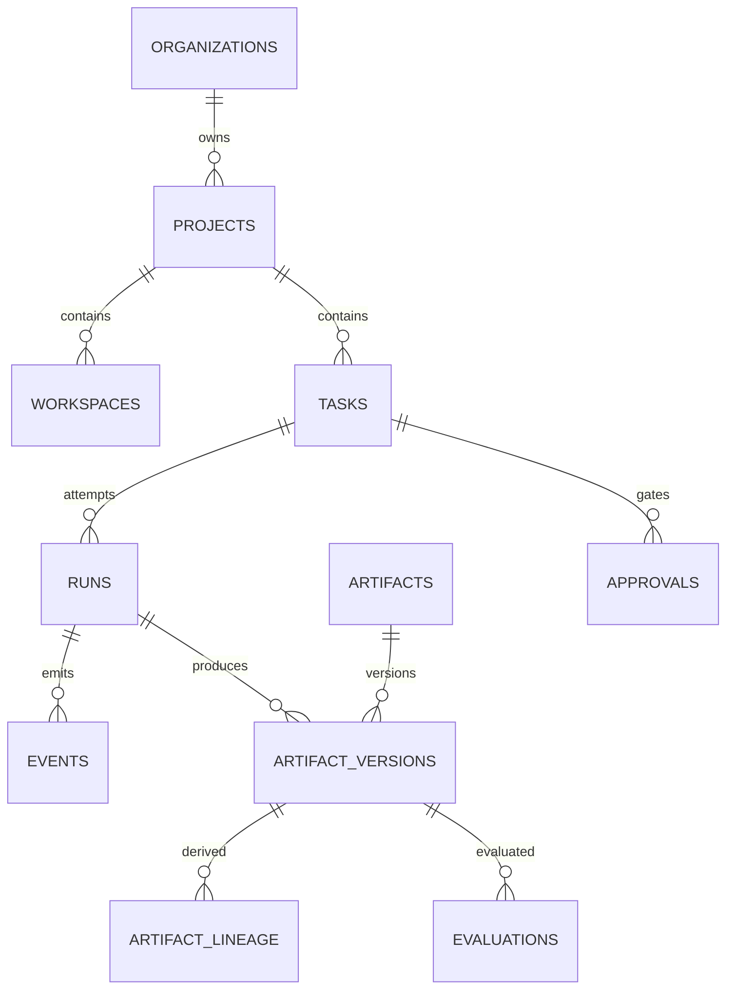

# Workforce — Database Schema

**版本：** V0.1 Draft  
**状态：** Architecture baseline  
**日期：** 2026-09-11

## 1. 目标与原则

数据库承载 Workforce 的业务事实、可恢复执行状态和完整审计链。V0.1 使用 SQLite，模型保持 PostgreSQL 可迁移性。

- Organization 是租户隔离边界；所有业务查询必须显式带 `organization_id`。
- Task 与 Run 分离；重试创建新 Run，不覆盖历史。
- 已用于执行的配置以不可变 version/snapshot 保存。
- Event、ArtifactVersion、Evaluation 和 Approval 保留历史，不做原地改写。
- 大文件不进入数据库；数据库只保存元数据、哈希和 StorageRef。
- ID 使用应用生成的 UUIDv7/ULID 文本；时间统一为 UTC ISO-8601，迁移 PostgreSQL 后使用 `timestamptz`。
- 可扩展结构使用 JSON，但身份、关系、状态、排序和高频过滤字段必须关系化。

## 2. 数据库演进

| 阶段 | 引擎 | 用途 | 约束 |
|---|---|---|---|
| V0.1 | SQLite（WAL） | 单机、本地模式、Desktop/Daemon | 单写者协调；不承担多租户云并发 |
| V0.x | SQLite + 同步边界 | 本地缓存、离线运行 | 云端 ID、事件游标和冲突策略预留 |
| V1 | PostgreSQL | 云端控制面、多用户协作 | RLS 可选；队列锁、JSONB、分区表 |

兼容策略：不依赖 SQLite 隐式类型、`rowid` 或业务关键 trigger；布尔值由 ORM 映射；JSON 字段必须经 schema 校验；枚举在应用层和 CHECK 约束双重校验。

## 3. 关系总览



Team、Worker、Workflow 使用“逻辑实体 + 不可变版本”模式；Project/Run 引用具体版本，确保历史可复现。

## 4. 核心表

以下类型采用逻辑类型：`id` 表示 `text`，`timestamp` 表示 SQLite `text` / PostgreSQL `timestamptz`，`json` 表示 SQLite `text` / PostgreSQL `jsonb`。

### 4.1 租户、成员与项目

| 表 | 关键列 | 约束与说明 |
|---|---|---|
| `organizations` | `id`, `name`, `slug`, `settings_json`, timestamps | `slug` UNIQUE |
| `principals` | `id`, `organization_id`, `type`, `external_id`, `display_name` | 用户、服务或 Worker 身份；UNIQUE `(organization_id,type,external_id)` |
| `projects` | `id`, `organization_id`, `name`, `objective`, `status`, `team_version_id`, `workflow_version_id`, `execution_snapshot_id`, `context_ref`, timestamps | Draft 可暂为空；计划确认后 `team_version_id` 与 `execution_snapshot_id` 必须非空，FK 均限制在同一组织 |
| `workspaces` | `id`, `organization_id`, `project_id`, `kind`, `platform`, `root_ref`, `isolation`, `status`, `repository_json`, timestamps | `root_ref` 不得保存凭据；软归档用 `archived_at` |

### 4.2 配置及不可变版本

| 逻辑实体表 | 版本表 | 版本表关键列 |
|---|---|---|
| `teams` | `team_drafts` / `team_versions` | Draft `revision`, `status`, `definition_json`, `content_hash`, `updated_at`；published version `version`, `source_draft_id`, `content_hash`, `published_at` |
| `workers` | `worker_versions` | `worker_id`, `version`, `role_id`, `runtime_profile_version_id`, `prompt_version_id`, `policy_version_id`, `definition_json`, `content_hash` |
| `workflows` | `workflow_drafts` / `workflow_versions` | 草稿 `revision`, `graph_json`, `content_hash`；发布版本 `workflow_id`, `version`, `graph_json`, `content_hash`, `published_at` |
| `runtime_profiles` | `runtime_profile_versions` | `runtime_profile_id`, `version`, `adapter_type`, `adapter_version`, `model`, `transport`, `placement_json`, `config_json`, `capabilities_json` |
| `policies` | `policy_versions` | `policy_id`, `version`, `rules_json`, `content_hash` |
| `prompts` | `prompt_versions` | `prompt_id`, `version`, `content_ref`, `content_hash` |

每个版本表：UNIQUE `(parent_id, version)`；一旦被 Project、Task 或 Run 引用，禁止 UPDATE/DELETE。逻辑实体的 `active_version_id` 仅代表默认新版本，不回写历史。

### 4.3 Workflow 与 Task

| 表 | 关键列 |
|---|---|
| `team_drafts` | `id`, `team_id`, `revision`, `status`, `definition_json`, `content_hash`, `updated_at`, `updated_by` | `status=draft` 可 CAS 更新；发布成功后插入带 `source_draft_id`/`published_at` 的不可变 `team_versions` 并写 Event |
| `workflow_drafts` | `id`, `workflow_id`, `revision`, `status`, `graph_json`, `content_hash`, `updated_at`, `updated_by` |
| `authoring_change_sets` / `authoring_change_set_steps` | ChangeSet identity/status/proposal 与逐目标 expected revision、step status、result/error | 持久化 CAS/staged apply，禁止把草稿状态改成 applying/applied |
| `project_execution_snapshots` | `id`, `project_id`, `workflow_version_id`, `team_version_id NOT NULL`, `content_hash`, `policy_snapshot_json`, `budget_snapshot_json`, `created_at` | 只写一次；Project 计划确认时生成 |
| `workflow_instances` | `id`, `organization_id`, `project_id`, `execution_snapshot_id NOT NULL`, `status`, `started_at`, `ended_at` | WorkflowVersion/TeamVersion 只从 execution snapshot 读取 |
| `tasks` | `id`, `organization_id`, `project_id`, `workflow_instance_id`, `workflow_node_id`, `parent_task_id`, `revision`, `title`, `objective`, `instructions`, `status`, `priority`, `assignment_worker_version_id`, `protocol_version`, timestamps |
| `task_payloads` | `task_id`, `revision`, `payload_json`, `content_hash`, `created_at` |
| `task_dependencies` | `task_id`, `depends_on_task_id`, `condition`, `required_status`, `created_at` |

`task_payloads` 保存完整协议修订；`tasks` 保存当前投影及高频查询字段。UNIQUE `(task_id, revision)`。Task 状态更新使用乐观锁：`UPDATE ... WHERE id=? AND revision=?`。

### 4.4 Run 与执行快照

| 表 | 关键列 | 说明 |
|---|---|---|
| `runs` | `id`, `organization_id`, `task_id`, `attempt`, `parent_run_id`, `status`, `orchestration_mode`, `execution_snapshot_id`, `worker_version_id`, `workspace_id`, `task_revision`, `runtime_adapter`, `runtime_adapter_version`, `transport`, `placement_snapshot_json`, `model`, `started_at`, `ended_at`, `heartbeat_at`, `failure_code`, `failure_json`, `created_at` | `workflow_bound` 必须有 execution snapshot，WorkflowVersion/TeamVersion 从 snapshot 读取；`direct` execution snapshot 必须为空但仍有不可变 Run/placement snapshot；UNIQUE `(task_id, attempt)` |
| `run_snapshots` | `run_id`, `task_snapshot_json`, `runtime_snapshot_json`, `context_bundle_ref`, `policy_snapshot_json`, `content_hash` | 一次写入、不可变 |
| `run_usage` | `run_id`, `input_tokens`, `output_tokens`, `runtime_ms`, `api_cost_minor`, `tool_cost_minor`, `currency`, `usage_json`, `updated_at` | 可累计；最终完成后冻结 |

Run 获取执行权须原子完成：校验 Task 状态、创建 Run、写快照、更新 Task 为 `running`、写 Event/Outbox。

## 5. Event Store 与 Outbox

### 5.1 `events`

| 列 | 类型 | 说明 |
|---|---|---|
| `id` | id | 全局事件 ID |
| `organization_id` | id | 租户隔离 |
| `project_id`, `task_id`, `run_id` | id nullable | 事件归属 |
| `stream_type`, `stream_id` | text | 聚合流 |
| `sequence` | integer | 流内单调递增 |
| `event_type`, `schema_version` | text | 事件类型及 schema |
| `actor_type`, `actor_id` | text | 行为主体 |
| `correlation_id`, `causation_id` | id nullable | 调用链与因果链 |
| `payload_json`, `metadata_json` | json | 经 schema 校验的数据 |
| `occurred_at`, `recorded_at` | timestamp | 发生时间与入库时间 |

UNIQUE `(stream_type, stream_id, sequence)`；Event append-only。V0.1 的业务状态仍以关系表为权威，Events 用于审计、实时 UI、调试和未来重建投影，并非完整 event sourcing。

### 5.2 Transactional Outbox

`outbox_messages(id, organization_id, event_id, topic, payload_json, available_at, attempts, claimed_at, published_at, last_error)` 与业务变更、Event 在同一事务写入。后台发布者幂等投递；消费者使用 `inbox_receipts(consumer, message_id, processed_at)` 去重。

SQLite 通过短事务 + 单发布者 lease；PostgreSQL 使用 `FOR UPDATE SKIP LOCKED`。

## 6. Artifact、版本与血缘

| 表 | 关键列 |
|---|---|
| `artifacts` | `id`, `organization_id`, `project_id`, `logical_name`, `kind`, `created_by_type`, `created_by_id`, timestamps |
| `artifact_versions` | `id`, `artifact_id`, `version`, `task_id`, `run_id`, `media_type`, `size_bytes`, `sha256`, `storage_provider`, `storage_key`, `external_uri`, `metadata_json`, `created_at` |
| `artifact_lineage` | `output_artifact_version_id`, `input_artifact_version_id`, `relation`, `task_id`, `run_id`, `created_at` |
| `artifact_permissions` | `artifact_id`, `principal_type`, `principal_id`, `permission`, `created_at` |

约束：UNIQUE `(artifact_id, version)`；同一 version 只能指向一个内容哈希；`storage_key` 是不含签名的内部引用；`external_uri` 必须经 allowlist/协议校验。血缘边 UNIQUE `(output_artifact_version_id,input_artifact_version_id,relation)`，服务层拒绝自环，并在创建时检测环。

## 7. 治理表

### 7.1 Approval

`approvals(id, organization_id, project_id, task_id, run_id, artifact_version_id, type, status, requested_by, assigned_principal_id, policy_version_id, request_json, decision, decision_comment, requested_at, due_at, decided_at)`。

- 状态：`pending | approved | rejected | changes_requested | cancelled | expired`。
- 一个审批只能决策一次；返工产生新 Approval。
- UNIQUE partial（PostgreSQL）或服务层约束：同一 gate 同时最多一个 `pending`。

### 7.2 Evaluation

`evaluations(id, organization_id, project_id, task_id, run_id, artifact_version_id, evaluator_type, evaluator_ref, rubric_version, status, score, dimensions_json, evidence_json, created_at, completed_at)`。评价不覆盖原结果；重评新建记录，并可用 `supersedes_evaluation_id` 关联。

### 7.3 Budget 与账本

| 表 | 用途 |
|---|---|
| `budgets` | 挂接 organization/project/task/worker，保存币种与 cost/token/time/tool 限额 |
| `budget_reservations` | Run 启动时预留额度；状态 `active/released/consumed/expired` |
| `usage_ledger` | 追加式实际用量账本，带 `run_id`, `provider`, `metric`, `quantity`, `unit_cost_minor`, `amount_minor`, `idempotency_key` |

货币只使用最小货币单位整数和 ISO 4217 币种，禁止浮点金额。

### 7.4 Credential 引用

数据库不存明文 Secret。`credential_refs(id, organization_id, provider, external_secret_id, display_name, scopes_json, status, expires_at, last_verified_at, created_by, created_at)` 只保存 Secret Manager/keychain 引用与元数据。Run snapshot 记录使用的 credential ref、scope 和版本/轮换标识，不记录值；日志 payload 必须脱敏。

## 8. 索引

V0.1 最低索引：

```text
projects               (organization_id, status, updated_at DESC)
workspaces             (project_id, status)
tasks                  (project_id, status, priority DESC, created_at)
tasks                  (assignment_worker_version_id, status)
task_dependencies      (depends_on_task_id)
runs                   (task_id, attempt DESC)
runs                   (status, heartbeat_at)
events                 (run_id, sequence)
events                 (organization_id, occurred_at DESC)
artifact_versions      (project_id, created_at DESC) [通过冗余或 join]
artifact_versions      (sha256)
artifact_lineage       (input_artifact_version_id)
approvals              (assigned_principal_id, status, due_at)
usage_ledger           (organization_id, created_at)
outbox_messages        (published_at, available_at)
```

PostgreSQL 云端阶段为 `events`、`usage_ledger` 按月/组织分区；先以实际查询和 `EXPLAIN` 数据决定，不在 V0.1 预优化。

## 9. 事务与并发不变量

必须处于同一事务的操作：

1. Task 状态迁移 + Event + Outbox。
2. Run 创建 + 执行快照 + 预算预留 + Task 状态迁移。
3. ArtifactVersion 创建 + 血缘边 + Event。
4. Approval 决策 + 被 gate 对象状态迁移 + Event。
5. Usage ledger append + reservation 消耗/释放 + Run usage 投影。

幂等写操作接受 `idempotency_key`；冲突时返回原结果。SQLite 使用 `BEGIN IMMEDIATE` 控制关键写事务并启用 `foreign_keys=ON`, `journal_mode=WAL`, `busy_timeout`；不得跨网络调用持有数据库事务。

## 10. 示例 DDL（SQLite）

```sql
CREATE TABLE team_drafts (
  id TEXT PRIMARY KEY,
  team_id TEXT NOT NULL REFERENCES teams(id),
  revision INTEGER NOT NULL CHECK (revision > 0),
  status TEXT NOT NULL CHECK (status = 'draft'),
  definition_json TEXT NOT NULL CHECK (json_valid(definition_json)),
  content_hash TEXT NOT NULL,
  updated_at TEXT NOT NULL,
  updated_by TEXT NOT NULL,
  UNIQUE(team_id, revision)
);

CREATE TABLE authoring_change_sets (
  id TEXT PRIMARY KEY,
  organization_id TEXT NOT NULL REFERENCES organizations(id),
  project_id TEXT NOT NULL REFERENCES projects(id),
  workflow_id TEXT REFERENCES workflows(id),
  source_run_id TEXT NOT NULL REFERENCES runs(id),
  status TEXT NOT NULL CHECK (status IN
    ('proposed','validating','applying','applied','partially_applied',
     'failed','cancelled','expired')),
  proposal_ref TEXT NOT NULL,
  created_at TEXT NOT NULL,
  updated_at TEXT NOT NULL,
  expires_at TEXT,
  failure_json TEXT CHECK (failure_json IS NULL OR json_valid(failure_json))
);

CREATE TABLE authoring_change_set_steps (
  id TEXT PRIMARY KEY,
  change_set_id TEXT NOT NULL REFERENCES authoring_change_sets(id),
  ordinal INTEGER NOT NULL CHECK (ordinal > 0),
  target_type TEXT NOT NULL CHECK (target_type IN ('team','task','workflow')),
  target_id TEXT NOT NULL,
  expected_revision INTEGER NOT NULL CHECK (expected_revision > 0),
  status TEXT NOT NULL CHECK (status IN
    ('pending','applying','applied','failed','cancelled','expired')),
  patch_ref TEXT NOT NULL,
  result_revision INTEGER,
  failure_json TEXT CHECK (failure_json IS NULL OR json_valid(failure_json)),
  started_at TEXT,
  completed_at TEXT,
  UNIQUE(change_set_id, ordinal),
  UNIQUE(change_set_id, target_type, target_id)
);

CREATE TABLE project_execution_snapshots (
  id TEXT PRIMARY KEY,
  project_id TEXT NOT NULL REFERENCES projects(id),
  workflow_version_id TEXT NOT NULL REFERENCES workflow_versions(id),
  team_version_id TEXT NOT NULL REFERENCES team_versions(id),
  content_hash TEXT NOT NULL,
  policy_snapshot_json TEXT NOT NULL CHECK (json_valid(policy_snapshot_json)),
  budget_snapshot_json TEXT CHECK (budget_snapshot_json IS NULL OR json_valid(budget_snapshot_json)),
  created_at TEXT NOT NULL
);

CREATE TABLE workflow_instances (
  id TEXT PRIMARY KEY,
  organization_id TEXT NOT NULL REFERENCES organizations(id),
  project_id TEXT NOT NULL REFERENCES projects(id),
  execution_snapshot_id TEXT NOT NULL REFERENCES project_execution_snapshots(id),
  status TEXT NOT NULL,
  started_at TEXT,
  ended_at TEXT
);

CREATE TABLE tasks (
  id TEXT PRIMARY KEY,
  organization_id TEXT NOT NULL REFERENCES organizations(id),
  project_id TEXT NOT NULL REFERENCES projects(id),
  workflow_instance_id TEXT REFERENCES workflow_instances(id),
  workflow_node_id TEXT,
  parent_task_id TEXT REFERENCES tasks(id),
  revision INTEGER NOT NULL DEFAULT 1 CHECK (revision > 0),
  title TEXT NOT NULL,
  objective TEXT NOT NULL,
  instructions TEXT,
  status TEXT NOT NULL CHECK (status IN
    ('draft','blocked','ready','queued','running','waiting_review',
     'completed','failed','cancelled')),
  priority INTEGER NOT NULL DEFAULT 50 CHECK (priority BETWEEN 0 AND 100),
  assignment_worker_version_id TEXT REFERENCES worker_versions(id),
  protocol_version TEXT NOT NULL,
  created_at TEXT NOT NULL,
  updated_at TEXT NOT NULL
);

CREATE INDEX idx_tasks_dispatch
  ON tasks(project_id, status, priority DESC, created_at);

CREATE TABLE runs (
  id TEXT PRIMARY KEY,
  organization_id TEXT NOT NULL REFERENCES organizations(id),
  task_id TEXT NOT NULL REFERENCES tasks(id),
  attempt INTEGER NOT NULL CHECK (attempt > 0),
  parent_run_id TEXT REFERENCES runs(id),
  status TEXT NOT NULL,
  orchestration_mode TEXT NOT NULL CHECK (orchestration_mode IN ('workflow_bound','direct')),
  execution_snapshot_id TEXT REFERENCES project_execution_snapshots(id),
  worker_version_id TEXT NOT NULL REFERENCES worker_versions(id),
  workspace_id TEXT NOT NULL REFERENCES workspaces(id),
  task_revision INTEGER NOT NULL,
  runtime_adapter TEXT NOT NULL,
  runtime_adapter_version TEXT NOT NULL,
  transport TEXT NOT NULL CHECK (transport IN ('process','sdk','http')),
  placement_snapshot_json TEXT NOT NULL CHECK (json_valid(placement_snapshot_json)),
  model TEXT,
  started_at TEXT,
  ended_at TEXT,
  heartbeat_at TEXT,
  failure_code TEXT,
  failure_json TEXT CHECK (failure_json IS NULL OR json_valid(failure_json)),
  created_at TEXT NOT NULL,
  CHECK (
    (orchestration_mode = 'workflow_bound'
      AND execution_snapshot_id IS NOT NULL)
    OR
    (orchestration_mode = 'direct'
      AND execution_snapshot_id IS NULL)
  ),
  UNIQUE(task_id, attempt)
);

CREATE TABLE events (
  id TEXT PRIMARY KEY,
  organization_id TEXT NOT NULL REFERENCES organizations(id),
  project_id TEXT REFERENCES projects(id),
  task_id TEXT REFERENCES tasks(id),
  run_id TEXT REFERENCES runs(id),
  stream_type TEXT NOT NULL,
  stream_id TEXT NOT NULL,
  sequence INTEGER NOT NULL,
  event_type TEXT NOT NULL,
  schema_version TEXT NOT NULL,
  actor_type TEXT NOT NULL,
  actor_id TEXT,
  correlation_id TEXT,
  causation_id TEXT,
  payload_json TEXT NOT NULL CHECK (json_valid(payload_json)),
  metadata_json TEXT NOT NULL CHECK (json_valid(metadata_json)),
  occurred_at TEXT NOT NULL,
  recorded_at TEXT NOT NULL,
  UNIQUE(stream_type, stream_id, sequence)
);
```

`team_drafts` 与 `workflow_drafts` 以 `(team_id|workflow_id, revision)` 唯一并允许 CAS 更新；发布 Draft 时插入带 `source_draft_id`/`published_at` 的 immutable version 并写发布 Event，Draft 本身始终保持 `status=draft`。`authoring_change_sets`/`authoring_change_set_steps` 持久化逐目标 expected revision、步骤状态和恢复信息。`project_execution_snapshots` 只写一次并以统一 `content_hash` 校验；Project 与 WorkflowInstance 都保存 `execution_snapshot_id`，计划确认后的 `team_version_id` 必须非空。Run 的 `orchestration_mode`、`transport` 和唯一 `placement_snapshot_json` 一旦创建不可更新；上面的 CHECK 保证 workflow-bound 必有 snapshot、direct 不带 snapshot。

创建 WorkflowInstance 或 workflow-bound Run 时，Application 必须在同一事务中校验 Task 的 `project_id`/租户、Project 的 `execution_snapshot_id` 与 snapshot 的 `project_id`/租户一致，并从 snapshot 取得唯一 WorkflowVersion/TeamVersion。不得通过分别写入的 version 列绕过该校验；direct Run 不得写 snapshot，也不更新 WorkflowInstance/Project。

## 11. Drizzle 实现方向

- `packages/database/schema/*` 按 bounded context 拆分：identity、project、configuration、execution、artifact、governance、event。
- 同一 TypeScript domain schema 生成/校验 JSON payload；数据库 schema 不承担协议语义转换。
- SQLite 使用 `drizzle-orm/sqlite-core`；PostgreSQL 使用独立 `pg-core` 映射，共享领域类型与 repository contract，不追求一份 dialect schema 强行复用。
- Repository 层暴露事务用例，如 `claimReadyTask`、`startRun`、`appendEvent`、`decideApproval`，禁止 UI/Adapter 直接操作表。
- Migration 必须提交 SQL 文件和 schema snapshot，CI 在空库升级并从上一发布版本演练升级。

## 12. Migration、备份与保留

### Migration

- 只允许向前迁移；破坏性变更采用 expand → backfill → switch → contract。
- 每次启动先备份本地数据库并校验 migration checksum；失败则停止 Daemon，不带病运行。
- 大表回填分批执行；协议 payload 保留原 schema version，由读取层升级解释。
- SQLite → PostgreSQL 迁移按主键复制、校验行数和内容哈希，再切换写入端；不依赖数据库自增序列。

### T04 D17/D18 schema migration（expand 已落地；backfill/switch/contract planned）

1. **Expand：** 新增 `authoring_change_sets`、`authoring_change_set_steps`；为现行 M3 `runs` 新增 nullable `orchestration_mode`、`execution_snapshot_id`、`transport`、`placement_snapshot_json`。保留历史 `workflow_version_id`/`team_version_id` 兼容读取，不能在此阶段直接套用目标 `NOT NULL/CHECK`。（已落地的 `005_execution_axes_expand` 沿用本步骤，并一并建 `team_drafts`、`workflow_drafts`、`project_execution_snapshots` 与 `projects`/`workflow_instances` 的 `execution_snapshot_id` 可空列。）
2. **Backfill：** 现行 M3 历史 Run 归一化为 `workflow_bound`。依据已有精确 WorkflowVersion、TeamVersion 和 Project/租户关系创建唯一 `ProjectExecutionSnapshot` 并回填 `execution_snapshot_id`；`transport` 只能从既有 RuntimeProfile/adapter 事实解析，`placement_snapshot_json` 只能从既有 Local Node、Workspace 与 Run binding 重建并标注 legacy snapshot schema version。缺失或冲突的 row 进入可审计 repair/quarantine，不猜测版本、不伪造远程能力；保留原 digest，并以 migration record 关联新的 canonical snapshot。D18 上线后产生的历史 direct Run 保持无 execution snapshot 引用。
3. **Switch：** Application/Repository 改为只从 `ProjectExecutionSnapshot` 读取 WorkflowVersion/TeamVersion，并对新 Run 双写已解析的 `orchestration_mode`、`transport`、`placement_snapshot_json`；新写入先完成 Placement，再原子创建 Run/snapshot/Event/Outbox，authoring step 只通过 ChangeSet 表恢复。旧 version 列只读用于迁移审计。
4. **Contract：** 回填审计和恢复演练通过后，删除 WorkflowInstance/Run 的冗余 version 列；将 `orchestration_mode`、`transport`、`placement_snapshot_json` 收紧为目标 `NOT NULL/CHECK`，并施加 workflow-bound 必有 `execution_snapshot_id`、direct 必为 `NULL` 的互斥 CHECK，最后关闭旧列读取。

该 migration 方案属于 T04 设计与验收范围。**expand 已落地**：`005_execution_axes_expand` 已建 5 张表（`team_drafts`、`workflow_drafts`、`authoring_change_sets`、`authoring_change_set_steps`、`project_execution_snapshots`）与 6 个**可空**列（`projects.execution_snapshot_id`、`workflow_instances.execution_snapshot_id`、`runs.orchestration_mode` / `transport` / `execution_snapshot_id` / `placement_snapshot_json`），**不加** `NOT NULL`、**不加** workflow_bound/direct 互斥 CHECK、不做 backfill。**backfill / switch / contract 仍未实现**；不得把本节的目标 DDL（尤其是 `NOT NULL/CHECK`）当作已执行 migration。作者面写入方（`authoring_change_sets`）与执行三轴写路径同样未接线。

### Retention

| 数据 | 默认策略 |
|---|---|
| Task/Run/Approval/Evaluation 元数据 | 项目存在期间保留；删除项目后进入可配置宽限期 |
| Event | V0.1 全量保留；云端按组织策略归档到对象存储 |
| Artifact metadata/lineage | 与 Artifact 生命周期一致；内容可按策略归档或清理 |
| stdout/stderr 高频块 | V0.1 可压缩存文件；数据库只保留索引和摘要，默认 30 天 |
| Credential audit metadata | 按安全/合规策略保留；Secret 生命周期独立 |
| Usage ledger | 追加式长期保留，满足计费与审计 |
| Authoring proposal/patch 原文 | 仅保存受控 `ArtifactRef`；按 Project Policy 或 `expires_at` 脱敏/清除内容，ChangeSet/step 保留哈希、目标 revision、状态与审计摘要，不保留 Secret |

删除采用 tombstone/audit event；真正物理清除由 retention job 完成。Legal hold 覆盖常规清理策略。

## 13. V0.1 实现范围

必须实现：

- Organization、Project、Workspace
- Worker/Runtime/Workflow 的逻辑实体与不可变版本
- WorkflowInstance、Task、TaskPayload、Dependency、Run、RunSnapshot、RunUsage
- Event 与 transactional outbox
- Artifact、ArtifactVersion、基础 lineage
- Approval、Evaluation、Budget/Usage 基础表
- CredentialRef（仅引用，不含 Secret）
- SQLite migration、备份、外键/WAL 配置和关键索引

V0.1 暂不实现：

- PostgreSQL 多租户部署、RLS 与表分区
- 双向离线同步及自动冲突合并
- 完整 event-sourced 重建
- 通用图数据库式血缘查询
- 自动冷热分层、legal hold UI 和自助数据导出
- 数据库内任务队列替代独立调度抽象

## 14. 验收标准

- 可从空库执行全部 migration，并通过外键与 CHECK 校验。
- 相同 Task 的并发 claim 最多产生一个有效首个 Run。
- 任一 Run 可追溯 Task revision、Worker/Runtime/Policy 快照、Events、Artifacts、Usage 和 Approval。
- 失败事务不会留下只有状态变更、没有 Event/Outbox 的半成品。
- Artifact 能向上追溯输入版本和创建它的 Task/Run。
- 数据库备份可恢复，并能从上一发布 schema 无损升级。
- schema/repository contract 测试同时覆盖 SQLite，PostgreSQL 适配开始后复用同一行为测试。

## 18. Execution Node 数据表补充

数据库模型增加：

| 表 | 关键字段 | 用途 |
|---|---|---|
| `execution_nodes` | id, organization_id, kind, platform, status, labels, capacity, last_heartbeat_at | 节点身份与容量 |
| `node_sessions` | id, node_id, started_at, expires_at, revoked_at | 节点连接会话 |
| `runtime_installations` | id, node_id, runtime_profile_id, versions, capabilities, status | 节点 Runtime inventory |
| `workspace_instances` | id, workspace_id, node_id, run_id, root_ref, isolation, status | Run 级实际 Workspace |
| `scheduling_records` | id, run_id, placement_snapshot, state, reason | 调度决策与等待原因 |
| `execution_leases` | id, run_id, node_id, fencing_token, acquired_at, renewed_at, expires_at | 单执行者保证 |
| `resource_allocations` | id, run_id, node_id, cpu, memory, gpu, disk | 并发资源占用 |
| `coordination_messages` | id, project_id, task_id, run_id, sender, recipients, kind, content_ref | Agent 结构化协作 |

`runs` 以唯一 `placement_snapshot_json` 保存 `nodeId`、`nodeSessionId`、`runtimeInstallationId`、`workspaceInstanceId`、Lease/fencing 等完整 resolved binding；不再另设平行 NodeExecutionBinding 或同义的运行时版本列。解析阶段可暂为空，但 Run 进入 `starting` 前必须完成 binding；migration 的临时 nullable 仅属于 expand/backfill 窗口，contract 后 workflow-bound Run 的 snapshot 必须存在。

唯一性与并发约束至少包括：一个非终态 Run 只有一个有效 Lease；`(node_session_id, source_sequence)` 唯一；`(run_id, attempt)` 唯一；资源分配释放与 Run 终态在同一事务或可对账流程中完成。
