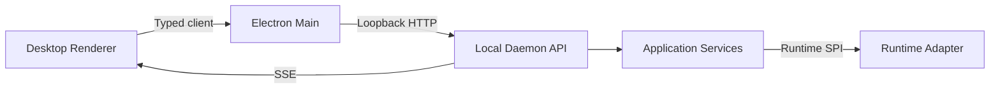

# Workforce — API Design

**版本：** V0.1 Draft  
**状态：** Engineering baseline  
**日期：** 2026-09-10

## 1. 目标

本文件定义 Desktop、Local Daemon、Runtime Adapter 与未来 Cloud Control Plane 之间的 API 契约。API 必须保持领域不变量，支持长任务实时观察、幂等命令、乐观并发和协议演进，同时不得把任意文件、Shell 或 Credential 能力直接暴露给 Renderer。

## 2. 边界与传输



- Renderer 只调用 `desktop-client` 的类型化接口，不拼装任意本地路径或命令。
- Electron Main 负责启动 Daemon、协商 session，并向受信 Renderer 提供最小 bridge。
- Local API 默认只监听随机 loopback 端口；禁止绑定 `0.0.0.0`。
- Daemon API 调用 application use case；API handler 不直接访问数据库或 Adapter。
- Adapter 使用内部 Runtime SPI，不作为公共 REST 资源暴露。
- 未来 Cloud API 复用 DTO 与语义，但身份、租户和资源地址不同，不假设与本地端点完全同构。

## 3. 风格选择：REST + Command Endpoints

V0.1 使用 JSON over HTTP：

- 查询和基础创建采用 REST resource endpoint。
- 会触发状态迁移或副作用的动作使用显式 command endpoint，如 `POST /runs/{id}:cancel`。
- 实时事件使用 SSE；交互式终端或 Runtime 输入后续可使用 WebSocket。
- Daemon 内部模块、Runtime Adapter 不经由公共 REST 相互调用。

不采用纯 CRUD，因为 `approve`、`retry`、`pause` 等动作有独立权限、前置状态和审计语义；不在 V0.1 引入 GraphQL。

## 4. 通用约定

### 4.1 基础地址与媒体类型

```text
http://127.0.0.1:{ephemeralPort}/api/v1
Content-Type: application/json
Accept: application/json
```

时间使用 UTC RFC 3339；ID 是不透明字符串；枚举值使用小写 `snake_case`。请求体未知字段默认拒绝，以暴露客户端/服务端版本漂移。

### 4.2 Envelope

单资源直接返回资源 DTO；列表使用：

```json
{
  "items": [],
  "page": { "nextCursor": null, "hasMore": false }
}
```

命令成功返回最新资源或 operation receipt：

```json
{
  "operationId": "op_01J...",
  "acceptedAt": "2026-09-10T10:00:00Z",
  "resource": { "type": "run", "id": "run_01J..." }
}
```

### 4.3 Commands 与 Queries

- `GET` 是无副作用 query，可安全重试。
- `POST` 创建资源或提交 command；副作用必须支持幂等。
- `PATCH` 只编辑尚可修改的定义；不可用来隐式迁移状态。
- V0.1 不提供通用 `DELETE`；归档、取消和清理由明确 command 表示。

## 5. 幂等与并发

所有创建和 command 请求必须携带：

```text
Idempotency-Key: <client-generated opaque value>
```

Daemon 在作用域 `session + method + route + key` 内保存请求摘要和响应。相同 key、相同请求返回原结果；相同 key、不同请求返回 `409 idempotency_key_reused`。V0.1 至少保留 24 小时。

可编辑资源返回 `revision` 与 `ETag`。更新或状态命令必须携带：

```text
If-Match: "7"
```

revision 不匹配返回 `412 revision_conflict`，并附当前 revision。Run、Event、已冻结的 Task execution snapshot 不允许原地修改。

## 6. 错误模型

使用 `application/problem+json`：

```json
{
  "type": "urn:workforce:error:invalid_transition",
  "title": "Invalid state transition",
  "status": 409,
  "code": "invalid_transition",
  "detail": "A completed run cannot be paused.",
  "instance": "/api/v1/runs/run_01J...:pause",
  "requestId": "req_01J...",
  "retryable": false,
  "fields": [],
  "currentRevision": 7
}
```

| HTTP | 典型含义 |
|---:|---|
| 400 | JSON/schema/参数错误 |
| 401 | 缺少或无效本地 session |
| 403 | Policy 拒绝 |
| 404 | 资源不存在或不可见 |
| 409 | 状态冲突、幂等冲突、资源占用 |
| 412 | revision/ETag 冲突 |
| 422 | 领域规则或能力验证失败 |
| 429 | 并发、速率或预算限制 |
| 500 | 未预期内部错误 |
| 503 | Runtime、存储或 Daemon 暂不可用 |

错误信息不得包含 secret、完整环境变量或未经脱敏的 Runtime 输出。

## 7. 本地认证与安全

1. Daemon 启动时生成高熵、短期 session token，通过受保护的 Electron Main IPC 完成交付，不写入 URL、日志或 Renderer 持久存储。
2. 请求使用 `Authorization: Bearer <session-token>`；重启、用户注销或显式撤销后 token 失效。
3. 校验 `Origin`、`Host`，只接受受信应用来源；浏览器跨域访问默认关闭。
4. 健康检查可不认证但只返回最少信息；其他端点全部认证。
5. 本地 token 只证明“受信桌面会话”，具体动作仍由 Policy Engine 以 principal、action、resource、context 判定。
6. API 仅接受 `WorkspaceId`、`ArtifactId`、`CredentialRef` 等受管引用。禁止任意路径读取、任意 command execution 和 Credential 明文响应。
7. 记录 `requestId`、principal、命令、资源、结果和关联 Event；敏感字段在持久化前脱敏。

未来可优先用 Unix domain socket / Windows named pipe，HTTP loopback 仍须维持上述安全条件。

## 8. 分页、过滤与排序

- Cursor 分页：`?limit=50&cursor=opaque`，默认 50，最大 200。
- Cursor 不公开数据库 offset，且绑定原过滤/排序条件。
- 常用过滤：`projectId`、`taskId`、`runId`、`status`、`type`、`createdAfter`。
- 排序采用受控枚举，如 `sort=-createdAt`；不接受任意 SQL 字段。
- Event 列表按 `(runId, sequence)`；其他列表默认 `createdAt DESC, id DESC`。

## 9. 版本策略

- HTTP major version 位于 `/api/v1`。
- DTO 可带对应协议版本，如 Task 的 `protocolVersion: "0.1"`。
- minor 变更只增加可选字段；客户端必须忽略已知 major 下未知响应字段。
- 删除字段、改变状态或字段语义、改变错误行为需要新的 API major。
- 响应可发送 `Workforce-API-Version` 与 `Deprecation`；V0.1 不维护多 major 实现。

## 10. Endpoint Catalog

### 10.1 System

| Method | Path | 说明 |
|---|---|---|
| GET | `/health` | 进程存活，不暴露配置 |
| GET | `/system/info` | API、Daemon、平台版本和能力 |
| GET | `/system/readiness` | DB、artifact store、adapter host 状态 |

### 10.2 Projects

| Method | Path | 说明 |
|---|---|---|
| POST | `/projects` | 创建 Project |
| GET | `/projects` | 列表 |
| GET | `/projects/{projectId}` | 详情 |
| PATCH | `/projects/{projectId}` | 编辑 draft/ready 定义 |
| POST | `/projects/{projectId}:start` | 实例化并启动 Workflow |
| POST | `/projects/{projectId}:pause` | 阻止新任务调度 |
| POST | `/projects/{projectId}:resume` | 恢复调度 |
| POST | `/projects/{projectId}:cancel` | 请求取消活动 Runs |

### 10.3 Tasks

| Method | Path | 说明 |
|---|---|---|
| POST | `/projects/{projectId}/tasks` | 创建 Task |
| GET | `/tasks` | 跨项目筛选列表 |
| GET | `/tasks/{taskId}` | Task 与当前 revision |
| PATCH | `/tasks/{taskId}` | 编辑未冻结 Task |
| POST | `/tasks/{taskId}:assign` | 绑定 WorkerVersion 或恢复自动路由 |
| POST | `/tasks/{taskId}:queue` | 将 ready Task 入队 |
| POST | `/tasks/{taskId}:cancel` | 取消尚未完成 Task |
| POST | `/tasks/{taskId}:retry` | 基于原 snapshot 创建新 Run |

`retry` 不复用旧 Run ID，也不修改旧 Run；响应返回新 Run。

### 10.4 Runs

| Method | Path | 说明 |
|---|---|---|
| POST | `/tasks/{taskId}/runs` | 显式创建/启动一次 Run |
| GET | `/runs` | 按 project/task/status 查询 |
| GET | `/runs/{runId}` | 状态、snapshot、usage、结果 |
| POST | `/runs/{runId}:pause` | Adapter 支持时暂停 |
| POST | `/runs/{runId}:resume` | 恢复暂停 Run |
| POST | `/runs/{runId}:cancel` | 请求协作取消，必要时终止进程树 |
| POST | `/runs/{runId}:input` | 向 waiting_input Run 提交受控输入 |
| GET | `/runs/{runId}/logs` | 脱敏日志片段/分页 |

### 10.5 Approvals

| Method | Path | 说明 |
|---|---|---|
| GET | `/approvals` | 待处理及历史审批 |
| GET | `/approvals/{approvalId}` | 详情、风险与待执行动作 |
| POST | `/approvals/{approvalId}:approve` | 授权一次待处理动作 |
| POST | `/approvals/{approvalId}:reject` | 拒绝并记录理由 |
| POST | `/approvals/{approvalId}:request-changes` | 返回结构化修改要求 |
| POST | `/approvals/{approvalId}:take-over` | 转为人类接管 |

每个 decision 必须带 `decisionReason`；审批 command 重复提交由 Idempotency-Key 收敛。审批只产生决定与 Event，由 Workflow Engine 推导后续状态。

### 10.6 Artifacts

| Method | Path | 说明 |
|---|---|---|
| POST | `/artifacts` | 注册受管内容或外部引用 |
| GET | `/artifacts` | 按 project/task/run/type 查询 |
| GET | `/artifacts/{artifactId}` | 元数据、版本、hash、lineage |
| GET | `/artifacts/{artifactId}/content` | 在 Policy 允许下流式读取内容 |
| GET | `/artifacts/{artifactId}/lineage` | 上下游关系 |
| POST | `/artifacts/{artifactId}:verify` | 重算完整性并记录结果 |
| POST | `/artifacts/{artifactId}:archive` | 标记归档，不直接删除内容 |

大文件不得 base64 塞入 JSON；本地采用受控 stream，未来云端采用短期签名上传/下载 URL。

### 10.7 Workspaces

| Method | Path | 说明 |
|---|---|---|
| POST | `/projects/{projectId}/workspaces` | 绑定/创建 Workspace |
| GET | `/workspaces/{workspaceId}` | 状态和安全化元数据 |
| POST | `/workspaces/{workspaceId}:validate` | 验证路径、Git、工具和权限 |
| POST | `/workspaces/{workspaceId}:provision` | 创建隔离目录/worktree |
| POST | `/workspaces/{workspaceId}:archive` | 停止新使用并归档 |
| GET | `/workspaces/{workspaceId}/changes` | 受控 diff/file-change 摘要 |

路径选择由 Electron 的受信原生 dialog 获取并转换为一次性授权引用；Renderer 不可提交任意绝对路径作为读取接口。

### 10.8 Runtimes

| Method | Path | 说明 |
|---|---|---|
| GET | `/runtimes` | 已安装 Adapter/Profile 列表 |
| GET | `/runtimes/{runtimeId}` | descriptor 与非敏感配置 |
| GET | `/runtimes/{runtimeId}/capabilities` | capability discovery |
| POST | `/runtimes/{runtimeId}:validate` | 检查 binary、版本、认证引用和兼容性 |
| POST | `/runtimes/{runtimeId}:diagnose` | 产生脱敏诊断结果 |

公共 API 不提供 `runtime.start`；只能通过 Task/Run application command 启动，以确保 snapshot、Workspace、Policy、预算和事件先建立。

### 10.9 Events

| Method | Path | 说明 |
|---|---|---|
| GET | `/events` | 审计/补拉事件，cursor 分页 |
| GET | `/events/stream` | 按 project/run 等过滤的 SSE |
| GET | `/runs/{runId}/events` | Run 历史，按 sequence |

## 11. SSE 与 WebSocket

V0.1 默认 SSE，因为主要流向是 Daemon → UI，具备原生重连和较小实现面：

```text
GET /api/v1/events/stream?projectId=prj_01J...
Accept: text/event-stream
Last-Event-ID: evt_01J...
```

```text
id: evt_01J...
event: run.status_changed
data: {"eventVersion":"0.1","sequence":18,"runId":"run_01J...","occurredAt":"2026-09-10T10:02:00Z","data":{"from":"running","to":"waiting_review"}}
```

- Event 必须先持久化，再推送。
- 客户端以 Event ID/sequence 去重；断线后用 `Last-Event-ID` 恢复。
- 若 retention 已越过断点，返回 `410 event_cursor_expired`，客户端重查资源快照后重新订阅。
- heartbeat 不属于领域事件，不持久化。
- WebSocket 仅用于高频双向 PTY/interactive runtime，候选路径 `/api/v1/interactive`；V0.1 可不开放通用终端。

## 12. 示例

### 12.1 创建 Task

```http
POST /api/v1/projects/prj_01J/tasks HTTP/1.1
Authorization: Bearer <session-token>
Idempotency-Key: create-task-42
Content-Type: application/json
```

```json
{
  "protocol": "workforce.task",
  "protocolVersion": "0.1",
  "title": "Implement health endpoint",
  "objective": "Expose a tested readiness endpoint.",
  "priority": 50,
  "inputs": [{
    "id": "repo",
    "type": "workspace",
    "name": "Source repository",
    "required": true,
    "workspaceId": "wsp_01J...",
    "selector": { "kind": "git", "ref": "main", "path": "." }
  }],
  "context": { "include": [], "maxBytes": 524288 },
  "requiredCapabilities": [{ "name": "coding", "version": ">=1" }],
  "expectedOutputs": [{ "type": "code_change", "required": true }],
  "acceptanceCriteria": [{ "type": "test", "commandRef": "test.default" }],
  "constraints": {},
  "dependencies": [],
  "executionPolicy": { "timeoutSeconds": 1800, "maxAttempts": 2 },
  "budget": {}
}
```

返回 `201 Created`、`Location: /api/v1/tasks/tsk_01J...` 和 Task DTO。

### 12.2 取消 Run

```http
POST /api/v1/runs/run_01J...:cancel HTTP/1.1
Authorization: Bearer <session-token>
Idempotency-Key: cancel-run-01
If-Match: "4"
Content-Type: application/json

{"reason":"Requested by user","mode":"graceful_then_force"}
```

如果取消已进入异步进程终止流程，返回 `202 Accepted`；最终状态通过 Event 和 `GET /runs/{id}` 获取。

### 12.3 审批

```http
POST /api/v1/approvals/apr_01J...:request-changes HTTP/1.1
Authorization: Bearer <session-token>
Idempotency-Key: review-03
If-Match: "2"
Content-Type: application/json

{
  "decisionReason": "Integration test is missing.",
  "requestedChanges": [
    { "criterionId": "ac_integration", "instruction": "Add an authenticated request test." }
  ]
}
```

## 13. V0.1 范围

V0.1 必须实现：

- Local loopback API、session token、origin/host 校验
- Project、Task、Run、Approval、Artifact、Workspace、Runtime 基础 endpoints
- command 幂等、revision/ETag、统一错误结构
- Cursor 分页与基础过滤
- Run/Event 持久化查询与 SSE 恢复
- Typed TypeScript client 与从 Zod/JSON Schema 生成的契约测试
- 所有危险动作经过 Policy/Approval，而非直接系统调用

V0.1 明确不实现：

- 公网监听、第三方 API key、OAuth developer platform
- GraphQL、通用 webhook、公开 SDK 稳定性承诺
- 任意 Shell/文件浏览 API
- 通用实时协作、复杂搜索、批量跨资源事务
- 多租户 Cloud API、signed upload、remote worker enrollment

## 14. 未来 Cloud 演进

Cloud Control Plane 延续 command/query、错误、事件和幂等语义，并增加：

- OIDC/OAuth、Organization tenancy、RBAC 和审计导出
- `region`、`nodeId`、remote execution lease 与 worker heartbeat
- PostgreSQL transactional outbox、消息总线与全局 Event cursor
- S3 multipart/signed URL、Artifact retention 与 residency policy
- webhook、service account、rate quota 和稳定 SDK
- Workflow trigger、schedule、GitHub/Slack 等 connector endpoints
- Offline local mutation 的同步协议、冲突检测和明确的 authoritative owner

Local 路径不得进入 Cloud DTO；改用 opaque WorkspaceRef/NodeRef。Cloud 不应因复用 DTO 而获得未经授权的本地文件访问能力。

## 15. 契约测试与完成标准

- OpenAPI 3.1 从代码 schema 生成，并在 CI 检测破坏性变化。
- 每个 endpoint 覆盖成功、schema failure、policy deny、revision conflict 与 idempotent replay。
- Runtime mock 验证 start、事件、取消、超时、等待输入和 Artifact 流程。
- SSE 测试覆盖断线重连、重复事件、缺口和 cursor expiry。
- Windows、macOS、Linux 均验证 loopback、进程生命周期和路径不泄露。
- API handler 不得绕过 application ports；响应快照与对应 Event 的关联 ID 可追踪。

满足以上条件后，API 可作为 Desktop UI 与 Local Daemon 并行开发的 V0.1 契约基线。
