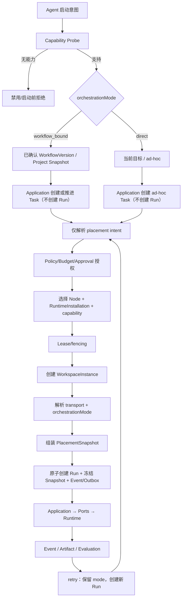

# D18 双执行模式流程

两条路径只在 Workflow 调度上分流：direct 仍创建项目内 Task/Run，不绕过治理，永不推进 WorkflowInstance 或 Project。若吸收 direct 产物，必须另发 workflow-bound/follow-up command，显式引用精确 ArtifactVersion 并重新验收；原 direct Run 不推进父聚合。`transport`、`placement`、`orchestrationMode` 是三条正交轴；retry 创建新 Run 并保留模式。流程不对应未冻结的 `:direct` endpoint。
