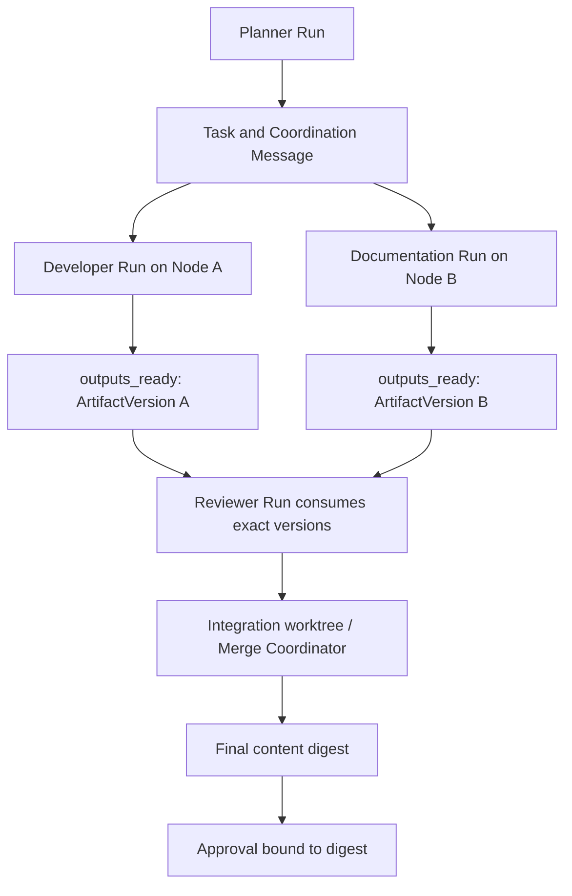

# Git 与信息协作流程

```mermaid
flowchart TD
  Planner[Planner Run] --> Task[Task and Coordination Message]
  Task --> Dev[Developer Run on Node A]
  Task --> Docs[Documentation Run on Node B]
  Dev --> OutA[outputs_ready: ArtifactVersion A]
  Docs --> OutB[outputs_ready: ArtifactVersion B]
  OutA --> Review[Reviewer Run consumes exact versions]
  OutB --> Review
  Review --> Merge[Integration worktree / Merge Coordinator]
  Merge --> Digest[Final content digest]
  Digest --> Approval[Approval bound to digest]
```

Review/Test 只消费精确 `ArtifactVersion`，依赖边默认 `outputs_ready`。各 Run 使用独立 worktree；整合后产生唯一 final digest，Evaluation/Reviewer/Approval 必须绑定该 digest。默认不自动 push 或创建 PR。
