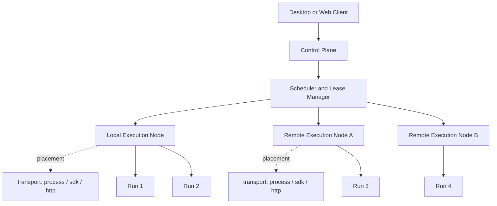

# 混合执行拓扑

`placement` 由 ExecutionNode/Workspace/Lease 决定，`transport` 由 Runtime Adapter 描述；两者正交。节点位置不改变 Renderer → Daemon → Application → Ports → Runtime 边界，也不把远程节点写成 Runtime transport。

Project 在执行前绑定唯一 `ProjectExecutionSnapshot`，由 snapshot 提供精确 `WorkflowVersion`/`TeamVersion`；`workflow_bound`/`direct` 两种 `orchestrationMode` 最终都由 Application 创建受治理 Task/Run。direct 永不推进 WorkflowInstance/Project，图中 Node 仅代表实际 placement。
