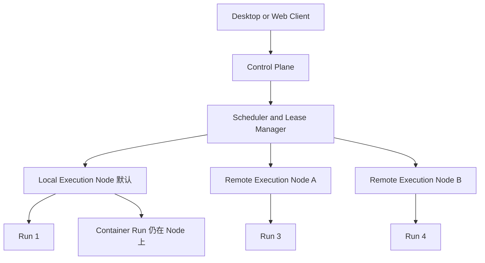

# 混合执行拓扑

产品 Placement kind：`local`（默认）/ `remote` / `container`（[D19](../planning/decision-register.md#d19-执行-placement本机远程与容器)）。下图是拓扑，不是 V0.1 已实现清单。容器 Run 仍画在某个 Node 上，不是第四种机器。V0.1 只实现 Local Node。

