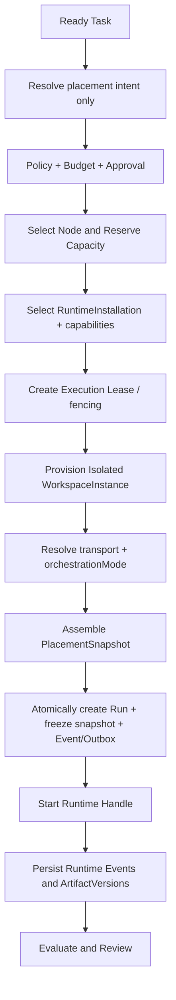

# 节点调度与执行流程

前段只解析 placement intent；Node、RuntimeInstallation、Lease/fencing 和 WorkspaceInstance 均确认后才组装唯一 `PlacementSnapshot`，再原子创建 Run、冻结 snapshot 并写 Event/Outbox。`workflow_bound` 只调度已确认 snapshot 中 WorkflowVersion 的节点；`direct` 在进入此图前只创建项目内 ad-hoc Task，Run 必须等待同一治理链完成。两者共用 Policy、Budget、Approval、Workspace、Capability、Lease 和 ArtifactVersion 治理，容量等待不消耗 attempt。
