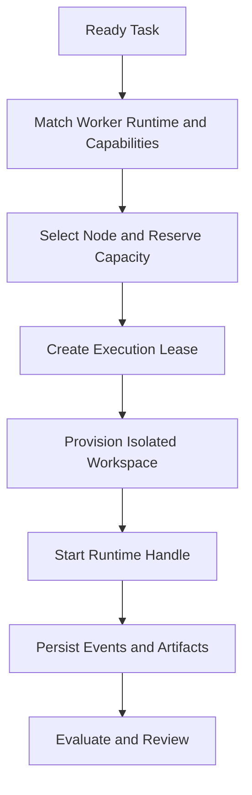

# 节点调度与执行流程

默认选本机 Local Node。远程与容器是产品 Placement（D19），本图不表示 runner 已实现。

```mermaid
flowchart TD
  Task[Ready Task] --> Match[Match Worker Runtime and Capabilities]
  Match --> Capacity[Select Node and Reserve Capacity]
  Capacity --> Lease[Create Execution Lease]
  Lease --> Workspace[Provision Isolated Workspace]
  Workspace --> Start[Start Runtime Handle]
  Start --> Events[Persist Events and Artifacts]
  Events --> Review[Evaluate and Review]
```
