# D17 Workflow Authoring 流程

```mermaid
flowchart LR
  User[用户意图] --> Renderer[Renderer 对话/结构化面]
  Renderer --> Main[Electron Main typed bridge]
  Main --> Daemon[Daemon API]
  Daemon --> App[Application Authoring Use Case]
  App --> AuthoringTask[创建受治理 authoring Task（不创建 Run）]
  AuthoringTask --> ResolveIntent[仅解析 placement intent]
  ResolveIntent --> Guard[Policy + Budget + CredentialRef + Capability + Usage]
  Guard --> Select[选择 RuntimeInstallation / Node]
  Select --> Lease[Lease/fencing]
  Lease --> Workspace[创建 WorkspaceInstance]
  Workspace --> ResolveAxes[解析 transport + orchestrationMode]
  ResolveAxes --> Binding[组装 PlacementSnapshot]
  Binding --> Snapshot[原子创建 authoring Run + 冻结 snapshot + Event/Outbox]
  Snapshot --> Ports[Runtime Ports]
  Ports --> Runtime[编排 Agent Runtime]
  Runtime --> Proposal[AuthoringProposal / ChangeSet 输出]
  Snapshot --> Control[Event: cancel / retry / failure / expired]
  Proposal --> Validate[Schema + Policy + Budget + DAG 校验]
  Validate --> CAS{CAS apply / expectedRevision}
  CAS -->|成功| Draft[WorkflowDraft / Team draft]
  CAS -->|跨聚合| Staged[持久化 staged apply]
  Staged --> Draft
  Draft --> Edit[画布/结构化编辑]
  Edit --> Publish{发布校验}
  Publish -->|通过| Version[不可变 WorkflowVersion]
  Publish -->|失败| Draft
  Version --> Confirm{Project 计划确认}
  Confirm -->|批准且 digest 未变| ProjectSnapshot[创建 Project Execution Snapshot]
  ProjectSnapshot --> Start[workflow.start]
  Start --> Execute[创建 WorkflowInstance 并进入 Runtime]
```

T20-B 接收 conversation turn/raw intent，并通过受治理 authoring Task/Run、usage/budget、cancel/retry/failure 和 Event 调用编排 Agent；proposal/change-set 是该 Run 的输出。Application 负责 CAS/staged apply、retention/redaction；Renderer 不直连 Runtime。发布不会修改活动执行图，未发布 draft 不可执行，authoring Run 成功也不会执行生成出的 Workflow。
