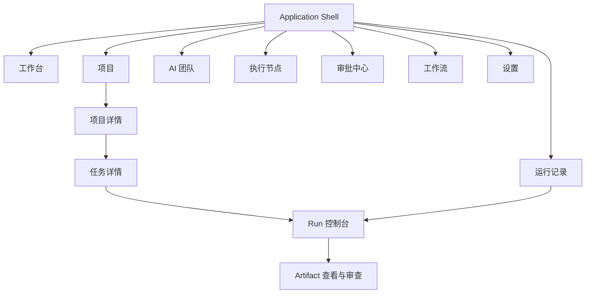

# Workforce 页面信息架构

**版本：** V0.1 Draft  
**状态：** Product UI baseline（§1 项目制主对象；§4.3 为项目详情现行规范；§4.6 / §6.2 服务项目循环）  
**日期：** 2026-09-11  
**修订：** 2026-09-11 — 产品主对象定为**项目制**（决策登记 §0）：围着一个 Project 编排 Team、Tasks、Workflow（含自定义 Team 与画布）。D15/D16 是该循环的必达环节，不是外挂。只读 `GET /workflows` 是已接通的 M3 过渡切片。§4.3.2：已发布执行图的公开 Task DTO 必须返回 `dependsOn`；UI 展示真实依赖边，字段缺失时才写“依赖：未返回”。2026-09-10 — §2：`P0`/`P1` 是交付切片深度，不是侧栏可见性；一级导航全部出现在左侧栏。§4.3 从“建议标签”改为现行条款，并消解与线框 §3 的冲突。

## 1. 设计目标

**主对象是项目。** Workforce 客户端围着一个 Project 工作，而不是先做一个团队工作室或通用工作流 IDE。围绕当前项目，用户：

1. 编排 / 配置 **Team**（M3 只读预设；M7 自定义编排）
2. 编排 **Tasks**
3. 编排 **Workflow**（M3 只读目录；M7 可视化画布）
4. 执行、审批、验收产出

主循环：`Project → Team → Tasks → Workflow 编排 → 执行与验收`（[决策登记 §0](../planning/decision-register.md#0-产品模型项目制)）。画布与自定义 Team 是这条循环上的页面能力，不是与项目并列的独立产品。

用户还需要随时回答：

1. 哪个项目正在运行，配置是否齐（Team / Workspace / 预算）？
2. 哪些 Worker 正在执行该项目的哪些 Task？
3. Run 位于哪一个 Execution Node？
4. 当前是否需要人工输入或审批？
5. Agent 修改了什么，产生了哪些 Artifact？
6. 失败后应该重试、换节点、重新分配还是接管？

UI 不假设执行发生在客户端所在电脑，也不把 Worker、Runtime 和 Execution Node 混为一个对象。

## 2. 一级导航

| 导航 | 核心对象 | 用户目的 | V0.1 |
|---|---|---|---|
| 工作台 | Project、Run、Approval、Node | 掌握全局状态与下一步行动 | P0 |
| 项目 | Project、Team、Workflow、Task、Artifact | **主对象**：创建项目，并在其中编排团队、任务与工作流、推进验收 | P0 |
| AI 团队 | Team、Worker、Role、RuntimeProfile | 为项目编排数字员工团队（M3 只读预设；M7 自定义）。服务项目循环，不是独立 HR 产品 | P0 |
| 执行节点 | ExecutionNode、RuntimeInstallation、Capacity | 查看本机与服务器执行能力 | P0 |
| 审批中心 | Approval、PolicyDecision | 集中处理人工决策 | P0 |
| 运行记录 | Run、Event、Usage | 查询执行历史和诊断问题 | P1 |
| 工作流 | WorkflowDefinition、WorkflowVersion | 为项目编排并发布可复用工作流（M3 只读目录；M7 可视化画布）。服务项目循环，不是独立 IDE | P1 |
| 设置 | Runtime、CredentialRef、Policy、Preferences | 配置运行环境与安全边界 | P0 |

`V0.1` 列是**交付切片深度**，不是“是否出现在一级导航”：

- **P0**：M3 主路径必须达到的页面深度（见 [api-capability-matrix.md](../planning/api-capability-matrix.md)）。
- **P1**：仍是本表中的一级导航，**必须出现在左侧栏**。M3 深度可以更薄（只读目录已接通）；M7 要求画布编辑器与可写 Team（[D15](../planning/decision-register.md#d15-可视化工作流画布编辑器) / [D16](../planning/decision-register.md#d16-自定义-team-编排)）。

不要把 P1 理解成隐藏入口。线框若只画了部分 P1 项，以本表为准，并回改线框。壳实现用 `primary: true` 表示侧栏可见，用 `priority: "p0" | "p1"` 表示切片深度。

产品**必须**能在项目循环里用可视化画布编排 Workflow，并用自定义 Team 给项目配团队（M7）。M3 可用只读模板/预设作为过渡切片，不得再写成「V0.1 不做画布 / 自定义 Team 后置」。

## 3. 页面层级

## 4. P0 页面清单

### 4.1 工作台

首屏展示：

- 系统与 Control Plane 连接状态
- 在线/离线/异常节点数量
- 运行中、等待输入、失败的 Run
- 待审批事项
- 活跃项目及总体进度
- 最近 Event 和异常

核心操作：

- 新建项目
- 进入等待处理的 Run
- 批准或拒绝高优先级请求
- 查看异常节点

### 4.2 项目列表

- 状态、Team、进行中 Run、待审批数、更新时间
- 新建、暂停、归档和筛选
- 不在列表中展示底层 Runtime 细节

### 4.3 项目详情

项目详情**必须**使用页面内六标签。禁止用单页平铺（概览卡片 + 任务列表 + 绑定区）代替标签结构。

权威关系：本节约束页面能力与分区，不发明 API 或状态值（[决策登记 D01](../planning/decision-register.md)）。`03-p0-wireframes.md` §3 是页头与默认画布的示意；若线框把标签写成 Overview、把 Task DAG 画在默认画布、或把 WorkspaceBinding 画成页头可写控件，**以本节为准**。

#### 4.3.1 页头（所有标签可见）

页头不随标签卸载，并承载：

- 项目名称与状态
- 项目命令：开始规划、确认计划、开始执行、取消（按[能力矩阵](../planning/api-capability-matrix.md)显隐；不支持的能力不得渲染为可点击成功态）
- 只读摘要：目标摘要、Team、Workspace **展示标签**、预算展示

页头可以只读展示 Workspace / 预算，**不得**作为 WorkspaceBinding 写入面。不展示宿主绝对路径。

#### 4.3.2 标签

稳定 `id` 用于深链。可见标签文案固定为下表，不得改成全英文 Overview。

| id | 标签 | 内容 | 明确排除 |
|---|---|---|---|
| `overview` | 概览 | 目标（draft/planning 可编辑名称与目标）、状态、Team、节点范围、进度计数、planning 时的 Plan 版本说明 | Task DAG/列表；WorkspaceBinding 写入 |
| `tasks` | Tasks | DAG 或按依赖可解释的列表；负责人、状态、依赖 | 把 Run 状态写成 Task 状态 |
| `runs` | Runs | 当前执行与历史执行 | 混用 Task / Run 状态词 |
| `artifacts` | Artifacts | 代码、文档、报告和外部资源 | 使用 `latest` 或无版本内容路径 |
| `activity` | Activity | Project Event 时间线 | 空列表时伪造“最近动态” |
| `settings` | Settings | WorkspaceBinding 写入、预算说明、策略说明 | 把开始规划/确认计划/开始执行藏进本标签 |

V0.1 诚实空态：已发布执行图的公开 Task DTO **必须**返回 `dependsOn`（可为空数组；`waitFor` 为 `outputs_ready` 或 `completed`）。Tasks 标签展示真实依赖边，不编造未返回的 DAG。仅当字段缺失（旧客户端/夹具）时写“依赖：未返回”。公开 API 未提供可写项目策略时只读说明，不假装保存成功；节点范围在仅 Local Node 时标明本机，不伪造远程节点可选。不发明可写项目策略 API 或远程节点 enrollment。

#### 4.3.3 深链

标签查询写在 hash 上：`#/projects/{id}?tab={id}`。应用壳 hash 路由只解析 path（去掉 `?` 之后）；`tab` 由项目详情读取。缺省或非法 `tab` 回退到 `overview`。`overview` 可省略查询。

#### 4.3.4 与 create→plan→start 的关系

决策登记 D02 与 §0 项目制：draft 先完成 Workspace / Team / Runtime / 预算，才能开始规划。桌面 V0.1 映射：

1. 列表创建项目后进入详情（默认 `overview`）——主对象始终是该 Project。
2. 打开 Settings，完成 WorkspaceBinding（稳定 test id：`project-bind-workspace`）；Team 在 M3 绑定预设，M7 可绑定已发布自定义 TeamVersion。
3. Tasks 在本页 `tasks` 标签编排/查看；Workflow 定义在「工作流」编排后绑定到本项目（M3 只读目录，M7 画布）。
4. 页头执行开始规划 → 确认计划 → 开始执行。这些命令留在页头，不因切换标签消失。

绑定动作不得为了迁就旧平铺页而复制到概览。

### 4.4 Task 详情

- Objective、instructions、输入和验收条件
- Worker 分配和 Placement intent
- 依赖关系
- 当前及历史 Run
- 输出 Artifact
- retry/rework 历史

Task 页面展示“应该做什么”；Runtime 原始日志放在 Run 页面。

### 4.5 Run 控制台

- Worker、Runtime、Execution Node、WorkspaceInstance
- 实时状态和结构化事件
- 命令、日志、文件变更、用量
- 暂停、继续、取消、重试、接管
- 输入请求和 Approval
- Artifact 与 Evaluation

### 4.6 AI 团队

目的：给**当前/后续项目**编排数字员工团队。入口在一级导航「AI 团队」，但能力属于项目制循环（先有项目要配谁干活），不是独立的员工目录。

**M3（当前实现深度）：**

- 只读预设 Team / TeamVersion（Software Development Team）
- Worker、Role、RuntimeProfile、能力与策略只读展示
- Worker 当前 Run 和负载（有数据则展示；无则诚实空态）
- 「新建团队 / 保存编排」不得渲染为可点击成功态

**M7（必达，尚未实现）：**

- 创建自定义 Team 草稿，编辑成员（role + RuntimeProfile + quantity），发布不可变 TeamVersion
- 新项目可绑定已发布自定义 TeamVersion；未发布草稿不能开始规划
- 编辑已发布编排必须新建 version

空态：

- 无自定义团队：说明仍可使用预设 Software Development Team，并提供「新建团队」（M7 才可点成功）
- 发布失败 / 412：保留用户输入，提示刷新，不假装已保存
- 列表失败：诚实错误，不回退夹具冒充已接通写接口

非目标：

- 不把 Worker 标记为固定运行在某台机器；节点由 Placement 决定
- 无云端组织、Marketplace、跨用户分享
- 不把只读预设页写成「自定义编排已完成」

### 4.7 执行节点

- Local/Remote/Enterprise 类型
- online、draining、offline、revoked 状态
- 平台、容量、资源使用和最大并发
- RuntimeInstallation inventory
- 当前 Run
- 诊断、drain 和 revoke 操作

V0.1 只需要默认 Local Node 和只读诊断；远程 enrollment 作为后续能力。

### 4.8 审批中心

审批卡必须明确展示：

- 请求动作与原因
- Worker、Task、Run
- 执行节点
- 目标 Workspace、Git 仓库或外部服务
- Credential 使用范围
- 影响级别和到期时间

### 4.9 设置

- 本地 Daemon/Node 健康检查
- Runtime 检测与验证
- Workspace 默认隔离策略
- CredentialRef 与 OS 安全存储
- 命令、网络、Git 和发布策略
- 日志保留和诊断导出

## 5. 全局交互规则

- 项目详情分区遵守 §4.3；线框不得覆盖标签职责。
- 所有任务状态进入 Task；所有执行细节进入 Run。
- 所有机器位置统一称为“执行节点”。
- 所有危险动作展示 actor、node、resource 和 impact。
- 状态颜色只表达语义，不单独依赖颜色传达。
- 远程断线不立即显示为 Run 失败，先进入恢复/对账状态。
- 节点容量不足显示为排队，不计为执行失败。
- Artifact 链接固定到版本或 commit SHA。
- 客户端断线后，用户恢复连接可从 Event cursor 继续查看。

## 6. P1 页面（一级导航，深度更薄）

### 6.1 运行记录

- 列表查询历史 Run、状态与用量；取消中不是已取消。
- 详情复用 §4.5 Run 控制台。
- 未知恢复状态不显示为失败，也不开放危险重跑。

### 6.2 工作流

目的：为**项目**编排可复用工作流（确认计划后绑定到该 Project）。入口在一级导航「工作流」，属于项目制循环，不是脱离项目的通用 IDE。

**M3 过渡切片（只读目录已接通，可与画布并存）：**

- 查看已发布 `WorkflowDefinition` / `WorkflowVersion`：模板列表、不可变版本、结构化步骤
- 查询走能力矩阵已列的只读目录：`GET /workflows`、`GET /workflows/{id}`、`GET /workflows/{id}/versions/{versionId}`。空目录展示诚实空态，不回退夹具冒充已接通
- 数据来自已发布模板（如 software-development-team feature-delivery），不是项目内已实例化的执行图
- 只读目录是过渡切片，不是终态；与画布目标兼容，不是「V0.1 不做画布」

**M7 必达（可视化画布，尚未实现）：**

- 主编辑面是画布：创建草稿、拖拽/连接有限 DAG、保存、发布不可变版本
- 已发布版本只读；再编辑创建新 version
- 画布与目录共用本导航：列表/详情可进入「在画布中编辑」

空态：

- 无已发布工作流：说明可从预设复制或新建空白图（M7）；M3 展示目录或诚实空列表
- 草稿未发布：明确写「未发布，Runtime 不会执行此图」
- 保存/发布失败：保留画布内容，不假装已发布

非目标：

- 不宣称 Mock 或真实 Runtime 执行未发布图，也不把目录接通写成「已可执行」
- 不把画布当成通用 iPaaS / Marketplace；节点类型以领域模型为限
- 不在画布上原地改活动执行 DAG（确认计划后的执行图仍按 D02 冻结）
