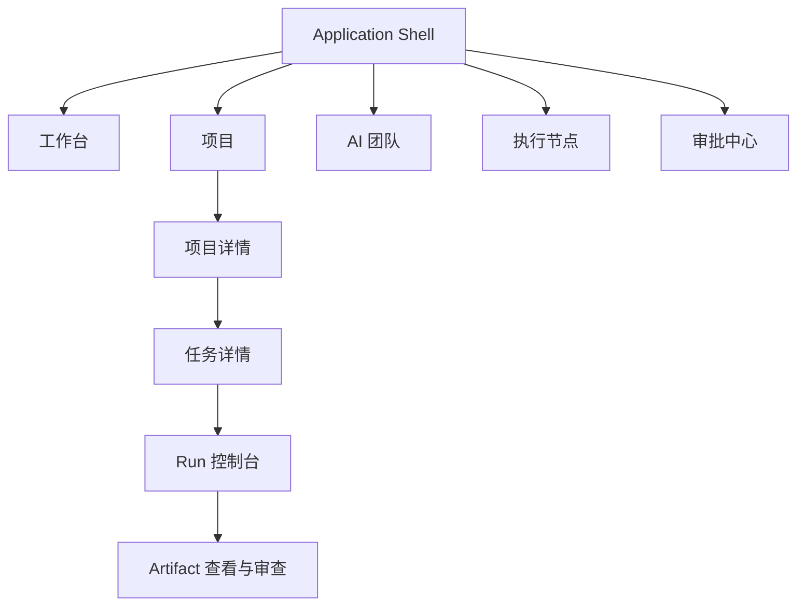

# Workforce 页面信息架构

**版本：** V0.1 Draft  
**状态：** Product UI baseline  
**日期：** 2026-09-10

## 1. 设计目标

Workforce 客户端是本地与远程 Agent 的统一控制界面。用户需要随时回答：

1. 哪些项目正在运行？
2. 哪些 Worker 正在执行哪些 Task？
3. Run 位于哪一个 Execution Node？
4. 当前是否需要人工输入或审批？
5. Agent 修改了什么，产生了哪些 Artifact？
6. 失败后应该重试、换节点、重新分配还是接管？

UI 不假设执行发生在客户端所在电脑，也不把 Worker、Runtime 和 Execution Node 混为一个对象。

## 2. 一级导航

| 导航 | 核心对象 | 用户目的 | V0.1 |
|---|---|---|---|
| 工作台 | Project、Run、Approval、Node | 掌握全局状态与下一步行动 | P0 |
| 项目 | Project、Workflow、Task、Artifact | 创建、推进和验收工作 | P0 |
| AI 团队 | Team、Worker、Role、RuntimeProfile | 组建和配置数字员工团队 | P0 |
| 执行节点 | ExecutionNode、RuntimeInstallation、Capacity | 查看本机与服务器执行能力 | P0 |
| 审批中心 | Approval、PolicyDecision | 集中处理人工决策 | P0 |
| 运行记录 | Run、Event、Usage | 查询执行历史和诊断问题 | P1 |
| 工作流 | WorkflowDefinition、WorkflowVersion | 管理可复用流程 | P1 |
| 设置 | Runtime、CredentialRef、Policy、Preferences | 配置运行环境与安全边界 | P0 |

V0.1 不建立大型可视化 Workflow 编辑器。工作流页面以模板、版本和结构化步骤为主。

## 3. 页面层级

## 4. P0 页面清单

### 4.1 工作台

首屏展示：

- 系统与 Control Plane 连接状态
- 在线/离线/异常节点数量
- 运行中、等待输入、失败的 Run
- 待审批事项
- 活跃项目及总体进度
- 最近 Event 和异常

核心操作：

- 新建项目
- 进入等待处理的 Run
- 批准或拒绝高优先级请求
- 查看异常节点

### 4.2 项目列表

- 状态、Team、进行中 Run、待审批数、更新时间
- 新建、暂停、归档和筛选
- 不在列表中展示底层 Runtime 细节

### 4.3 项目详情

建议使用页面内标签：

| 标签 | 内容 |
|---|---|
| 概览 | 目标、状态、Team、节点范围、进度 |
| Tasks | DAG/列表、负责人、状态、依赖 |
| Runs | 当前和历史执行 |
| Artifacts | 代码、文档、报告和外部资源 |
| Activity | Project Event 时间线 |
| Settings | WorkspaceBinding、预算和策略 |

### 4.4 Task 详情

- Objective、instructions、输入和验收条件
- Worker 分配和 Placement intent
- 依赖关系
- 当前及历史 Run
- 输出 Artifact
- retry/rework 历史

Task 页面展示“应该做什么”；Runtime 原始日志放在 Run 页面。

### 4.5 Run 控制台

- Worker、Runtime、Execution Node、WorkspaceInstance
- 实时状态和结构化事件
- 命令、日志、文件变更、用量
- 暂停、继续、取消、重试、接管
- 输入请求和 Approval
- Artifact 与 Evaluation

### 4.6 AI 团队

- Team 和 TeamVersion
- Worker、Role、RuntimeProfile、能力与策略
- Worker 当前 Run 和负载
- 不把 Worker 标记为固定运行在某台机器；节点由 Placement 决定

### 4.7 执行节点

- Local/Remote/Enterprise 类型
- online、draining、offline、revoked 状态
- 平台、容量、资源使用和最大并发
- RuntimeInstallation inventory
- 当前 Run
- 诊断、drain 和 revoke 操作

V0.1 只需要默认 Local Node 和只读诊断；远程 enrollment 作为后续能力。

### 4.8 审批中心

审批卡必须明确展示：

- 请求动作与原因
- Worker、Task、Run
- 执行节点
- 目标 Workspace、Git 仓库或外部服务
- Credential 使用范围
- 影响级别和到期时间

### 4.9 设置

- 本地 Daemon/Node 健康检查
- Runtime 检测与验证
- Workspace 默认隔离策略
- CredentialRef 与 OS 安全存储
- 命令、网络、Git 和发布策略
- 日志保留和诊断导出

## 5. 全局交互规则

- 所有任务状态进入 Task；所有执行细节进入 Run。
- 所有机器位置统一称为“执行节点”。
- 所有危险动作展示 actor、node、resource 和 impact。
- 状态颜色只表达语义，不单独依赖颜色传达。
- 远程断线不立即显示为 Run 失败，先进入恢复/对账状态。
- 节点容量不足显示为排队，不计为执行失败。
- Artifact 链接固定到版本或 commit SHA。
- 客户端断线后，用户恢复连接可从 Event cursor 继续查看。
