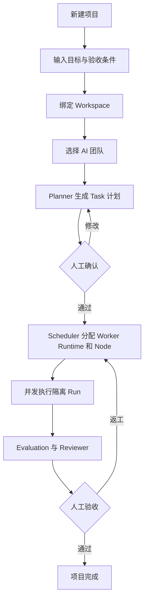
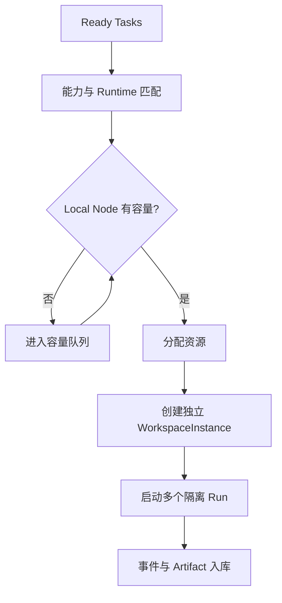
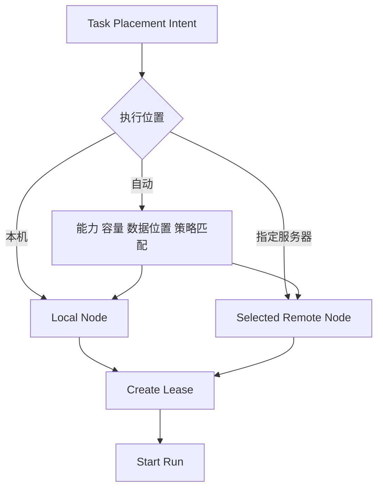
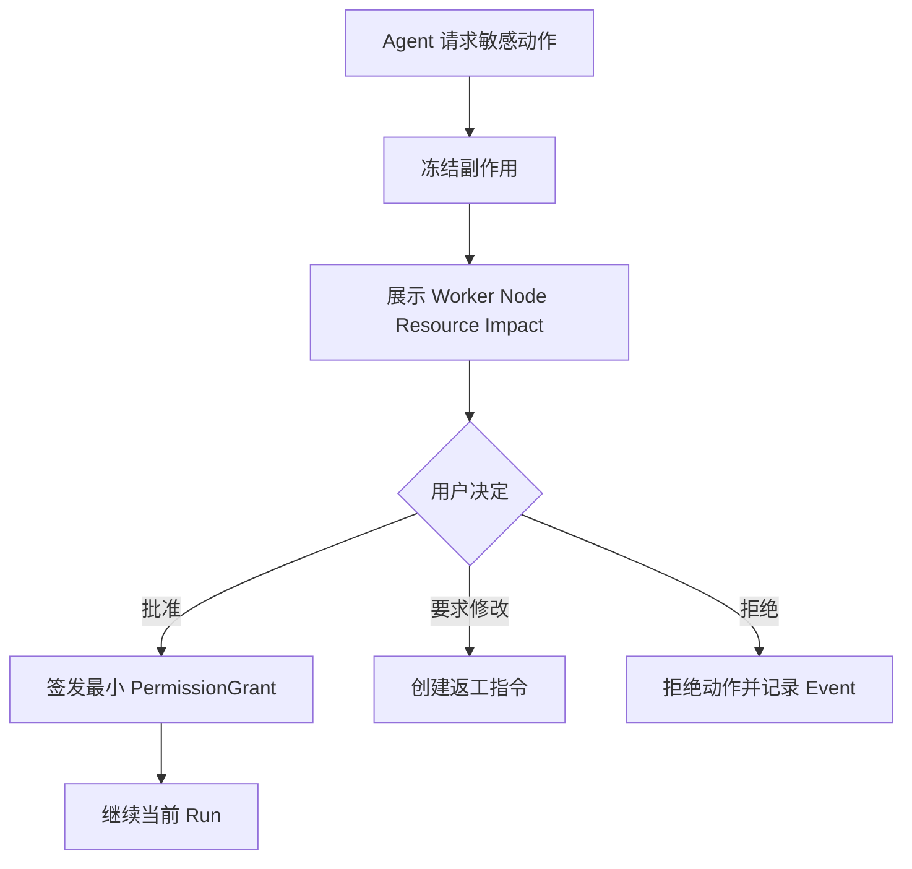
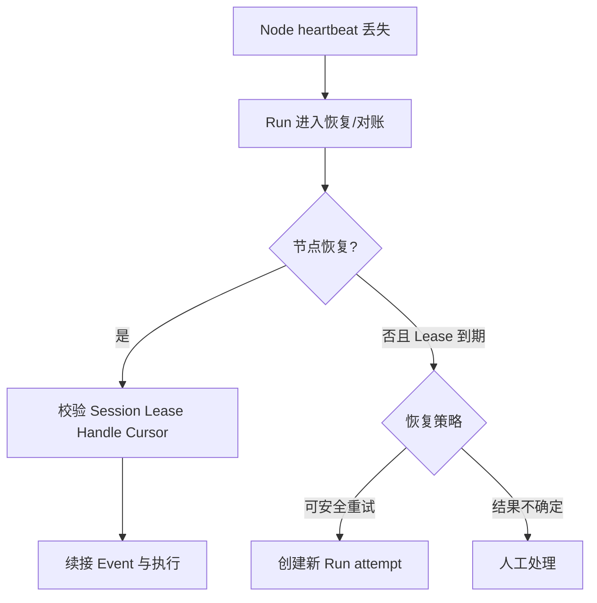
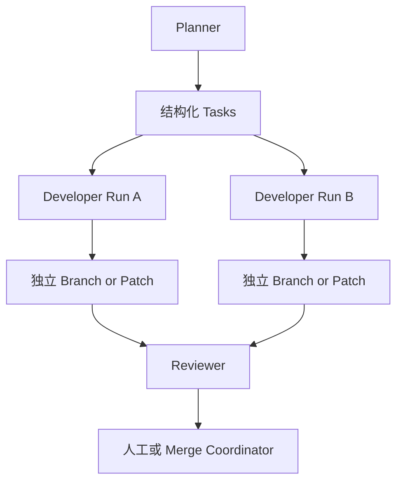

# Workforce 核心用户流程

**版本：** V0.1 Draft  
**状态：** Product flow baseline  
**日期：** 2026-09-10

## 1. 创建并运行项目

## 2. 单节点多 Agent 调度

约束：

- 同一节点可以并发执行多个 Run。
- 每个 Run 使用独立 worktree/目录/容器、进程树和 PermissionGrant。
- `maxConcurrentRuns` 与资源预算同时生效。
- 容量等待不会消耗 Task attempt。

## 3. 本机与远程节点选择

V0.1 只实现 Local Node，但界面保留“自动调度 / 本机 / 指定节点”的模型；未实现选项必须清晰标记，而不是伪造可用。

## 4. 人工审批

审批决定与执行动作分离。重复提交由 Idempotency-Key 收敛。

## 5. 节点断线与恢复

旧节点恢复后，过期 fencing token 对应的结果只能进入审计记录，不能推进 Task 状态。

## 6. Git 与信息协作

- Git/GitHub 保存代码、文档和版本化 Artifact。
- Task、Event 与 CoordinationMessage 传递状态、请求、反馈和 handoff。
- 消息只传 ArtifactRef，不内嵌大文件。
- 默认禁止 Agent 直接写主分支。
