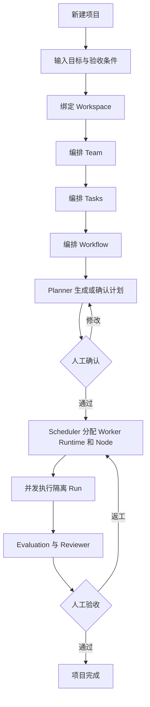
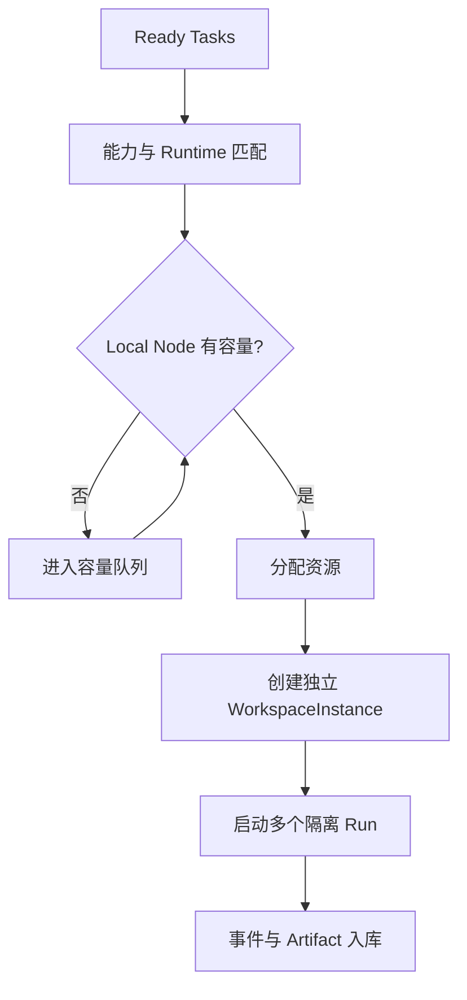
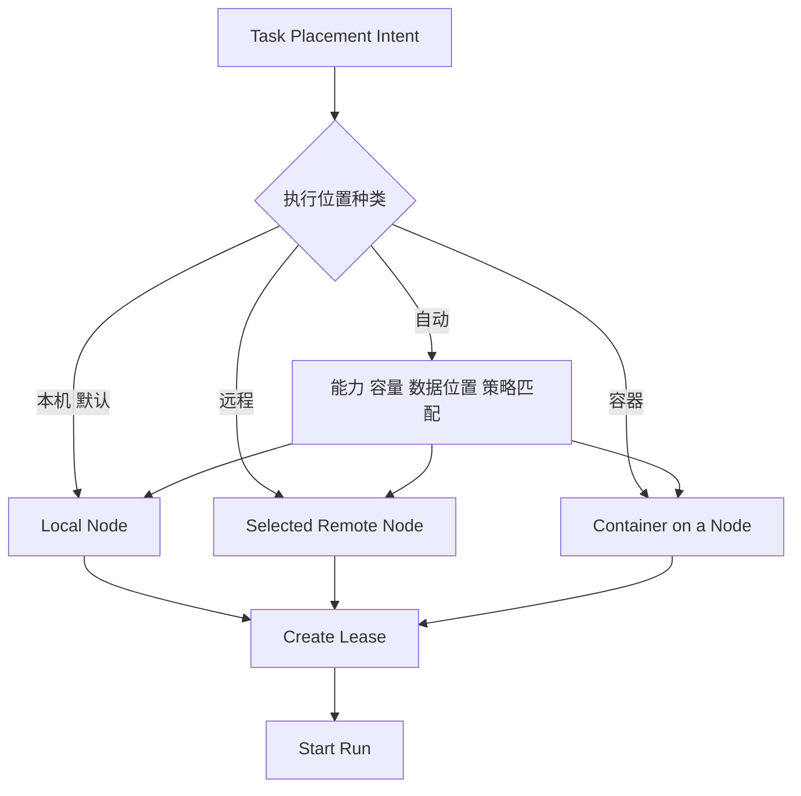
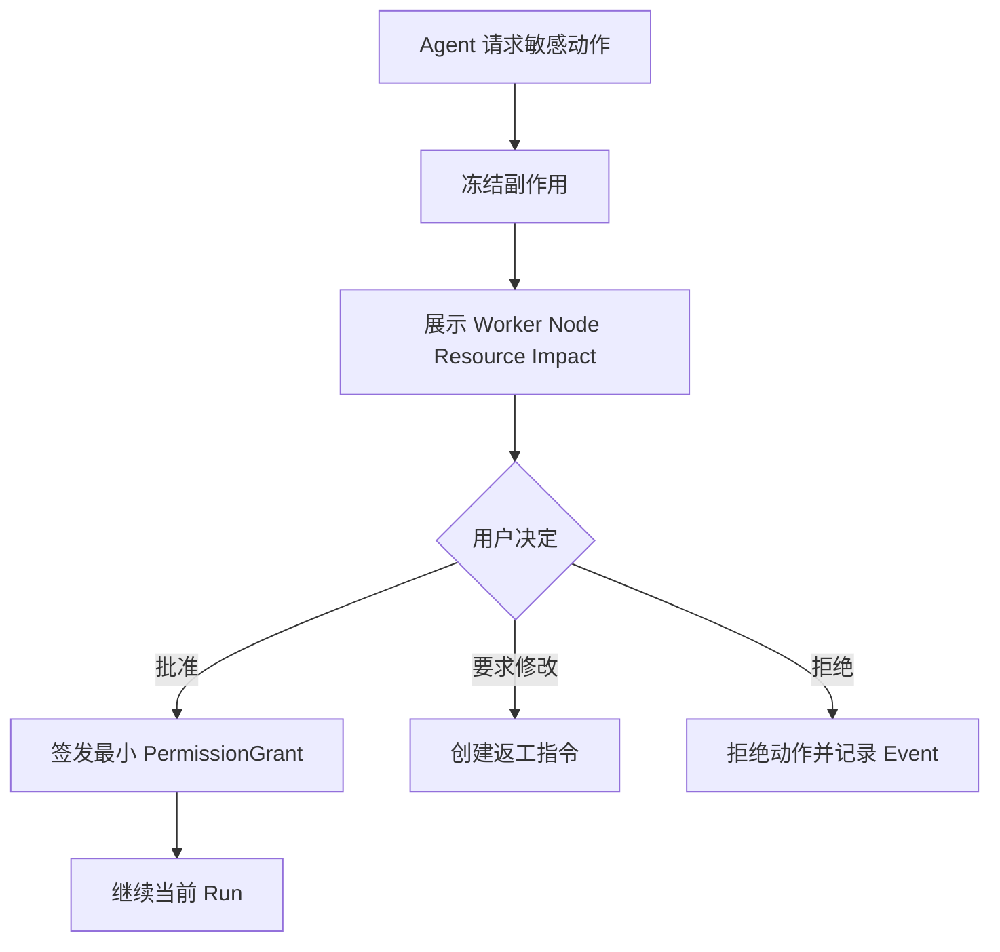
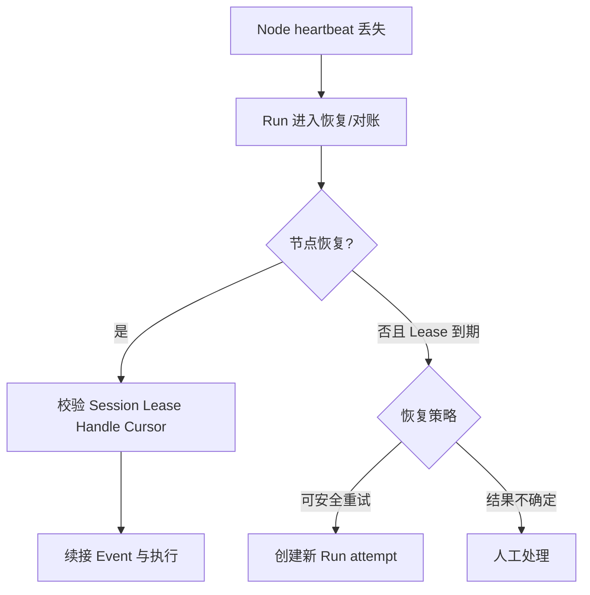
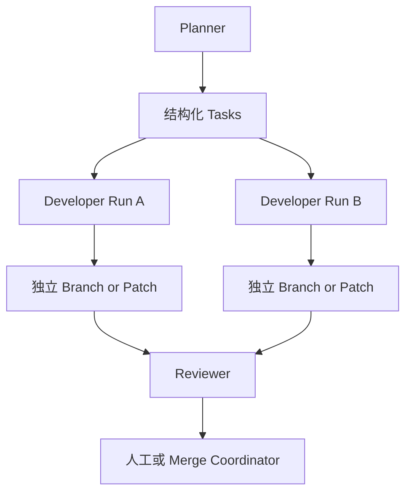
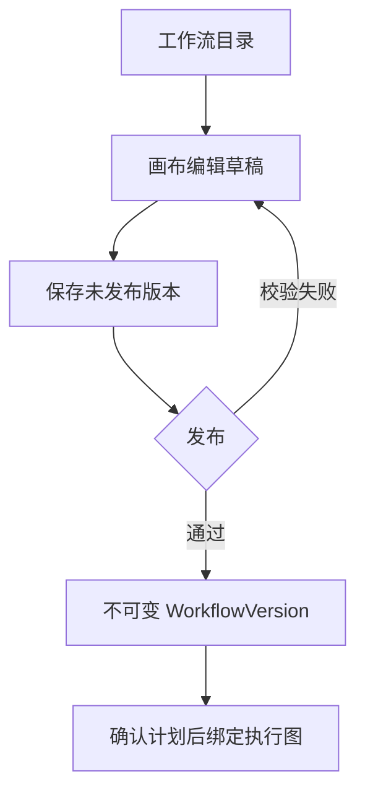
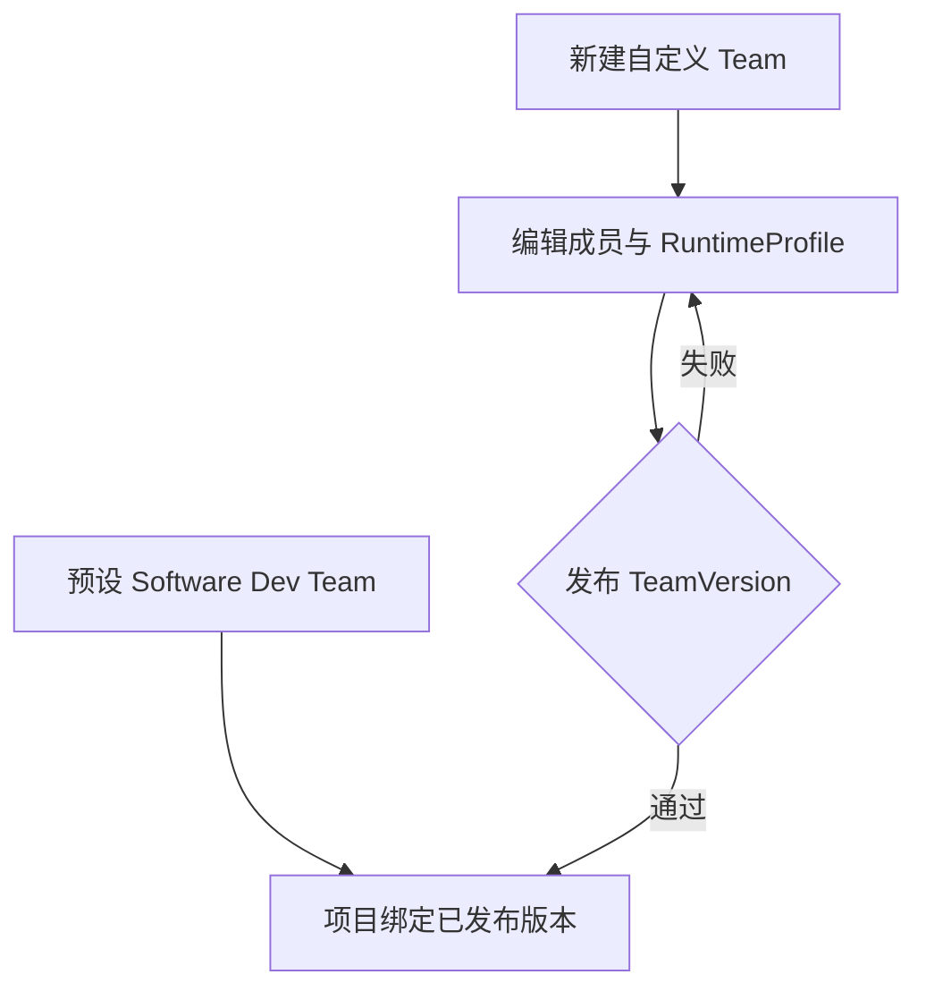
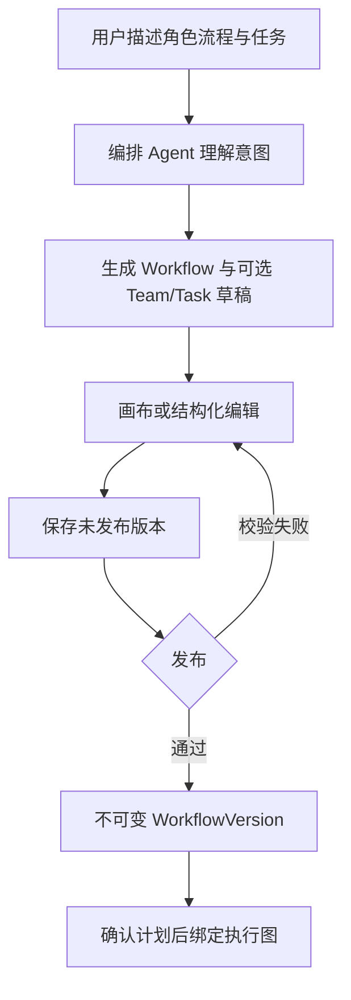
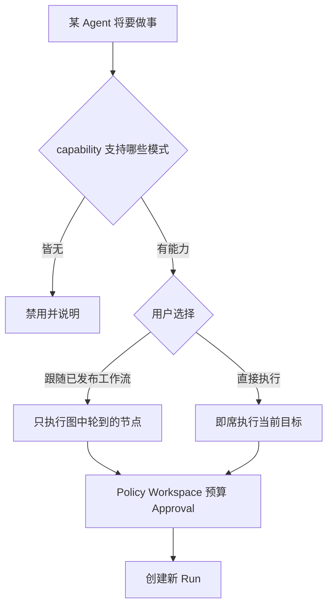

# Workforce 核心用户流程

**版本：** V0.1 Draft  
**状态：** Product flow baseline  
**日期：** 2026-09-11  
**修订：** 2026-09-12 — §10：T21 启动面选择控件已接线；无 probe 时 direct disabled。不宣称 M8 完成。2026-09-11 — §9：Desktop 作者面壳 + 写 API 落草稿已有；会话协议 / 编排 Agent 仍未实现。同日 §2/§3 对齐 D19：默认本机；远程与容器是一等 Placement；V0.1 隔离仍是 worktree，容器 runner 未实现。同日主循环改为项目制：Project → 编排 Team → 编排 Tasks → 编排 Workflow。增补 §7 画布与 §8 自定义 Team（M7）。同日增补 §9 对话生成（D17 / M7 planned）与 §10 双执行模式（D18 / M8 planned）。2026-09-10 — §1 映射到 IA §4.3.4（Settings 绑定，页头命令）。

## 1. 创建并运行项目

产品主对象是 Project。围着该项目：编排 Team（M3 选预设；M7 可自定义或由对话生成角色草稿）、编排 Tasks、编排 Workflow（M3 只读目录；M7 对话生成草稿后进画布编辑），再执行与验收（M8：每个 Agent 可绑定已发布工作流或直接执行）。桌面 V0.1 把“绑定 Workspace”映射到项目详情 **Settings**（IA §4.3.4）。开始规划 / 确认计划 / 开始执行留在页头，不随标签卸载。D17 会话协议 / 编排 Agent 与 D18 **尚未实现**（T20 仅有作者面壳）。

M3 切片：Team 步只读预设，Workflow 步只读已发布目录。M7 才要求自定义 Team、画布与对话生成。M8 才要求按 Agent 选择执行模式。未发布图 / 草稿 Team 不得进入开始规划或 Runtime。无 capability 不得渲染直接执行成功态。

## 2. 单节点多 Agent 调度

约束：

- 同一节点可以并发执行多个 Run。
- 每个 Run 使用独立 WorkspaceInstance、进程树和 PermissionGrant。V0.1 **已实现**的隔离是独立 git worktree，不是容器 Placement。
- 产品 Placement kind 为 `local`（默认）/ `remote` / `container`（[D19](../planning/decision-register.md#d19-执行-placement本机远程与容器)）。本节流程图里的「容器」不得读成 runner 已落地。
- `maxConcurrentRuns` 与资源预算同时生效。
- 容量等待不会消耗 Task attempt。

## 3. 本机、远程与容器选择

默认执行位置是**本机**。远程与容器是一等产品能力，不是 later nicety。

约束：

- UX / API 缺省解析为 `local_only` + kind `local`。`automatic` 在仅 Local Node 可用时也必须落到本机。
- V0.1 **只实现** Local Node。界面可以保留「自动 / 本机 / 远程 / 容器」模型；未接通的远程与容器必须 disabled 或启动前拒绝，禁止伪造在线节点或可点成功的容器调度。
- 容器 Placement 仍绑定某个 ExecutionNode 上的 WorkspaceInstance；不是第四种机器，也不是 D10 worktree 的别名。
- 不发明 enrollment / Docker / K8s endpoint。远程 drain/revoke 仍按能力矩阵 later，不得显示在线远程节点。

## 4. 人工审批

审批决定与执行动作分离。重复提交由 Idempotency-Key 收敛。

## 5. 节点断线与恢复

旧节点恢复后，过期 fencing token 对应的结果只能进入审计记录，不能推进 Task 状态。

## 6. Git 与信息协作

- Git/GitHub 保存代码、文档和版本化 Artifact。
- Task、Event 与 CoordinationMessage 传递状态、请求、反馈和 handoff。
- 消息只传 ArtifactRef，不内嵌大文件。
- 默认禁止 Agent 直接写主分支。

## 7. 编辑并发布工作流（M7 画布）

未发布图不能被 Runtime 执行。活动执行图仍按 D02 冻结，不在画布上原地改。

## 8. 自定义 Team 编排（M7）

未发布草稿不能 `:start-planning`。预设模板始终可选。

## 9. 对话生成工作流（M7；作者面壳已有，会话协议尚未实现）

用户与编排 Agent 对话，生成可编辑的工作流（及可选的角色/任务草稿），再进入 D15 画布。Desktop 已有「对话生成」作者面壳：发送对话在 T02 冻结 session DTO 前保持禁用；结构化名称可走已接通写接口落未发布草稿。这不是编排 Agent 已接通，也不是 M7 完成。

约束：

- 对话只生成定义，不执行 Runtime，也不把聊天回复写成 Task/Run 完成。
- 生成结果必须可编辑；禁止一次生成即锁定。
- 未发布图不能被 Runtime 执行。写接口未就绪时，「对话生成」不得假成功。
- 会话协议未由 T02 冻结前，对话发送不是已实现 endpoint；页面不得假成功。结构化落草稿复用矩阵已列的 M7 workflow 写接口，产出仍是未发布版本。

## 10. 按 Agent 选择执行模式（M8；T21 UI 切片已接线）

约束：

- workflow-bound 与 direct 都是一等模式，UI/API 必须诚实，靠 probe 显隐。
- direct 仍受 Policy、隔离 worktree、预算与 Approval 约束，不是无协议乱跑。
- 重试创建新 Run，不改写旧 Run 的模式。
- T21 启动面已有选择控件；无 probe 时「直接执行」必须 disabled。不得把 happy-dom 切片写成 M8 完成或生产 Codex direct。
