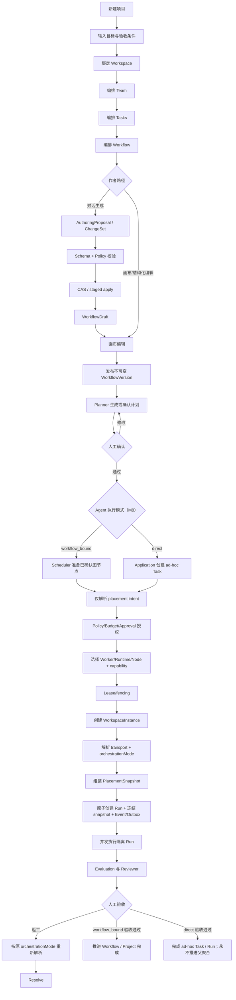
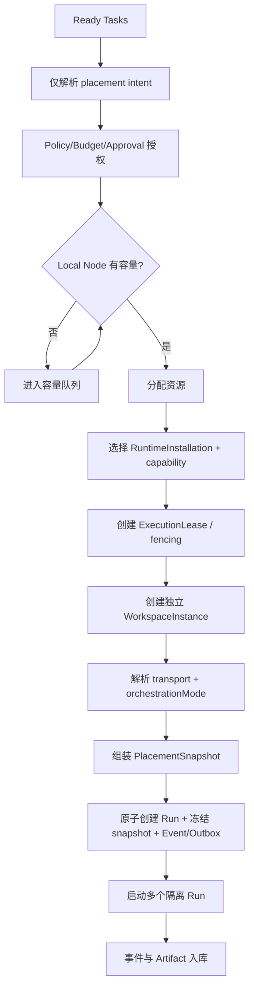
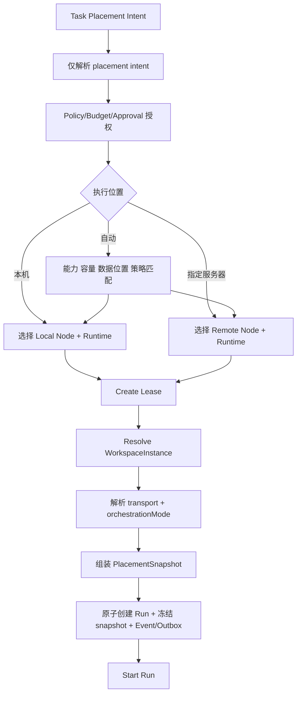
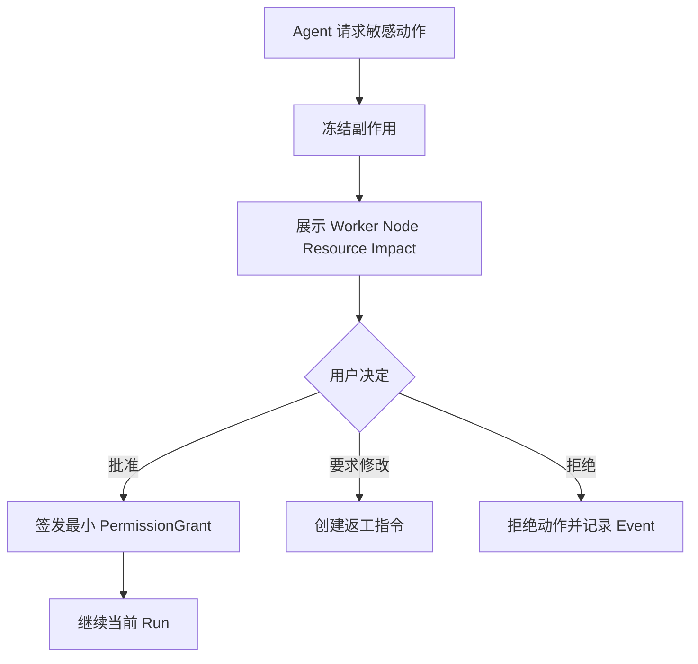
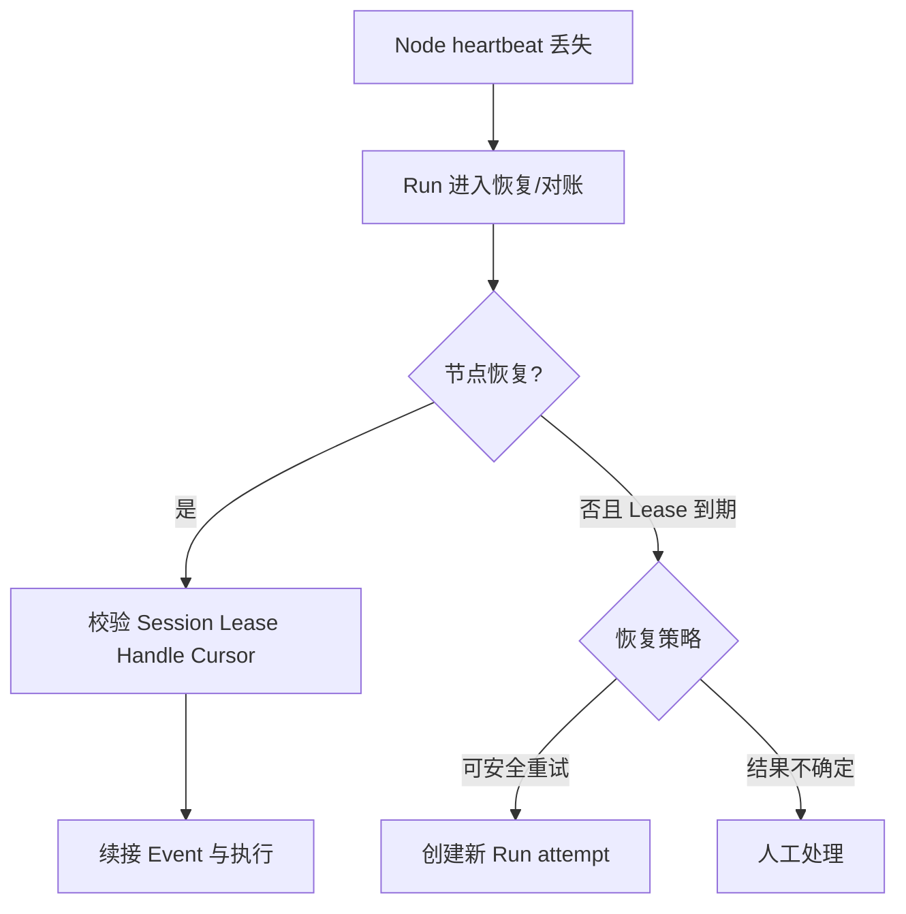
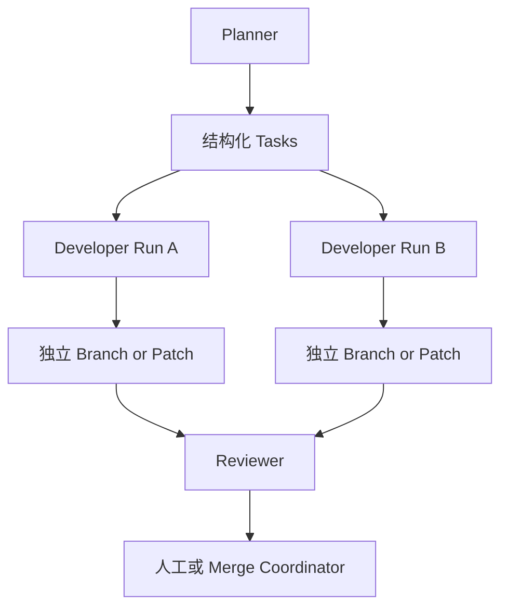
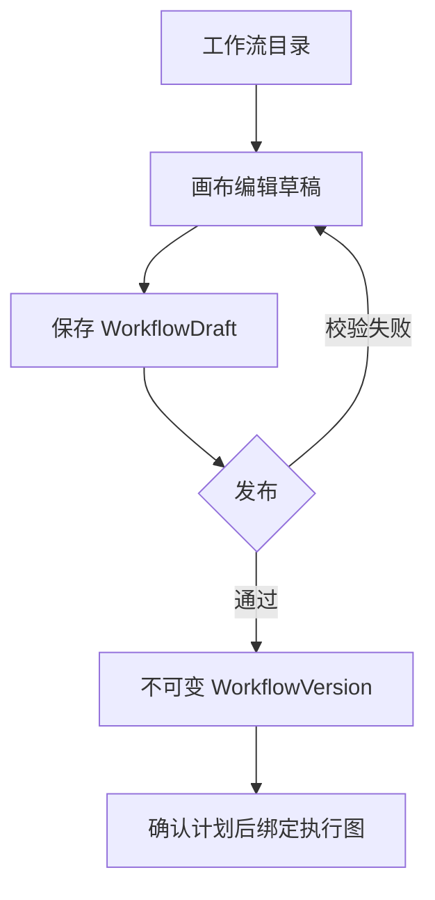
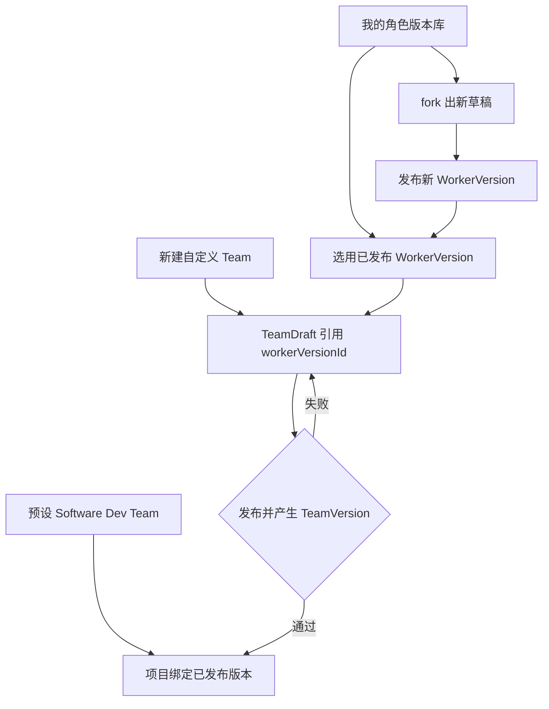
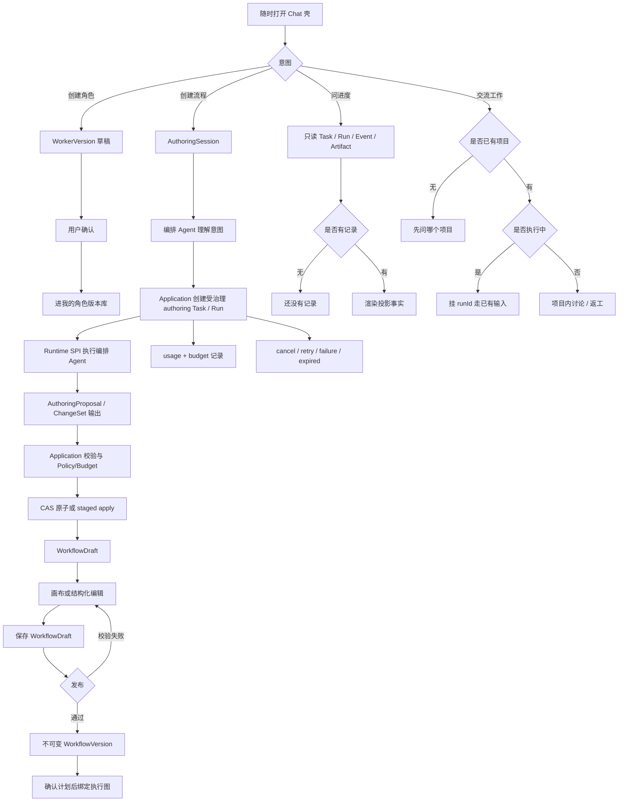
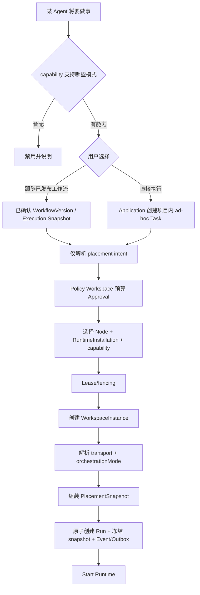

# Workforce 核心用户流程

**版本：** V0.1 Draft  
**状态：** Product flow baseline  
**日期：** 2026-09-13  
**修订：** 2026-09-13 — §8 改为库选用/fork；§9 扩为全局 Chat 四类意图（均 planned）。2026-09-11 — 主循环改为项目制：Project → 编排 Team → 编排 Tasks → 编排 Workflow。增补 §7 画布与 §8 自定义 Team（M7）。同日增补 §9 对话生成（D17 / M7 planned）与 §10 双执行模式（D18 / M8 planned），均未实现。2026-09-10 — §1 映射到 IA §4.3.4（Settings 绑定，页头命令）。

## 1. 创建并运行项目

产品主对象是 Project。围着该项目：编排 Team（M3 选预设；M7 从**我的角色版本库**选用/fork `WorkerVersion`，也可用 Chat 创建角色草稿）、编排 Tasks、编排 Workflow（M3 只读目录；M7 可用 Chat 创建流程后进画布编辑），再执行与验收（M8：每个 Agent 可绑定已发布工作流或直接执行）。**全局 Chat 随时可开**，不限于作者页。桌面 V0.1 把“绑定 Workspace”映射到项目详情 **Settings**（IA §4.3.4）。开始规划 / 确认计划 / 开始执行留在页头，不随标签卸载。角色库、全局 Chat、D17/D18 **尚未实现**。

M3 切片：Team 步只读预设，Workflow 步只读已发布目录。M7 才要求自定义 Team、角色版本库、画布与全局 Chat。M8 才要求按 Agent 选择执行模式。未发布图 / 草稿 Team 不得进入开始规划或 Runtime。无 capability 不得渲染直接执行成功态。问进度不得编造完成。

## 2. 单节点多 Agent 调度

约束：

- 同一节点可以并发执行多个 Run。
- 每个 Run 使用独立 worktree/目录/容器、进程树和 PermissionGrant。
- `maxConcurrentRuns` 与资源预算同时生效。
- 容量等待不会消耗 Task attempt。

## 3. 本机与远程节点选择

V0.1 只实现 Local Node，但界面保留“自动调度 / 本机 / 指定节点”的模型；远程与容器是已冻结的产品 Placement（D19），未实现选项必须清晰标记，而不是伪造可用。不发明 enrollment / Docker / K8s endpoint。

## 4. 人工审批

审批决定与执行动作分离。重复提交由 Idempotency-Key 收敛。

## 5. 节点断线与恢复

旧节点恢复后，过期 fencing token 对应的结果只能进入审计记录，不能推进 Task 状态。

## 6. Git 与信息协作

- Git/GitHub 保存代码、文档和版本化 Artifact。
- Task、Event 与 CoordinationMessage 传递状态、请求、反馈和 handoff。
- 消息只传 ArtifactRef，不内嵌大文件。
- 默认禁止 Agent 直接写主分支。

## 7. 编辑并发布工作流（M7 画布）

未发布图不能被 Runtime 执行。活动执行图仍按 D02 冻结，不在画布上原地改。

## 8. 自定义 Team 编排（M7）

从**我的角色版本库**选用或 fork 已发布 WorkerVersion，而不是把 `{ role, runtimeProfileId, quantity }` 当编辑目标。

未发布草稿不能 `:start-planning`。归档版本不可再被新 Team 选用。预设模板始终可选。现在不做 Marketplace 一等面。

## 9. 全局 Chat（V0.1 就要有，尚未实现）

用户随时打开 Chat 壳。每句解析到意图，并读或写已点名的对象。创建类走 AuthoringSession；问进度只读事实；交流工作挂 `projectId` / 执行中 `runId`。

约束：

- authoring Run 会通过 Runtime SPI 执行编排 Agent；但生成出的 Workflow 定义不会被该 Run 执行，也不把聊天回复写成目标 Task/Run 完成。
- 创建类必须经用户确认才落草稿；禁止一次生成即锁定或即执行。
- 问进度没有事实就说「还没有记录」，禁止模型编造完成。
- 交流工作没有 `projectId` 不发写；针对执行中再挂 `runId`。
- 「去做」未就绪时诚实 unsupported，不渲染已在跑。
- 未发布图不能被 Runtime 执行。写接口未就绪时，Chat 不得假成功。
- 公开 path 由 T02 冻结前，本流程只是产品路径，不对应已实现 endpoint。
- 仍禁止 Worker IM / 无项目聊天室。

## 10. 按 Agent 选择执行模式（M8，尚未实现）

约束：

- workflow-bound 与 direct 都是一等模式，UI/API 必须诚实，靠 probe 显隐。
- direct 只绕过本次 WorkflowInstance 图调度，仍创建项目内 ad-hoc Task/Run，受 Policy、隔离 worktree、预算与 Approval 约束，不是无协议乱跑；永不推进 WorkflowInstance/Project。若吸收其成果，必须另发 workflow-bound/follow-up command，引用精确 ArtifactVersion 并重新验收。
- `transport`、`placement`、`orchestrationMode` 分开展示；M3 缺省模式按 `workflow_bound` 兼容解析。
- 重试创建新 Run，不改写旧 Run 的模式。
- 当前代码无此选择面；不得预置可点击成功的「直接执行」。
